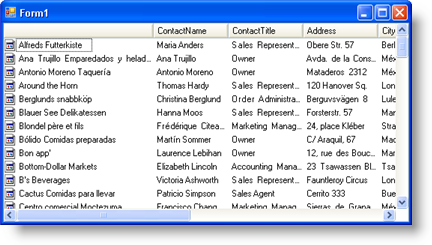
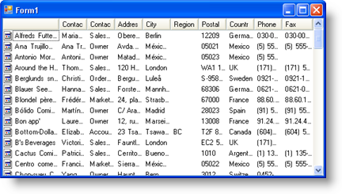

////

|metadata|
{
    "name": "winlistview-automatically-fit-all-columns-in-details-view",
    "controlName": ["WinListView"],
    "tags": ["How Do I","Tips and Tricks"],
    "guid": "{19F4302B-8A6C-4253-80D8-E96225AC7766}",  
    "buildFlags": [],
    "createdOn": "0001-01-01T00:00:00Z"
}
|metadata|
////

= Automatically Fit All Columns in Details View

In Details view, WinListView attempts to size all  pick:[win-forms="link:{ApiPlatform}win.ultrawinlistview{ApiVersion}~infragistics.win.ultrawinlistview.ultralistviewsubitem.html[SubItemColumns]"]  to the best fit if you don't set column widths yourself. However, if there's not enough screen real estate to display all SubItem columns, WinListView will display a scrollbar for your end user to scroll through the data. If scrolling doesn't appeal to you, or you'd rather have all data displayed at all times, regardless of the width of the columns, you can use the  pick:[win-forms="link:{ApiPlatform}win.ultrawinlistview{ApiVersion}~infragistics.win.ultrawinlistview.ultralistviewdetailssettings~autofitcolumns.html[AutoFitColumns]"]  property to have WinListView automatically size all columns to fit in the space allotted.

Setting AutoFitColumns to ResizeAllColumns will resize all columns to fit in the allotted space whenever WinListView is resized. WinListView will always use the entire space given to it and all SubItem columns will always be of even width; the  pick:[win-forms="link:{ApiPlatform}win.ultrawinlistview{ApiVersion}~infragistics.win.ultrawinlistview.ultralistviewmaincolumn.html[MainColumn]"]  will always be twice the width of the SubItem columns.

AutoFitColumns set to Default (None)

AutoFitColumns set to ResizeAllColumns

Use the following code sample to have WinListView automatically resize columns in Details view.

*In Visual Basic:*

----
Me.UltraListView1.ViewSettingsDetails.AutoFitColumns =_
	Infragistics.Win.UltraWinListView.AutoFitColumns.ResizeAllColumns
----

*In C#:*

----
this.ultraListView1.ViewSettingsDetails.AutoFitColumns =
	Infragistics.Win.UltraWinListView.AutoFitColumns.ResizeAllColumns;
----