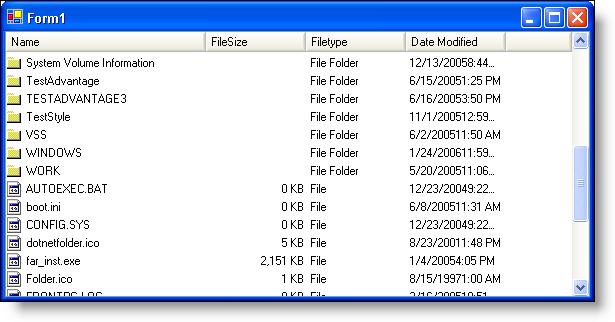

////

|metadata|
{
    "name": "winlistview-new-winlistview-control-whats-new-2006-1",
    "controlName": [],
    "tags": [],
    "guid": "{8ABB4870-F7DF-4368-9B59-0F94DDC4810E}",  
    "buildFlags": [],
    "createdOn": "0001-01-01T00:00:00Z"
}
|metadata|
////

= New WinListView Control

The WinListView™ control is a completely new control in the Infragistics Windows Forms 2006 Volume 1 release. It actually emulates three separate controls (ListView, ListBox, and CheckedListBox) through property settings, making it a versatile control that can perform several functions. It mimics the in-box ListView, ListBox, and CheckedBox controls with the added support of our unique link:win-plf-overview.html[Presentation Layer Framework™]. With the WinListView control, you will be able to mimic applications such as the Windows® Explorer. If your application simply requires a standard CheckedBox, set the  pick:[win-forms="link:{ApiPlatform}win.ultrawinlistview{ApiVersion}~infragistics.win.ultrawinlistview.ultralistviewlistsettingsbase~checkboxstyle.html[CheckBoxStyle]"]  property (exposed by  pick:[win-forms="link:{ApiPlatform}win.ultrawinlistview{ApiVersion}~infragistics.win.ultrawinlistview.ultralistview~viewsettingslist.html[ViewSettingsList]"]  and  pick:[win-forms="link:{ApiPlatform}win.ultrawinlistview{ApiVersion}~infragistics.win.ultrawinlistview.ultralistview~viewsettingsdetails.html[ViewSettingsDetails]"]  object properties) in order to turn the WinListView control into a CheckedBox-type control.

== Related Topics

link:winlistview-about-winlistview.html[About WinListView]

link:winlistview-object-model.html[WinListView Object Model]

link:winlistview-view-property.html[View Property]

link:winlistview-use-the-different-views-of-winlistview.html[Use the Different Views of WinListView]

link:winlistview-use-checkboxes-in-winlistview.html[Use Checkboxes in WinListView]

link:winlistview-use-winlistview-as-a-listbox.html[Use WinListView as a ListBox]

link:winlistview-populating-winlistview-with-directories-and-files.html[Populating WinListView with Directories and Files]