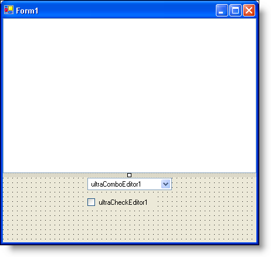
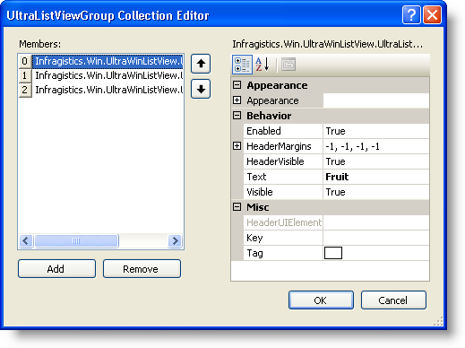
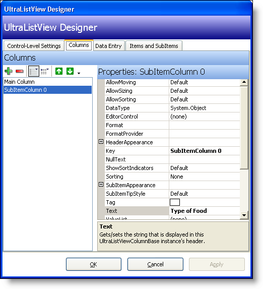
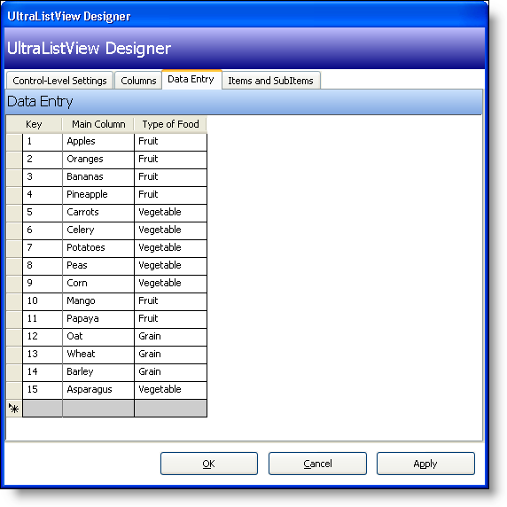
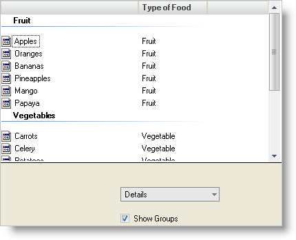

////

|metadata|
{
    "name": "winlistview-showing-groups-in-winlistview",
    "controlName": ["WinListView"],
    "tags": ["How Do I"],
    "guid": "{1EC01644-C9FF-4C2B-B62B-07D8F94669E9}",  
    "buildFlags": [],
    "createdOn": "0001-01-01T00:00:00Z"
}
|metadata|
////

= Showing Groups in WinListView

== Before You Begin

The WinListView™ control is capable of displaying all of its items in groups. This is similar to the way in which the Windows® Explorer functions. Each  pick:[win-forms="link:{ApiPlatform}win.ultrawinlistview{ApiVersion}~infragistics.win.ultrawinlistview.ultralistviewitem.html[UltraListViewItem]"]  can be assigned a  pick:[win-forms="link:{ApiPlatform}win.ultrawinlistview{ApiVersion}~infragistics.win.ultrawinlistview.ultralistviewgroup.html[Group]"]  to which it corresponds. In this walkthrough, you will create a WinListView control filled with several items. The  pick:[win-forms="link:{ApiPlatform}win.ultrawinlistview{ApiVersion}~infragistics.win.ultrawinlistview.ultralistviewmaincolumn.html[MainColumn]"]  will be a specific type of food; the  pick:[win-forms="link:{ApiPlatform}win.ultrawinlistview{ApiVersion}~infragistics.win.ultrawinlistview.ultralistviewsubitemcolumn.html[SubItemColumn]"]  will be the general type of food that the items will be grouped by. You will also be using a WinComboEditor™ to switch between the different View styles of WinListView and a WinCheckEditor™ to turn Groups on and off.

== What You Will Accomplish

This topic will help you understand Groups in the WinListView control. You will use three separate Infragistics Windows Forms controls in conjunction with each other to demonstrate how Groups function and what they look like in the different views of WinListView. You will also become familiar with the WinListView designer and how to perform tasks using it.

== Follow these Steps

*Add the necessary controls to your form.*

[start=1]
. Before you start writing any code, you should place using/imports directives in your code-behind so you don't need to always type out a member's fully qualified name.

*In Visual Basic:*

----
Imports Infragistics.Win.UltraWinListView
Imports Infragistics.Win
----

*In C#:*

----
using Infragistics.Win.UltraWinListView;
using Infragistics.Win;
----

[start=2]
. Add an  pick:[win-forms="link:{ApiPlatform}win.ultrawinlistview{ApiVersion}~infragistics.win.ultrawinlistview.ultralistview.html[UltraListView]"]  control from the toolbox to your form.
[start=3]
. Set its Dock property to Top.
[start=4]
. Add an  pick:[win-forms="link:{ApiPlatform}win.ultrawineditors{ApiVersion}~infragistics.win.ultrawineditors.ultracomboeditor.html[UltraComboEditor]"]  and  pick:[win-forms="link:{ApiPlatform}win.ultrawineditors{ApiVersion}~infragistics.win.ultrawineditors.ultracheckeditor.html[UltraCheckEditor]"] . Arrange the controls so they look something like this:

*Set up the WinListView control and add some data.*

[start=1]
. With WinListView selected, set the  pick:[win-forms="link:{ApiPlatform}win.ultrawinlistview{ApiVersion}~infragistics.win.ultrawinlistview.ultralistview~view.html[View]"]  property in the Properties window to Details and the  pick:[win-forms="link:{ApiPlatform}win.ultrawinlistview{ApiVersion}~infragistics.win.ultrawinlistview.ultralistview~showgroups.html[ShowGroups]"]  property to False.
[start=2]
. Find the  pick:[win-forms="link:{ApiPlatform}win.ultrawinlistview{ApiVersion}~infragistics.win.ultrawinlistview.ultralistviewgroupscollection.html[Groups]"]  collection in the properties window and click the ellipsis (…) next to it. The UltraListViewGroup Collection Editor opens.
[start=3]
. Click Add. Upon clicking Add, the first group is created. Set its Text property to "Fruit".
[start=4]
. Click Add again and set the second Group's Text property to "Vegetables".
[start=5]
. Click Add once more and set the third Group's Text property to "Grains". When you are finished, the UltraListViewGroup Collection Editor should look like this:

[start=6]
. Click OK to close the Editor.
[start=7]
. Find the  pick:[win-forms="link:{ApiPlatform}win.ultrawinlistview{ApiVersion}~infragistics.win.ultrawinlistview.ultralistviewsubitemcolumnscollection.html[SubItemColumns]"]  collection in the Properties window and click the ellipsis (…) to open the UltraListView Designer. The Columns tab is selected by default.
[start=8]
. Click the green (+) button to add a SubItem column.
[start=9]
. Set the Text property to "Type of Food". When you are finished, the Columns tab should look like this:

[start=10]
. With the UltraListView Designer still open, click the Data Entry tab. Fill in the table with the following data:

[options="header", cols="a,a,a"]
|====
|Key|MainColumn|Type of Food

|1
|Apples
|Fruit

|2
|Oranges
|Fruit

|3
|Bananas
|Fruit

|4
|Pineapples
|Fruit

|5
|Carrots
|Vegetable

|6
|Celery
|Vegetable

|7
|Potatoes
|Vegetable

|8
|Peas
|Vegetable

|9
|Corn
|Vegetable

|10
|Mango
|Fruit

|11
|Papaya
|Fruit

|12
|Oat
|Grain

|13
|Wheat
|Grain

|14
|Barley
|Grain

|15
|Asparagus
|Vegetable

|====

The Designer should now look like this:

[start=11]
. Click OK to close the Designer.

*Add the code-behind for WinListView's Group.*

In the Form Load event, add the following code:

*In Visual Basic:*

----
Dim item As UltraListViewItem
' If the text in Column 1 (SubItems(0)) is "Fruit", then
' set that item's group to Group 1. If "Vegetable", set
' the group for that item to Group 2, if "Grain", then Group 3.
For Each item In Me.UltraListView1.Items
	Select Case item.SubItems(0).Text
		Case "Fruit"
			item.Group = Me.UltraListView1.Groups(0)
		Case "Vegetable"
			item.Group = Me.UltraListView1.Groups(1)
		Case "Grain"
			item.Group = Me.UltraListView1.Groups(2)
	End Select
Next
----

*In C#:*

----
foreach(UltraListViewItem item in this.ultraListView1.Items)
{
	// If the text in Column 1 (SubItems[0]) is "Fruit", then 
	// set that item's group to Group 1. If "Vegetable", set
	// the group for that item to Group 2, if "Grain", then Group 3.
	switch(item.SubItems[0].Text)
	{
		case "Fruit":
			item.Group = this.ultraListView1.Groups[0];
			break;
		case "Vegetable":
			item.Group = this.ultraListView1.Groups[1];
			break;
		case "Grain":
			item.Group = this.ultraListView1.Groups[2];
			break;
	}
}
----

The code above adds all of the items to one of the three Groups that we set up earlier. The Foreach loop will loop through every item in the WinListView control. As the loop hits every item, it looks at the text in the SubItemColumn. If that text is "Fruit", then the item is added to the first group. If the text is "Vegetable", then the item is added to the second group and so forth.

*Add the code-behind for the WinComboEditorControl.*

In the Form Load event after the previous Foreach loop, add the following code:

*In Visual Basic:*

----
Dim s As String
For Each s In [Enum].GetNames(GetType(UltraListViewStyle))
	Me.UltraComboEditor1.Items.Add(s)
Next s
----

*In C#:*

----
foreach (string s in Enum.GetNames(typeof (UltraListViewStyle)))
{
	this.ultraComboEditor1.Items.Add(s);
}
----

This code will loop through each of the enumerations for UltraListViewStyle. For each enumeration, the loop will retrieve the string value and add it as an Item to the WinComboEditor control.

Create a  pick:[win-forms="link:{ApiPlatform}win.ultrawineditors{ApiVersion}~infragistics.win.ultrawineditors.ultracomboeditor~selectionchanged_ev.html[SelectionChanged]"]  event for ultraComboEditor1 and add the following code to it:

*In Visual Basic:*

----
Private Sub UltraComboEditor1_SelectionChanged(ByVal sender As Object, _
  ByVal e As System.EventArgs) Handles UltraComboEditor1.SelectionChanged
	Me.UltraListView1.View = [Enum].Parse(GetType(UltraListViewStyle), _
	  Me.UltraComboEditor1.SelectedItem.ToString())
End Sub
----

*In C#:*

----
private void ultraComboEditor1_SelectionChanged(object sender, System.EventArgs e)
{
this.ultraListView1.View = 
  (UltraListViewStyle) Enum.Parse(typeof (UltraListViewStyle),
  this.ultraComboEditor1.SelectedItem.ToString());
}
----

This code snippet uses the Parse method of the System.Enum class. This method accepts two parameters: an enumeration type (in this case, the  pick:[win-forms="link:{ApiPlatform}win.ultrawinlistview{ApiVersion}~infragistics.win.ultrawinlistview.ultralistviewstyle.html[UltraListViewStyle]"]  enumeration), and a string that represents that enumeration. In the above code, when the WinComboEditor's selection is changed, it uses the string of what it was changed to, matches that string to an enumeration in UltraListViewStyle, and sets the View property of ultraListView1 to the corresponding enumeration.

*Add the code-behind for the WinCheckEditor control.*

Create a  pick:[win-forms="link:{ApiPlatform}win.ultrawineditors{ApiVersion}~infragistics.win.ultrawineditors.ultracheckeditor~checkedchanged_ev.html[CheckedChanged]"]  event handler for ultraCheckEditor1 and add the following code to it:

*In Visual Basic:*

----
Private Sub UltraCheckEditor1_CheckedChanged(ByVal sender As Object, _
  ByVal e As System.EventArgs) Handles UltraCheckEditor1.CheckedChanged
	Me.UltraListView1.ShowGroups = Me.UltraCheckEditor1.Checked
End Sub
----

*In C#:*

----
private void ultraCheckEditor1_CheckedChanged(object sender,
  System.EventArgs e)
{
	this.ultraListView1.ShowGroups = this.ultraCheckEditor1.Checked;
}
----

When the end user selects or clears the checkbox, the CheckedChanged event fires. When this event fires, the ShowGroups property will be set to True or False – whichever ultraCheckEditor1 is set to.

*Run the application.*

When you run the application, you will see a long list of food items in the Details view. Select the ultraCheckEditor1 checkbox and these items will be grouped by food type. Experiment with ultraComboEditor1 and select different views. Notice how the groups are maintained in the different views. The only exception to this is the List view. The List view does not support groups because items are positioned in such a way that a group separator cannot be drawn horizontally.

