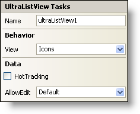

////

|metadata|
{
    "name": "winlistview-smart-tag",
    "controlName": ["WinListView"],
    "tags": ["Getting Started"],
    "guid": "{CFF83F9A-58EE-4C9C-9870-1CFF17C6C7E4}",  
    "buildFlags": [],
    "createdOn": "0001-01-01T00:00:00Z"
}
|metadata|
////

= WinListView Smart Tag

In Visual Studio 2005 (.NET Framework 2.0), each Infragistics Windows Forms control/component is equipped with a Smart Tag. By simply selecting the control/component, a Smart Tag anchor appears. When you click this anchor, a pop-up panel appears, providing you with quick and easy access to the most common properties and settings of the control/component.

The WinListView™ Smart Tag contains the name of the control, as well as the following sections:

* Behavior -- Provides easy access to properties that govern how the control behaves on the form.
* Data -- Refers to any underlying data the control is using and how you can manipulate it.

See below for a description of the item (e.g., field, drop-down list, checkbox) in each section, as well as the item's corresponding property in the properties grid.

[options="header", cols="a,a,a"]
|====
|Behavior|Description|Corresponding Property

|View
|There are five views that WinListView can display: Details, Icons, List, Tiles, and Thumbnails. The Details view shows the main item with several sub item columns for additional information. The Icons view shows the main item text with an icon overtop. The List view displays a list of information much like a ListBox control. The Tiles view displays the main column text to the right of the icon. The Thumbnails view would be ideal for a folder containing images as the main column text is underneath a thumbnail image.
| pick:[win-forms="link:infragistics4.win.ultrawinlistview.v{ProductVersion}~infragistics.win.ultrawinlistview.ultralistview~view.html[View]"] 

|====

[options="header", cols="a,a,a"]
|====
|Data|Description|Corresponding Property

|HotTracking
|Selecting the checkbox will enable the control to highlight items in the WinListView control as the mouse hovers overtop them.
| pick:[win-forms="link:infragistics4.win.ultrawinlistview.v{ProductVersion}~infragistics.win.ultrawinlistview.ultralistviewitemsettings~hottracking.html[HotTracking]"] 

|AllowEdit
|Selecting True from the drop-down list will allow the end user to edit the contents of the WinListView control.
| pick:[win-forms="link:infragistics4.win.ultrawinlistview.v{ProductVersion}~infragistics.win.ultrawinlistview.ultralistviewitemsettings~allowedit.html[AllowEdit]"] 

|====