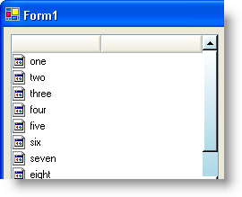

////

|metadata|
{
    "name": "winlistview-style-the-scrollbars-of-winlistview",
    "controlName": ["WinListView"],
    "tags": ["How Do I","Styling"],
    "guid": "{1D5B0E1D-2281-44F6-9CF6-DD227B3DF5DD}",  
    "buildFlags": [],
    "createdOn": "0001-01-01T00:00:00Z"
}
|metadata|
////

= Style the Scrollbars of WinListView

In Infragistics Windows Forms 2006 Volume 2, you can style the scrollbars in WinListView™ as you would with WinScrollBar™. We added a  pick:[win-forms="link:{ApiPlatform}win.ultrawinlistview{ApiVersion}~infragistics.win.ultrawinlistview.ultralistview~scrollbarlook.html[ScrollBarLook]"]  property to the WinListView that exposes several of the same objects as the WinScrollBar control. By setting the  pick:[win-forms="link:{ApiPlatform}win{ApiVersion}~infragistics.win.ultrawinscrollbar.scrollbarlook~appearance.html[Appearance]"]  property of the ScrollBarLook property to an  pick:[win-forms="link:{ApiPlatform}win{ApiVersion}~infragistics.win.appearance.html[Appearance]"]  object, you can style the entire scrollbar. Alternatively, if you need more control, you can set properties such as  pick:[win-forms="link:{ApiPlatform}win{ApiVersion}~infragistics.win.ultrawinscrollbar.scrollbarlook~buttonappearance.html[ButtonAppearance]"] ,  pick:[win-forms="link:{ApiPlatform}win{ApiVersion}~infragistics.win.ultrawinscrollbar.scrollbarlook~thumbappearance.html[ThumbAppearance]"] , and  pick:[win-forms="link:{ApiPlatform}win{ApiVersion}~infragistics.win.ultrawinscrollbar.scrollbarlook~trackappearance.html[TrackAppearance]"] .

The following code will create an Appearance object, set a few of its properties to show a light blue vertical gradient, and than apply that appearance to the WinListView's scrollbars.

*In Visual Basic:*

----
Imports Infragistics.Win
...
' Create an appearance object
Dim app1 As New Infragistics.Win.Appearance()
' Set the properties of the first appearance object
app1.BackColor = Color.White
app1.BackColor2 = Color.LightBlue
app1.BackGradientStyle = GradientStyle.Vertical
app1.ThemedElementAlpha = Alpha.Transparent
' Set the appearance of the WinListView's scrollbar
Me.UltraListView1.ScrollBarLook.Appearance = app1
----

*In C#:*

----
using Infragistics.Win;
...
// Create an appearance object
Infragistics.Win.Appearance app1 = new Infragistics.Win.Appearance();
// Set the properties of the first appearance object
app1.BackColor = Color.White;
app1.BackColor2 = Color.LightBlue;
app1.BackGradientStyle = GradientStyle.Vertical;
app1.ThemedElementAlpha = Alpha.Transparent;
// Set the appearance of the WinListView's scrollbar
this.ultraListView1.ScrollBarLook.Appearance = app1;
----