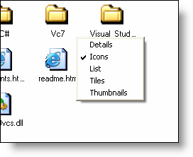

////

|metadata|
{
    "name": "winlistview-use-the-different-views-of-winlistview",
    "controlName": ["WinListView"],
    "tags": ["How Do I"],
    "guid": "{72EA8ADE-97C8-4BBE-9F7A-4BF241938941}",  
    "buildFlags": [],
    "createdOn": "0001-01-01T00:00:00Z"
}
|metadata|
////

= Use the Different Views of WinListView

The WinListView™ control supports the same views as those supported in Microsoft® Windows® Explorer. A list of these views can be seen in Windows Explorer by right-clicking in a blank area of the right-hand pane, and pointing to "View". The sub-items under this menu each represent a different view available to the end user.

The equivalent functionality in the WinListView control is extended through the control's  pick:[win-forms="link:{ApiPlatform}win.ultrawinlistview{ApiVersion}~infragistics.win.ultrawinlistview.ultralistview~view.html[View]"]  property. The property is of type  pick:[win-forms="link:{ApiPlatform}win.ultrawinlistview{ApiVersion}~infragistics.win.ultrawinlistview.ultralistviewstyle.html[UltraListViewStyle]"] , and the members of this enumeration are the same ones offered in Windows Explorer: Details, Icons, Tiles, Thumbnails, and List.

When the end user presses the right mouse button on the WinListView control, a context menu appears, displaying the different values of the UltraListViewStyle enumeration, with the item that represents the current value of the control's View property showing as checked

To start add a  pick:[win-forms="link:{ApiPlatform}win.ultrawintoolbars{ApiVersion}~infragistics.win.ultrawintoolbars_namespace.html[WinToolbarsManger]"]  and WinListView to your form. In the properties window of WinToolbarsManager click on the ellipsis of  pick:[win-forms="link:{ApiPlatform}win.ultrawintoolbars{ApiVersion}~infragistics.win.ultrawintoolbars.optionset.html[OptionSets]"] . Add an optionSet named "ViewStyle" with AllowAllUp set to true. The remaining steps are in the following code sample. It demonstrates how to configure an WinToolbarsManager and assign it to WinListView's ContextMenu property so that the end user can select a view similarly to how they can in Windows Explorer:

*In Visual Basic:*

----
Imports Infragistics.Win.UltraWinListView
Imports Infragistics.Win.UltraWinToolbars
...
Private Sub Form1_Load(ByVal sender As System.Object, ByVal e As System.EventArgs) Handles MyBase.Load
	Dim popupMenuTool1 As New PopupMenuTool("PopupMenuTool1")
	Me.UltraToolbarsManager1.SetContextMenuUltra(Me.UltraListView1, "PopupMenuTool1")
	Dim optionSet1 As New OptionSet("ViewStyle")
	Dim enumValues As Array = [Enum].GetValues(GetType(UltraListViewStyle))
	Dim tools1 As StateButtonTool() = New StateButtonTool(enumValues.Length - 1) {}
	Dim tools2 As StateButtonTool() = New StateButtonTool(enumValues.Length - 1) {}
	For i As Integer = 0 To enumValues.Length - 1
		tools1(i) = New StateButtonTool(enumValues.GetValue(i).ToString(), "ViewStyle")
		tools1(i).MenuDisplayStyle = StateButtonMenuDisplayStyle.DisplayCheckmark
		tools1(i).SharedProps.Caption = enumValues.GetValue(i).ToString()
		tools1(i).Checked = (UltraListView1.View.ToString() = enumValues.GetValue(i).ToString())
		Me.UltraToolbarsManager1.Tools.Add(tools1(i))
	Next
	Me.UltraToolbarsManager1.Tools.Add(popupMenuTool1)
	For i As Integer = 0 To enumValues.Length - 1
		tools2(i) = New StateButtonTool(enumValues.GetValue(i).ToString(), "ViewStyle")
		popupMenuTool1.Tools.Add(tools2(i))
	Next
	AddHandler Me.UltraToolbarsManager1.ToolClick, AddressOf Me.ultraToolbarsManager1_ToolClick
End Sub
Private Sub ultraToolbarsManager1_ToolClick(ByVal sender As Object, ByVal e As Infragistics.Win.UltraWinToolbars.ToolClickEventArgs)
	Dim t As StateButtonTool = Nothing
	t = TryCast(e.Tool, StateButtonTool)
	If t Is Nothing Then
		Return
	End If
	If t.Checked Then
		Me.ultraListView1.View = DirectCast([Enum].Parse(GetType(UltraListViewStyle), t.Key, True), UltraListViewStyle)
	End If
End Sub
----

*In C#:*

----
using Infragistics.Win.UltraWinListView;
using Infragistics.Win.UltraWinToolbars;
...
private void Form1_Load(object sender, EventArgs e)
{
	PopupMenuTool popupMenuTool1 = new PopupMenuTool("PopupMenuTool1");
	this.ultraToolbarsManager1.SetContextMenuUltra(this.ultraListView1, "PopupMenuTool1");
	OptionSet optionSet1 = new OptionSet("ViewStyle");
	Array enumValues = Enum.GetValues(typeof(UltraListViewStyle));
	StateButtonTool[] tools1 = new StateButtonTool[enumValues.Length];
	StateButtonTool[] tools2 = new StateButtonTool[enumValues.Length];
	for (int i = 0; i < enumValues.Length; i++)
	{
		tools1[i] = new StateButtonTool(enumValues.GetValue(i).ToString(), "ViewStyle");
		tools1[i].MenuDisplayStyle = StateButtonMenuDisplayStyle.DisplayCheckmark;
		tools1[i].SharedProps.Caption = enumValues.GetValue(i).ToString();
		tools1[i].Checked = (ultraListView1.View.ToString() == enumValues.GetValue(i).ToString());
		this.ultraToolbarsManager1.Tools.Add(tools1[i]);
	}
	this.ultraToolbarsManager1.Tools.Add(popupMenuTool1);
	for (int i = 0; i < enumValues.Length; i++)
	{
		tools2[i] = new StateButtonTool(enumValues.GetValue(i).ToString(), "ViewStyle");
		popupMenuTool1.Tools.Add(tools2[i]);
	}
	this.ultraToolbarsManager1.ToolClick += new ToolClickEventHandler(this.ultraToolbarsManager1_ToolClick);
}
private void ultraToolbarsManager1_ToolClick(object sender, Infragistics.Win.UltraWinToolbars.ToolClickEventArgs e)
{
	StateButtonTool t = null;
	t = e.Tool as StateButtonTool;
	if (null == t) return;
	if (t.Checked)
	{
		this.ultraListView1.View = (UltraListViewStyle)Enum.Parse(typeof(UltraListViewStyle), t.Key,true);
	}
}
----