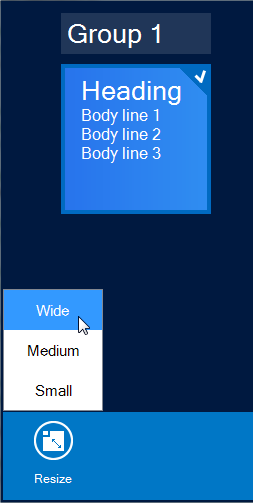

////

|metadata|
{
    "name": "winlivetileview-adding-winlivetileview-in-code-behind",
    "controlName": [],
    "tags": [],
    "guid": "d9c21371-8d0b-4fd0-b9bc-cb39772f348e",  
    "buildFlags": [],
    "createdOn": "2013-09-15T23:22:49.6608649Z"
}
|metadata|
////

= Adding WinLiveTileView in Code-Behind

== Topic Overview

=== Purpose

This topic demonstrates how to add the  _WinLiveTileView_™ control and tiles in code-behind.

=== In this topic

This topic contains the following sections:

* <<_Ref366364907,Adding  _WinLiveTileView_   Control>>
** <<_Ref366364917,Adding assembly references>>
** <<_Ref366364930,Adding the control>>
** <<_Ref366365492,Adding a group>>
** <<_Ref366365504,Adding a static tile>>
** <<_Ref366365518,Adding Live Tiles>>
** 

*** <<_Ref366365535,Create a live tile>>
*** <<_Ref366365547,Create a medium frame>>
*** <<_Ref366365557,Create a medium template>>
*** <<_Ref366365571,Create a wide frame>>
*** <<_Ref366365583,Create a wide template>>

* <<_Ref366365597,Adding a Live Tile with animation>>

* <<_Ref366365606,Related Content>>

[[_Ref366364907]]
== Adding  _WinLiveTileView_   Control

[[_Ref366364917]]

=== Adding assembly references

Adding the control in code-behind first requires the completion of the following steps:

1. Add the following assembly references to your project:

* `{ApiPlatform}Shared.v{ProductVersion}`

* `{ApiPlatform}Win.Misc.v{ProductVersion}`

* `{ApiPlatform}Win.UltraWinEditors.v{ProductVersion}`

* `{ApiPlatform}Win.UltraWinLiveTileView.v{ProductVersion}`

* `{ApiPlatform}Win.v{ProductVersion}`

2. Add the following namespace as a using statements in your form:

*In C#:*

[source,csharp]
----
using Infragistics.Win.UltraWinLiveTileView;
using System;
----

*In Visual Basic:*

[source,vb]
----
Imports Infragistics.Win.UltraWinLiveTileView
Imports System
----

[[_Ref366364930]]

=== Adding the control

Create and add an instance of the link:{ApiPlatform}win.ultrawinlivetileview{ApiVersion}~infragistics.win.ultrawinlivetileview.ultralivetileview_members.html[UltraLiveTileView] control to the form.

*In C#:*

[source,csharp]
----
UltraLiveTileView ultraLiveTileView = new UltraLiveTileView();
Controls.Add(ultraLiveTileView);
----

*In Visual Basic:*

[source,vb]
----
Dim ultraLiveTileView As New UltraLiveTileView()
Controls.Add(ultraLiveTileView)
----

[[_Ref366365492]]

=== Adding a group

Create the group into which you will add the tile.

*In C#:*

[source,csharp]
----
// Create a tile group and add it to the control's group collection
TileGroup tileGroup = ultraLiveTileView1.Groups.Add("Group 1");
----

*In Visual Basic:*

[source,vb]
----
' Create a tile group and add it to the control's group collection
Dim tileGroup As TileGroup = ultraLiveTileView1.Groups.Add("Group 1")
----

[[_Ref366365504]]

=== Adding a static tile

Add a static tile to the group.

*In C#:*

[source,csharp]
----
// Create a tile group and add it to the control's group collection
TileGroup tileGroup = ultraLiveTileView1.Groups.Add("Group 1");
// Assign a group name
tileGroup.Text = "Group 1";
// Create a tile group and add it to the control's group collection
StaticTile staticTile = tileGroup.Tiles.AddStaticTile("StaticTile1");
// Assign a tile name
staticTile.DefaultView.Text = "Static Tile";
// Assign an icon to the tile
staticTile.DefaultView.Image.AllResolutions.Image = // your image
----

*In Visual Basic:*

[source,vb]
----
' Create a tile group and add it to the control's group collection
Dim tileGroup As TileGroup = ultraLiveTileView1.Groups.Add("Group 1")
' Assign a group name
tileGroup.Text = "Group 1"
' Create a tile group and add it to the control's group collection
Dim staticTile As StaticTile = tileGroup.Tiles.AddStaticTile("StaticTile1")
' Assign a tile name
staticTile.DefaultView.Text = "Static Tile"
' Assign an icon to the tile
staticTile.DefaultView.Image.AllResolutions.Image = ' your image
----

A preview of the resultant tile follows. Optionally run the application to verify the result.

[[_Ref366365518]]
== Adding Live Tiles

[[_Ref366365535]]

=== Create a live tile

Create an instance of a medium live tile. By default, the optional link:{ApiPlatform}win.ultrawinlivetileview{ApiVersion}~infragistics.win.ultrawinlivetileview.tilebase~currentsize.html[CurrentSize] property is set to `Medium`, but best practice dictates that this property be set explicitly.

The available options for link:{ApiPlatform}win.ultrawinlivetileview{ApiVersion}~infragistics.win.ultrawinlivetileview.tilebase~currentsize.html[CurrentSize] property are `Small`, `Medium`, `Wide`, and `Large`.

.Note:
[NOTE]
====
It is not possible to animate small size tiles, and they do not have frames. It only exposes image properties.
====

*In C#:*

[source,csharp]
----
LiveTile mediumLiveTile = tileGroup.Tiles.AddLiveTile("MediumLiveTile");
mediumLiveTile.CurrentSize = TileSize.Medium;
----

*In Visual Basic:*

[source,vb]
----
Dim mediumLiveTile As LiveTile = tileGroup.Tiles.AddLiveTile("MediumLiveTile")
mediumLiveTile.CurrentSize = TileSize.Medium
----

[[_Ref366365547]]

=== Create a medium frame

Create a medium frame and add it to the medium live tile.

*In C#:*

[source,csharp]
----
LiveTileFrameMedium mediumFrame = mediumLiveTile.DefaultView.MediumFrames.Add();
----

*In Visual Basic:*

[source,vb]
----
Dim mediumFrame As LiveTileFrameMedium = mediumLiveTile.DefaultView.MediumFrames.Add()
----

[[_Ref366365557]]

=== Create a medium template

Create content for the medium frame.

*In C#:*

[source,csharp]
----
TileMediumText01 mediumContent = new TileMediumText01();
mediumContent.TextHeading.Text = "Heading";
mediumContent.TextBody1.Text = "Body line 1";
mediumContent.TextBody2.Text = "Body line 2";
mediumContent.TextBody3.Text = "Body line 3";
// Add the content to the frame
mediumFrame.Content = mediumContent;
----

*In Visual Basic:*

[source,vb]
----
Dim mediumContent As New TileMediumText01()
mediumContent.TextHeading.Text = "Heading"
mediumContent.TextBody1.Text = "Body line 1"
mediumContent.TextBody2.Text = "Body line 2"
mediumContent.TextBody3.Text = "Body line 3"
' Add the content to the frame
mediumFrame.Content = mediumContent
----

At this point the medium live tile is complete as illustrated in the following screenshot.

[[_Ref366365571]]

=== Create a wide frame

Live tiles support dynamic runtime resizing allowing you to `right-click` the medium tile and select an option from the application bar to resize it to wide, while running the application, thus requiring the presence of some wide frame template, otherwise it will display a blank tile for a wide size as illustrated below.

Create a wide frame and add it to the medium live tile.

*In C#:*

[source,csharp]
----
LiveTileFrameWide wideFrame = mediumLiveTile.DefaultView.WideFrames.Add();
----

*In Visual Basic:*

[source,vb]
----
Dim wideFrame As LiveTileFrameWide = mediumLiveTile.DefaultView.WideFrames.Add()
----

[[_Ref366365583]]

=== Create a wide template

Create content for the wide frame.

*In C#:*

[source,csharp]
----
TileWideText01 wideContent = new TileWideText01();
wideContent.TextHeading.Text = "Heading";
wideContent.TextBody1.Text = "Body line 1";
wideContent.TextBody2.Text = "Body line 2";
wideContent.TextBody3.Text = "Body line 3";
wideContent.TextBody4.Text = "Body line 4";
// Add the content to the frame
wideFrame.Content = wideContent;
----

*In Visual Basic:*

[source,vb]
----
Dim wideContent As New TileWideText01()
wideContent.TextHeading.Text = "Heading"
wideContent.TextBody1.Text = "Body line 1"
wideContent.TextBody2.Text = "Body line 2"
wideContent.TextBody3.Text = "Body line 3"
wideContent.TextBody4.Text = "Body line 4"
' Add the content to the frame
wideFrame.Content = wideContent
----

The following images illustrate the tile rendered in its original and wide size. Optionally, repeat the same procedure for large frame.

Resized view.

[[_Ref366365597]]
== Adding a Live Tile with animation

=== Adding a live tile with animation

The following code example demonstrates how to add a live tile with animation displaying a temperature for each day of the week using sample data. .

Repeat the previous step to create a group if you have not already done so, and then continue on from here.

*In C#:*

[source,csharp]
----
// Create an instance of a Live tile.
LiveTile liveTile = tileGroup.Tiles.AddLiveTile("MediumLiveTile");
// Create a sample data, a list of temperatures for a week.
string[] temperatures = new[] {"65", "69", "72", "70", "75", "67", "77"};
// Iterate through the list of temperatures and create frames in order to animate.
foreach (string temp in temperatures)
{
    // Create a frame object for each iteration.
    LiveTileFrameMedium frame = new LiveTileFrameMedium();
    // Optional - Assign the direction of the animation (Default = SlideFromBottom).
    frame.Animation = TileFrameAnimation.Default;
    // Optional - Set up a time interval for animation (Default = 5 seconds).
    frame.Interval = TimeSpan.FromSeconds(2);
    // Add the frame to the tile's collection.
    liveTile.DefaultView.MediumFrames.Add(frame);
    // Create a content for each frame.
    TileMediumBlock content = new TileMediumBlock();
    // Assign the block text.
    // Since this tile will display a temperature, we will suffix it with a degree symbol ( (char) 176 ).
    content.TextBlock.Text = temp + (char) 176; 
    // Assign the second text (TextSubBlock). 
    content.TextSubBlock.Text = DateTime.Today.DayOfWeek.ToString();
    // Add the content to each frame.
    frame.Content = content;
}
----

*In Visual Basic:*

[source,vb]
----
' Create an instance of a Live tile.
Dim liveTile As LiveTile = tileGroup.Tiles.AddLiveTile("MediumLiveTile")
' Create a sample data, a list of temperatures for a week.
Dim temperatures As String() = New () {"65", "69", "72", "70", "75", "67", _
      "77"}
' Iterate through the list of temperatures and create frames in order to animate.
For Each temp As String In temperatures
      ' Create a frame object for each iteration.
      Dim frame As New LiveTileFrameMedium()
      ' Optional - Assign the direction of the animation (Default = SlideFromBottom).
      frame.Animation = TileFrameAnimation.[Default]
      ' Optional - Set up a time interval for animation (Default = 5 seconds).
      frame.Interval = TimeSpan.FromSeconds(2)
      ' Add the frame to the tile's collection.
      liveTile.DefaultView.MediumFrames.Add(frame)
      ' Create a content for each frame.
      Dim content As New TileMediumBlock()
      ' Assign the block text.
      ' Since this tile will display a temperature, we will suffix it with a degree symbol ( (char) 176 ).
      content.TextBlock.Text = temp & ChrW(176)
      ' Assign the second text (TextSubBlock). 
      content.TextSubBlock.Text = DateTime.Today.DayOfWeek.ToString()
      ' Add the content to each frame.
      frame.Content = content
Next
----

Optionally, run the application to verify the result, which will animate a medium live tile displaying weekday temperatures.

[[_Ref366365606]]
== Related Content

=== Topics

The following topics provide additional information related to this topic.

[options="header", cols="a,a"]
|====
|Topic|Purpose

| link:winlivetileview-adding-winlivetileview-using-the-designer.html[Adding WinLiveTileView Using the Designer]
|This topic demonstrates how to add the _UltraLiveTileView_ control and tiles in an application using the designer interface.

| link:winlivetileview.html[WinLiveTileView]
|The topics in this group introduce the latest _UltraLivetileView_ control, along with instructions on its use and configuration. This control is similar to Microsoft 8 operating system’s tiles start screen.

|====