////

|metadata|
{
    "name": "winlivetileview-adding-winlivetileview-using-the-designer",
    "controlName": [],
    "tags": [],
    "guid": "8018ea38-7663-404a-8e97-e39166dcdf4f",  
    "buildFlags": [],
    "createdOn": "2013-09-15T23:21:59.3488342Z"
}
|metadata|
////

= Adding WinLiveTileView Using the Designer

== Topic Overview

=== Purpose

This topic demonstrates how to add the link:{ApiPlatform}win.ultrawinlivetileview{ApiVersion}~infragistics.win.ultrawinlivetileview.ultralivetileview_members.html[UltraLiveTileView]™ control and tiles in an application using the designer interface.

=== In this topic

This topic contains the following sections:

* <<_Ref366271127,Adding  _WinLiveTileView_   Control>>
** <<_Ref366271137,Adding a Static Tile>>
** <<_Ref366261059,Adding a Live Tile>>
** <<_Ref366271158,Adding a Live Tile with Animation>>

* <<_Ref366271169,Related Content>>

[[_Ref366271127]]
== Adding  _WinLiveTileView_   Control

=== Adding the control

1. Create a new Windows forms project and drop the link:{ApiPlatform}win.ultrawinlivetileview{ApiVersion}~infragistics.win.ultrawinlivetileview.ultralivetileview_members.html[UltraLiveTileView] control from the Toolbox area onto the form or some container.

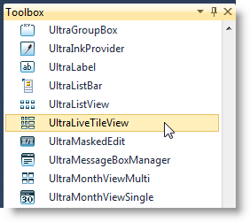

2. Use the controls `smart tag` (outlined in the screenshot) to drop down its task dialog window and click the “ *UltraLiveTileView Designer* ” link.

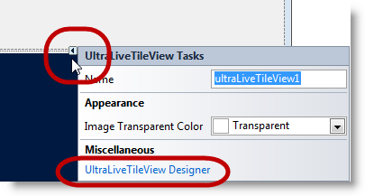

Alternatively, complete the step by right-clicking on the link:{ApiPlatform}win.ultrawinlivetileview{ApiVersion}~infragistics.win.ultrawinlivetileview.ultralivetileview_members.html[UltraLiveTileView] control and choosing the “ *UltraLiveTileView Designer* ” link.

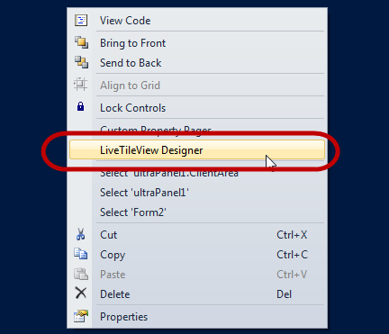

The designer windows opens up as follows:

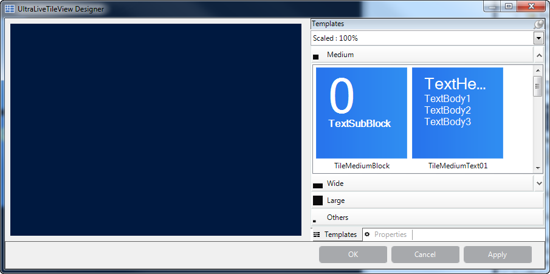

3. Observe the designer elements. The designer scaling drop-down allows scaling the tiles in their group area to see the different tiles while working with them.

.Note:
[NOTE]
====
the following screenshot display the Template view (outlined).
====

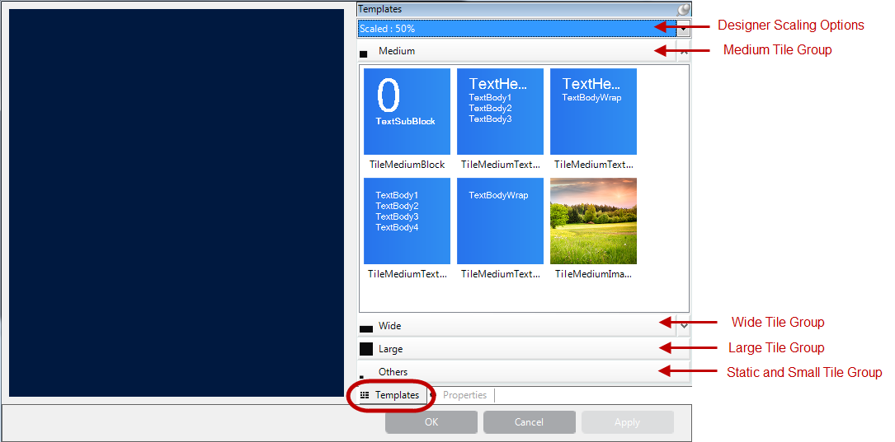

[[_Ref366271137]]
== Adding a Static Tile

=== Adding a static tile

1. Click on the  *Others*  group of templates to display the static templates. The static tiles come in two sizes; medium and small.

The small live tile, seen below the static templates, is the same size for all live tiles making it easiest to preview it here to be in one location.

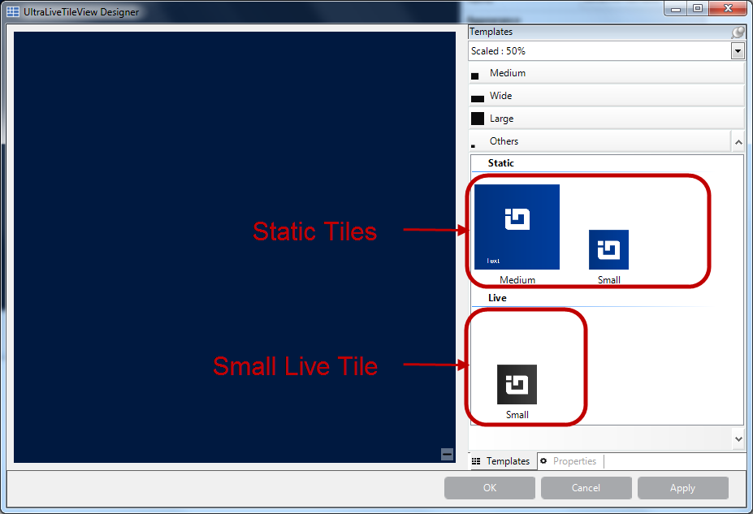

2. Drag the medium tile from the preview area to the control’s surface.

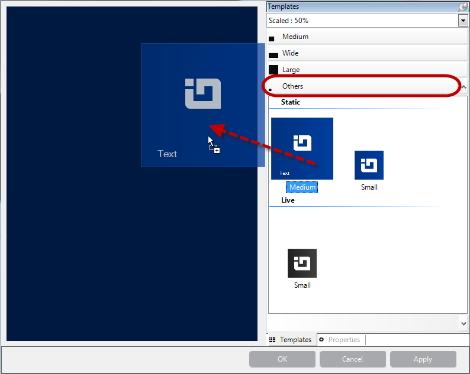

3. The result after dragging a tile.

Creates a uniquely keyed, automatically generated group . By default, the group name is editable and derives from the text. The images on tile templates are removed while dragging the tile from the preview area to the control’s surface. Those images are merely for previewing purposes.

image::images/Adding_WinLiveTileView_Using_the_Designer_8.png[]

4. Configure the tile by typing in text and adding an image from your image source. For adding an image, use the image property’s drop-down button with the ellipses (`…`).

Do the same for link:{ApiPlatform}win.ultrawinlivetileview{ApiVersion}~infragistics.win.ultrawinlivetileview.multiresolutionpropertyset`1~scale100percent.html[Scale100Percent], link:{ApiPlatform}win.ultrawinlivetileview{ApiVersion}~infragistics.win.ultrawinlivetileview.multiresolutionpropertyset`1~scale140percent.html[Scale140Percent], link:{ApiPlatform}win.ultrawinlivetileview{ApiVersion}~infragistics.win.ultrawinlivetileview.multiresolutionpropertyset`1~scale180percent.html[Scale180Percent] and link:{ApiPlatform}win.ultrawinlivetileview{ApiVersion}~infragistics.win.ultrawinlivetileview.multiresolutionpropertyset`1~scale80percent.html[Scale80Percent] thus allowing the tile images to display properly in any of the scaled views. For more about tile sizes, refer to link:winlivetileview-winlivetileview-control.html[WinLiveTileView Control] topic.

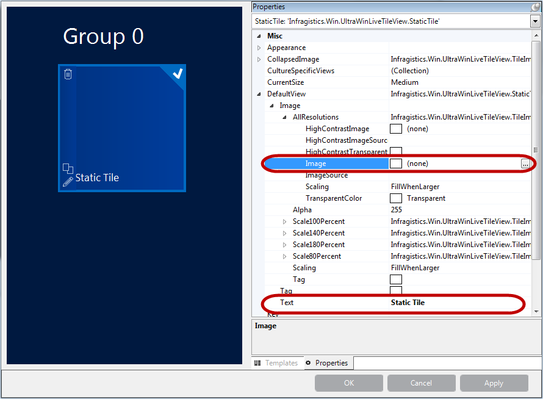

5. The resultant designer image. Optionally, run the application to verify the result.

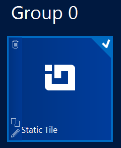

[[_Ref366261059]]
== Adding a Live Tile

=== Adding a live tile

1. Click on a tile template and drag it over the control’s surface (On Left).

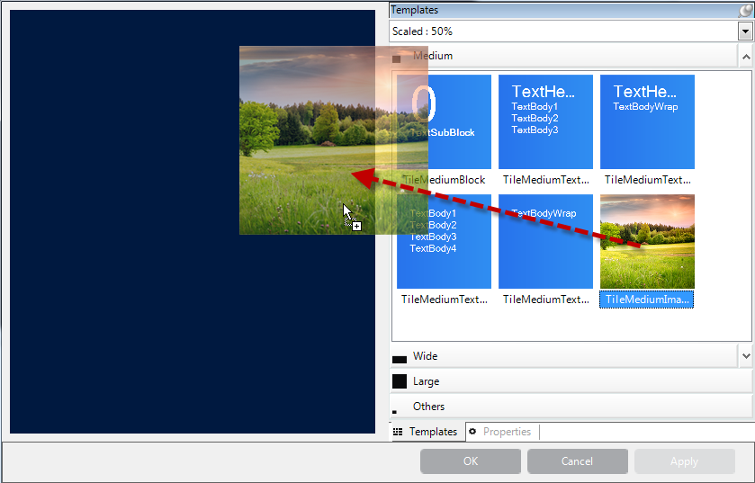

The following screenshot is the result of dragging a tile from the preview area to the control.

.Note:
[NOTE]
====
The tile template shown in the tile group does not transfer the image displayed in the preview area. The images are merely for previewing purposes.
====

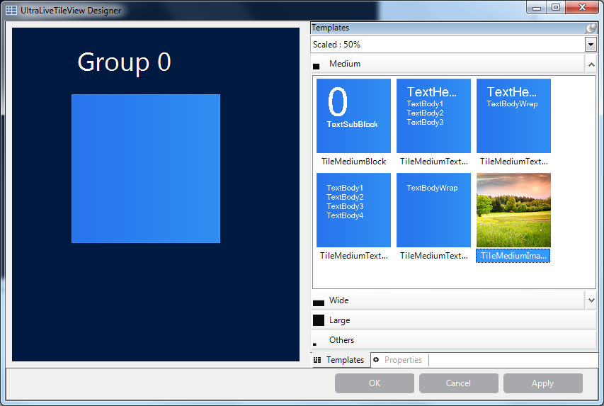

2. To make configuring quick and easy each tile has three buttons (`Delete`, `Duplicate` and `Edit`). Clicking on the tile displays the buttons on the left side of the tile. The buttons are hidden when the tile is unchecked.

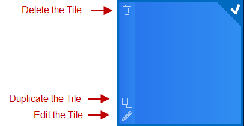

You can also `right-click` on the tile and select a configuration option.

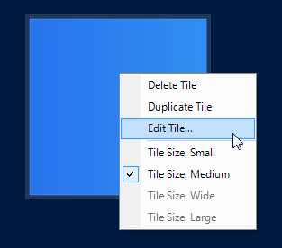

3. Select the “ *Edit Tile…* ” option or click the  *Edit*  button to open a tile configuration dialog window.

This window displays the different frame types (On Left) for the selected live tile and two image properties (Small and Collapsed). The reason for this property layout is to simplify configuration by dragging a template over to the frame’s layout, which then adds that template to the frame’s collection as the frame’s content.

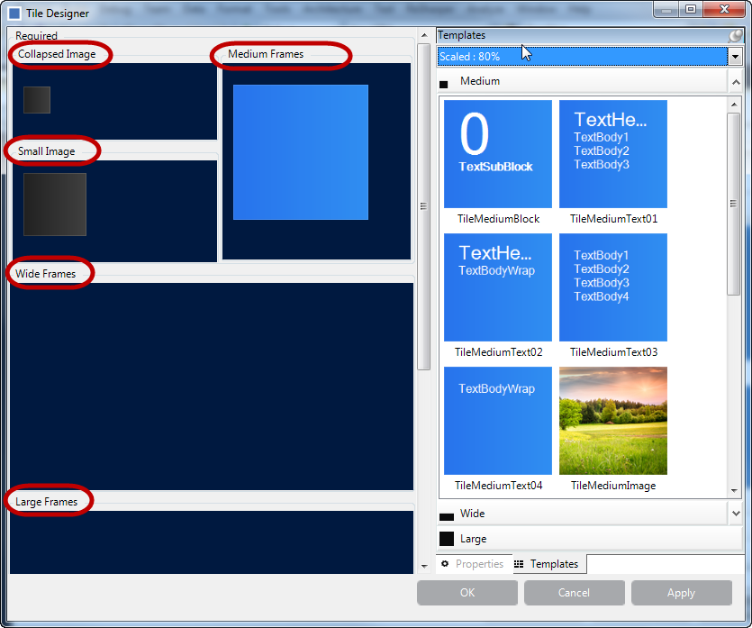

Click on a tile in the  *Medium Frames*  layout, and then click the  *Properties*  tab (On Right). It displays only the properties of that object. The benefit of doing this is that you do not have to look through all the control’s properties trying to find the medium frames object, the property grid will only display that object.

Each tile consists of set of properties, supporting different image resolutions, which you can inspect in the property grid (On Right).

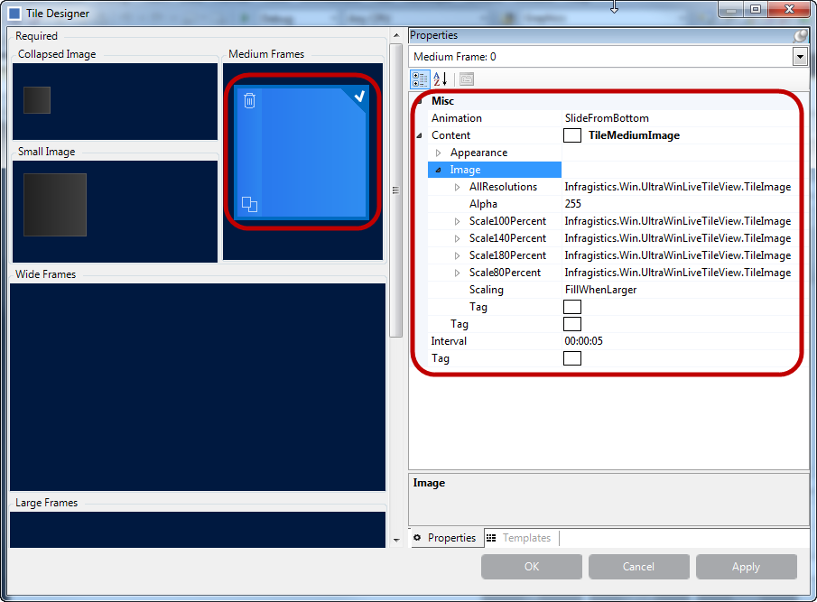

4. Expand the link:{ApiPlatform}win.ultrawinlivetileview{ApiVersion}~infragistics.win.ultrawinlivetileview.multiresolutiontileimageset~allresolutions.html[AllResolutions] property and click on the image property. This enables the ellipse button (`…`) allowing you to attach an image from your image source.

Do the same for link:{ApiPlatform}win.ultrawinlivetileview{ApiVersion}~infragistics.win.ultrawinlivetileview.multiresolutionpropertyset`1~scale100percent.html[Scale100Percent], link:{ApiPlatform}win.ultrawinlivetileview{ApiVersion}~infragistics.win.ultrawinlivetileview.multiresolutionpropertyset`1~scale140percent.html[Scale140Percent], link:{ApiPlatform}win.ultrawinlivetileview{ApiVersion}~infragistics.win.ultrawinlivetileview.multiresolutionpropertyset`1~scale180percent.html[Scale180Percent] and link:{ApiPlatform}win.ultrawinlivetileview{ApiVersion}~infragistics.win.ultrawinlivetileview.multiresolutionpropertyset`1~scale80percent.html[Scale80Percent] thus allowing the tile images to display properly in any of the scaled views.

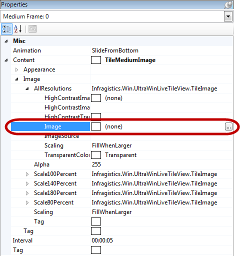

Repeat the previous step for wide and large frames, and add images for small and collapsed views.

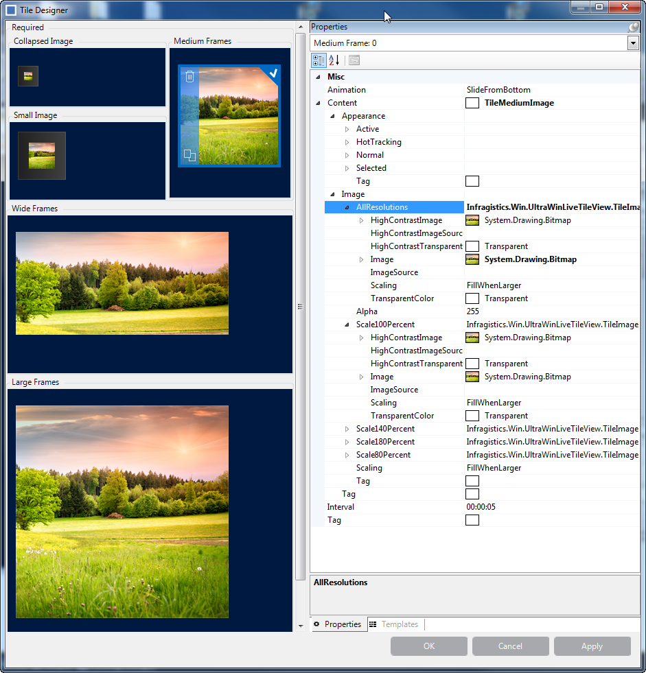

5. Click the  *Apply*  button on the designer window to save the tile configuration. Then click  *Ok*  to close the designer window. Optionally, run the application to verify the result including resizing to small, wide, large, and collapsed views.

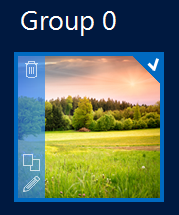

[[_Ref366271158]]
== Adding a Live Tile with Animation

=== Adding a live tile with animation

The procedure for adding live tiles with animation is the same as in <<_Ref366261059,Adding a Live Tile>>. The only difference is the additional frames in the collection.

Repeat  *Step3*  from <<_Ref366261059,Adding a Live Tile>> to add more frames to the  *Medium frames*  collection that will result in animating the frames. The animation runs by default when a live tile contains multiple frames.

Observe the following screenshot. It contains two frames with different contents. As soon as you add the second frame and save (click  *OK* ), you will see the animation in the designer window. The animation applies immediately.

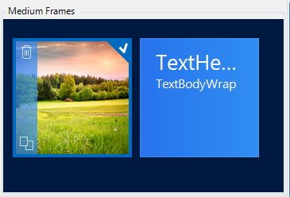

Another way to add frames is through the properties as illustrated in the following screenshot.

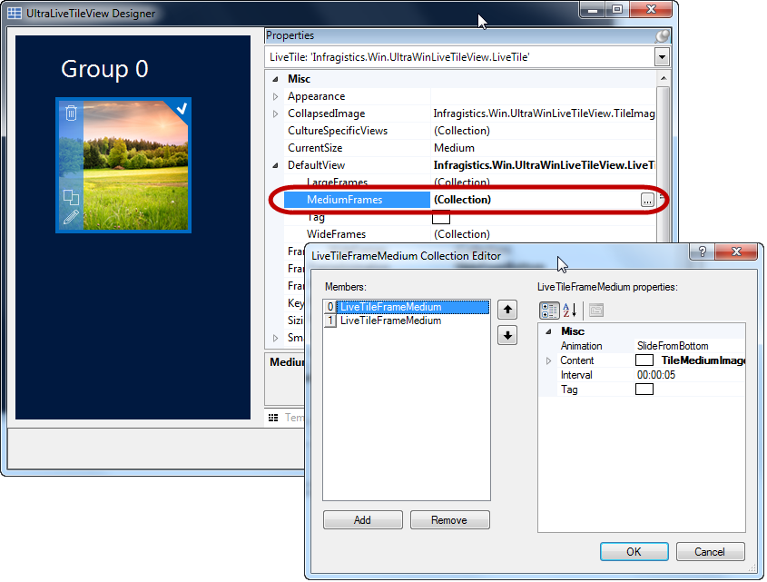

The animation feature’s key properties are link:{ApiPlatform}win.ultrawinlivetileview{ApiVersion}~infragistics.win.ultrawinlivetileview.livetileframe`1~animation.html[Animation] and link:{ApiPlatform}win.ultrawinlivetileview{ApiVersion}~infragistics.win.ultrawinlivetileview.livetileframe`1~interval.html[Interval] as pointed out with arrows below. By default, the interval is five seconds and the available animation options are:

* link:{ApiPlatform}win.ultrawinlivetileview{ApiVersion}~infragistics.win.ultrawinlivetileview.tileframeanimation.html[SlideFromTop]

* link:{ApiPlatform}win.ultrawinlivetileview{ApiVersion}~infragistics.win.ultrawinlivetileview.tileframeanimation.html[SlideFromLeft]

* link:{ApiPlatform}win.ultrawinlivetileview{ApiVersion}~infragistics.win.ultrawinlivetileview.tileframeanimation.html[SlideFromRight]

* link:{ApiPlatform}win.ultrawinlivetileview{ApiVersion}~infragistics.win.ultrawinlivetileview.tileframeanimation.html[SlideFromBottom] (Default)

* link:{ApiPlatform}win.ultrawinlivetileview{ApiVersion}~infragistics.win.ultrawinlivetileview.tileframeanimation.html[Fade]

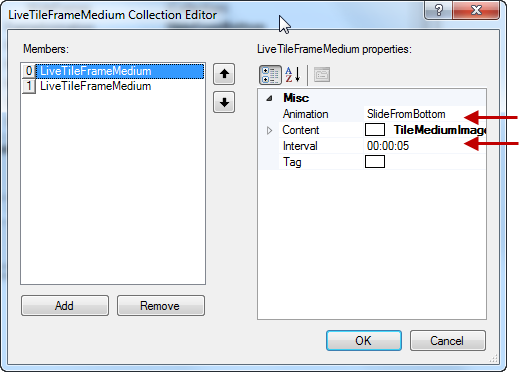

[[_Ref366271169]]
== Related Content

=== Topics

The following topics provide additional information related to this topic.

[options="header", cols="a,a"]
|====
|Topic|Purpose

| link:winlivetileview-adding-winlivetileview-in-code-behind.html[Adding WinLiveTileView in Code-Behind]
|This topic demonstrates how to add the _UltraLiveTileView_ control and tiles in code-behind.

| link:winlivetileview.html[WinLiveTileView]
|The topics in this group introduce the latest _UltraLivetileView_ control, along with instructions on its use and configuration. This control is similar to Microsoft 8 operating system’s tiles start screen.

|====