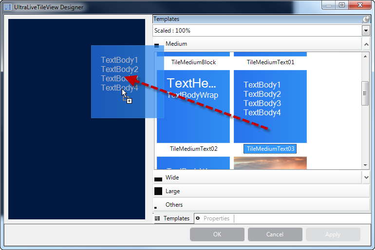
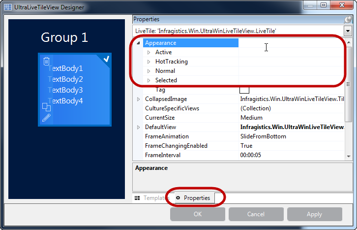
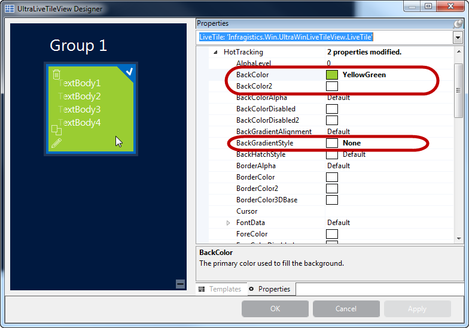
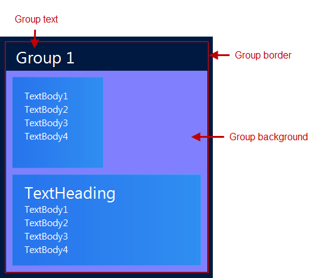
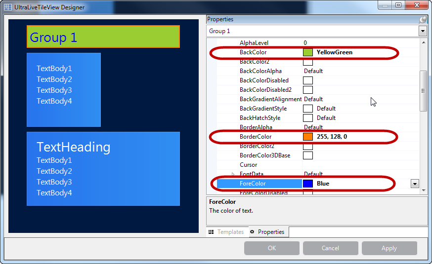
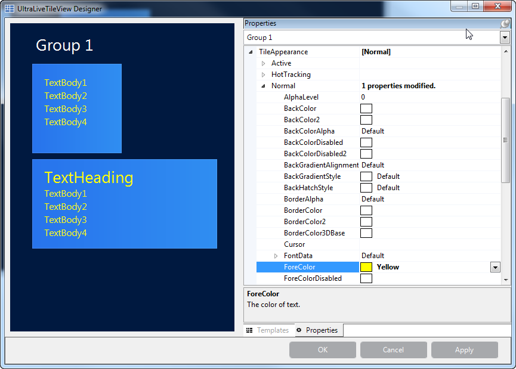

////

|metadata|
{
    "name": "winlivetileview-styling-winlivetileview",
    "controlName": [],
    "tags": [],
    "guid": "89c86f37-6b79-4117-b168-e74418ddc9a2",  
    "buildFlags": [],
    "createdOn": "2013-09-15T23:24:56.264524Z"
}
|metadata|
////

= Styling WinLiveTileView

== Topic Overview

=== Purpose

This topic demonstrates how to style the  _WinLiveTileView_™ control using the designer, in code-behind and  _AppStylist_  .

[[_Ref366515165]]

=== Required background

The following topic is required as a prerequisite to understanding this topic.

[options="header", cols="a,a"]
|====
|Topic|Purpose

| link:winlivetileview-adding-winlivetileview-using-the-designer.html[Adding WinLiveTileView Using the Designer]
|This topic demonstrates how to add the link:{ApiPlatform}win.ultrawinlivetileview{ApiVersion}~infragistics.win.ultrawinlivetileview.ultralivetileview_members.html[UltraLiveTileView] control and tiles using the designer interface.

|====

=== In this topic

This topic contains the following sections:

* <<_Ref366530222,Overview>>
* <<_Ref366530234,Styling the  _WinLiveTileView_  >>
** <<_Ref366530253,Styling tiles>>
** <<_Ref366530260,Code Example>>

* <<_Ref366530268,Styling the Groups>>
** <<_Ref366530288,Group appearance>>
** <<_Ref366530299,Group text appearance>>
** <<_Ref366530350,Group tile appearance>>

** <<_Ref366530365,Styling the  _WinLiveTileView_   Using the  _AppStylist_  >>

* <<_Ref366530400,Related Content>>

[[_Ref366530222]]
== Overview

=== Overview

The  _WinLiveTileView_   control provides different ways to style the appearances of the tiles and other visual elements.

The  _WinLiveTileView_   also supports  _AppStylist_   that you can use to create a style library file with desired styles for the elements and save it as a theme file for your  _WinLiveTileView_   control.

[[_Ref366530234]]
== Styling the  _WinLiveTileView_

[[_Ref366530253]]

=== Styling tiles

For using the  _WinLiveTileView_   designer, please refer to the <<_Ref366515165,Required background>> section before you continue, as this section assumes that you already familiar using the designer interface to create a tile.

Open the  _WinLiveTileView_  ’s designer and add a medium tile to the control layout.

Select the tile, click the  *Properties*  tab, and then expand the Appearance property in the property grid.

Each tile exposes the four `Appearance` properties outlined above:

[options="header", cols="a,a"]
|====
|Property|Description

|`Active`
|When a tile is active using the keyboard navigation (press *Ctrl* key, and use the arrow keys).

|`HotTracking`
|When moving the mouse pointer over the tile.

|`Normal`
|The tile displays without any additional user interactions.

|`Selected`
|When the tile is selected showing a checkmark on its upper-right corner.

|====

The following screenshot illustrates one of the appearance settings (HotTracking) as the others are similar.

.Note:
[NOTE]
====
If you are using a solid color, then either disable the `BackGradientStyle` and set only the `BackColor`, or set both `BackColor` and `BackColor2`, because the `BackGradientStyle` requires both.
====

[[_Ref366530260]]

=== Code example

The following code example demonstrates styling the tile’s background in code-behind by obtaining a reference of the group and the tile within that group.

*In C#:*

[source,csharp]
----
LiveTile liveTile = (LiveTile)ultraLiveTileView1.Groups[“Group 1”].Tiles[“mediumTile1”];
liveTile.Appearance.HotTracking.BackColor = Color.YellowGreen;
liveTile.Appearance.HotTracking.BackGradientStyle = GradientStyle.None;
----

*In Visual Basic:*

[source,vb]
----
Dim liveTile As LiveTile = DirectCast(ultraLiveTileView1.Groups(“Group 1”).Tiles(“mediumTile1”), LiveTile)
liveTile.Appearance.HotTracking.BackColor = Color.YellowGreen
liveTile.Appearance.HotTracking.BackGradientStyle = GradientStyle.None
----

[[_Ref366530268]]
== Styling the Groups

[[_Ref366530288]]

=== Group appearance

The  _WinLiveTileView_   groups expose a slightly different set of properties, including tile collections and capability to set style for all tiles within that group.

=== Code example

The following code example demonstrates styling the group appearance (`Border` and `BackColor`) in code-behind by obtaining a reference of the group with key.

*In C#:*

[source,csharp]
----
TileGroup tileGroup = (TileGroup) ultraLiveTileView1.Groups["Group 1"];
tileGroup.Appearance.Normal.BorderColor = Color.Red;
tileGroup.Appearance.Normal.BackGradientStyle = GradientStyle.None;
tileGroup.Appearance.Normal.BackColor = Color.FromArgb(128, 128, 255);
----

*In Visual Basic:*

[source,vb]
----
Dim tileGroup As TileGroup = DirectCast(ultraLiveTileView1.Groups("Group 1"), TileGroup)
tileGroup.Appearance.Normal.BorderColor = Color.Red
tileGroup.Appearance.Normal.BackGradientStyle = GradientStyle.None
tileGroup.Appearance.Normal.BackColor = Color.FromArgb(128, 128, 255)
----

[[_Ref366530299]]

=== Group text appearance

The following code example demonstrates styling the group text appearance (`Border` and `BackColor`) in code-behind by obtaining a reference of the group with key.

=== Code example

The following code example demonstrates styling the group text appearance (`Border`, `ForeColor` and `BackColor`) in code-behind by obtaining a reference of the group with key.

*In C#:*

[source,csharp]
----
TileGroup tileGroup = ultraLiveTileView1.Groups["Group 1"];
tileGroup.TextAreaAppearance.Normal.BackColor = Color.YellowGreen;
tileGroup.TextAreaAppearance.Normal.BorderColor = Color.Orange;
tileGroup.TextAreaAppearance.Normal.ForeColor = Color.Blue;
----

*In Visual Basic:*

[source,vb]
----
Dim tileGroup As TileGroup = ultraLiveTileView1.Groups("Group 1")
tileGroup.TextAreaAppearance.Normal.BackColor = Color.YellowGreen
tileGroup.TextAreaAppearance.Normal.BorderColor = Color.Orange
tileGroup.TextAreaAppearance.Normal.ForeColor = Color.Blue
----

[[_Ref366530350]]

=== Group tile appearance

The group contains a collection of tiles; consequently, changes made to setting the group’s tile appearance properties, apply to all tiles within that group.

=== Code example

The following code example demonstrates styling the group tile appearance (`ForeColor`) in code-behind by obtaining a reference of the group with key. This setting applies to all tiles in the group.

*In C#:*

[source,csharp]
----
TileGroup tileGroup = ultraLiveTileView1.Groups["Group 1"];
tileGroup.TileAppearance.Normal.ForeColor = Color.Yellow;
----

*In Visual Basic:*

[source,vb]
----
Dim tileGroup As TileGroup = ultraLiveTileView1.Groups("Group 1")
tileGroup.TileAppearance.Normal.ForeColor = Color.Yellow
----

[[_Ref366530365]]
== Styling  _WinLiveTileView_   Using the  _AppStylist_

=== Styling the WinLiveTileView using AppStylist

The  _WinLiveTileView_   component supports  _AppStylist_  , providing you with several styling option, such as using one of the pre-defined style library files; or one of the existing templates and customizing it with a different look; or even creating your own library file using the  _AppStylist_  .

For more information, please refer to the link:styling-guide-setting-up-your-application-for-styling.html[Setting Up Your Application for Styling] topic on how to create style library files with  _AppStylist_   for `LiveTileView` or any other  _Infragistics Windows Forms_   controls in general.

[[_Ref366530400]]
== Related Content

=== Topics

The following topics provide additional information related to this topic.

[options="header", cols="a,a"]
|====
|Topic|Purpose

| link:winlivetileview.html[WinLiveTileView]
|The topics in this group introduce the latest _WinLiveTileView_ control, along with instructions on its use and configuration. This control is similar to Microsoft 8 operating system’s tiles start screen.

|====