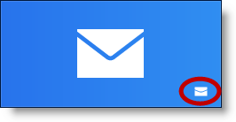

////

|metadata|
{
    "name": "winlivetileview-winlivetileview-control",
    "controlName": [],
    "tags": [],
    "guid": "89d6bdcd-9ab2-4fdf-be27-5257b84e68ea",  
    "buildFlags": [],
    "createdOn": "2013-09-15T23:48:01.9921205Z"
}
|metadata|
////

= WinLiveTileView Control

== Topic Overview

=== Purpose

This topic provides a conceptual overview of fully touch supported static and live tiles found in the new link:{ApiPlatform}win.ultrawinlivetileview{ApiVersion}~infragistics.win.ultrawinlivetileview.ultralivetileview_members.html[UltraLiveTileView]™ control along with their behaviors.

=== Prerequisites

The following topics are prerequisites to understanding this topic:

[options="header", cols="a,a"]
|====
|Topic|Purpose

| link:http://msdn.microsoft.com/en-us/library/windows/apps/hh779724.aspx[Tile and tile notification overview] (MSDN)
|This topic discusses the concepts and terminology surrounding app tiles, which are the Start screen tiles that represent and launch your app.

| link:http://msdn.microsoft.com/en-us/library/windows/apps/hh761491.aspx#live_tiles[The tile template catalog] (MSDN)
|This topic lists the tile templates available for use in a tile notification, with pictorial examples of each together with their XML content.

|====

=== In this topic

This topic contains the following sections:

* Introduction
* <<_Ref366493137, _WinLiveTileView_   Elements>>
** <<_Ref366218516,Tile groups>>
** <<_Ref366218533,Group names>>
** <<_Ref366218541,Application bar>>
** <<_Ref366218550,Collapse button>>

* <<_Ref366218563,Tile Templates>>
** <<_Ref366218575,Tiles sizes>>
** <<_Ref366218587,Tile Scales>>
** <<_Ref366218597,Tile Text sizes>>
** <<_Ref366218605,Tile Logo>>
** <<_Ref366493194,Tile badge>>
** <<_Ref366218627,Code example sending a badge notification>>

* <<_Ref366218635,Related Content>>

== Introduction

=== WinLiveTileView Introduction

The  _WinLiveTileView_   control emulates the  _look and feel_   of the Microsoft Windows 8 start screen fully supporting touch gestures such as panning, zooming, and press-and-hold.

Windows 8 places particular emphases on making applications look visually appealing across a wide range of pixel densities. Moreover, the  _WinLiveTileView_   provides mechanisms for encouraging these best practices and making them easier for developers.

There are over 50 different tile templates (although many of them are similar in their contents) containing different text and image combinations for content that can fit in an area that is usually about an inch square or 2” by 1” in the case of a wide tile.

The following screenshot illustrates the kind of results possible using the  _WinLiveTileView_   control.

image::images/WinLiveTileView_Control_1.png[]

[[_Ref366218505]]
[[_Ref366493137]]
== _WinLiveTileView_   Elements

[[_Ref366218516]]

=== Tile groups

Presented in groups, tiles can be dragged and dropped from one group to another. The groups are invisible when they are empty, meaning the group will not display its name or appearance unless it contains at least one tile in it. Tiles

[[_Ref366218533]]

=== Group names

A group is a container for tiles. The group name appears when its `Text` property is set. The group name is editable when in customize mode.

For example, right-clicking on the group name or on a control layout, the  *Customize*  button appears allowing customization of the group name element. Selecting a tile with a checkmark (right-click) also causes the  *Customize*  button to appear.

[[_Ref366218541]]

=== Application bar

Selecting one or more tiles causes the application bar to slide out from the bottom of the control.

.Note:
[NOTE]
====
Adds the selected tiles with the checkmark (right-click) to the control’s link:{ApiPlatform}win.ultrawinlivetileview{ApiVersion}~infragistics.win.ultrawinlivetileview.ultralivetileview~selectedtiles.html[SelectedTiles] collection.
====

The application bar displays icons based on a type of user interaction, for example:

1. Selecting a static tile with checkmark (right-click), causing the  *Resize*  icon to appear allowing you to resize the selected tile.

2. Selecting more than one tile with a checkmark (right-click) the “ *Clear selection”*  icon also appears allowing to clear all tile selections.

3. Selecting a live tile with checkmark (right-click), causes the “ *Turn Live tile on”*  icon to appear allowing you to toggle the animation of the selected live tiles On or Off.

4. By default the  *Customize*  button clears all selections and hides the application bar. This button also appears when the group name element is right-clicked allowing customizing the group name.

.Note:
[NOTE]
====
The  *Customize*  button can remove or replace all buttons.
====

[[_Ref366218550]]

=== Collapse button

Collapse button allows you to collapse and expand the entire view for all groups with tiles. If you have multiple groups that some of them are out of view, you may find it beneficial to collapse the view and click on a desired group to expand rather than scrolling to that group.

Collapsed view.

[[_Ref366218563]]
== Tile Templates

[[_Ref366218575]]

=== Tiles sizes

The Tiles come in `Small`, `Medium`, `Wide` and `Large` sizes and a wide range of templates. The actual pixel dimensions of a tile dependent on the user’s screen resolution and size for viewing the tile.

[options="header", cols="a,a,a"]
|====
|Tile|Screenshot|Size in pixels

|Small
|image::images/WinLiveTileView_Control_7.png[]
|70 x 70

|Medium
|image::images/WinLiveTileView_Control_8.png[]
|150 x 150

|Wide
|image::images/WinLiveTileView_Control_9.png[]
|310 x 150

|Large
|image::images/WinLiveTileView_Control_10.png[]
|310 x 310

|====

[[_Ref366218587]]

=== Tile Scales

Windows 8 determines the user’s screen resolution using one of the following four scales depending on which of these resolutions it most closely matches. When the screen resolution is low, the tile image displays the 120 X 120 or 248 X 120; when it is very high, the tile displays 270 X 270 or 558 X 270 allowing for consistency without affecting image quality.

[options="header", cols="a,a,a,a,a,a,a"]
|====
|Screen resolution|Scale|Small|Medium|Wide|Large|Spacing

|Low (less than 1366)
|80%
|56 X 56
|120 X 120
|248 X 120
|248 X 248
|8 pixels

|Normal (1366 X 768)
|100%
|70 X 70
|150 X 150
|310 X 150
|310 X 310
|10 pixels

|High Definition (1920 X 1080)
|140%
|98 X 98
|210 X 210
|434 X 210
|434 X 434
|14 pixels

|Quad XGA (2048 X 1536)
|180%
|126 X 126
|270 X 270
|558 X 270
|558 X 558
|18 pixels

|====

_WinLiveTileView_   provides similar mechanism for exposing image properties keyed by an enumeration identifying each of the four screen resolutions. By design, the control identifies the screen resolution and use the image targeted for that resolution. Alternately, the developer may specify a resolution-independent image, scaled for display at the resolutions for which no defined specific image.

[options="header", cols="a,a,a"]
|====
|Scale|Medium Tile|Property

|80%
|image::images/WinLiveTileView_Control_11.png[]
| link:{ApiPlatform}win.ultrawinlivetileview{ApiVersion}~infragistics.win.ultrawinlivetileview.multiresolutionpropertyset`1~scale80percent.html[Scale80Percent]

|100%
|image::images/WinLiveTileView_Control_12.png[]
| link:{ApiPlatform}win.ultrawinlivetileview{ApiVersion}~infragistics.win.ultrawinlivetileview.multiresolutionpropertyset`1~scale100percent.html[Scale100Percent]

|140%
|image::images/WinLiveTileView_Control_13.png[]
| link:{ApiPlatform}win.ultrawinlivetileview{ApiVersion}~infragistics.win.ultrawinlivetileview.multiresolutionpropertyset`1~scale140percent.html[Scale140Percent]

|180%
|image::images/WinLiveTileView_Control_14.png[]
| link:{ApiPlatform}win.ultrawinlivetileview{ApiVersion}~infragistics.win.ultrawinlivetileview.multiresolutionpropertyset`1~scale180percent.html[Scale180Percent]

|====

.Note:
[NOTE]
====
link:{ApiPlatform}win.ultrawinlivetileview{ApiVersion}~infragistics.win.ultrawinlivetileview.ultralivetileview_members.html[UltraLiveTileView] exposes properties for high-contrast color schemes, so that the developer can specify different images when the user is running in high-contrast mode. Similar determining the scaling by screen resolution, the control determines whether the user is running in high-contrast mode, and uses the appropriate image set accordingly.
====

[[_Ref366218597]]

=== Tile Text sizes

A tile supports four different text sizes `Block`, `Heading`, `Normal`, and `Small` (in descending order of size).

.Note:
[NOTE]
====
By default, the small text is not displayed on any tile. The live tiles expose a property called “Logo” that allows setting a small text for a tile.
====

[[_Ref366218605]]

=== Tile Logo

Live tiles expose a property called “Logo” for a short name or a small icon to display in the lower left corner of the tile, for example:

`_tile.Logo.ShortName` `= "IG";`

`_tile.Logo.Image.Image` `= // your image`

[[_Ref366493194]]

=== Tile badge

A “Badge” is a small informative icon displayed on the tile’s lower right corner and used as a reminder, alert, or for any other purpose that requires the user’s attention.

The following code example demonstrates sending a badge notification to an existing tile with a “New message” icon, and displaying it for five seconds.

*In C#:*

[source,csharp]
----
_tile.SendBadgeNotification(TileBadgeGlyph.NewMessage, TimeSpan.FromSeconds(5));
----

*In Visual Basic:*

[source,vb]
----
_tile.SendBadgeNotification(TileBadgeGlyph.NewMessage, TimeSpan.FromSeconds(5))
----

[[_Ref366218627]]

=== Code example sending a badge notification

Complete code used in implementing the badge sending notification example.

*In C#:*

[source,csharp]
----
private TileGroup _tileGroup;
// Add a Group
private void Form1Load(object sender, EventArgs e)
{
    _tileGroup = ultraLiveTileView1.Groups.Add("Group1");
    AddlLiveTile();
}
// Send a badge notification
private void UltraButton1Click(object sender, EventArgs e)
{
    var tile = (LiveTile)_tileGroup.Tiles["W1"];
    if (tile == null)
        return;
    _tile.SendBadgeNotification(TileBadgeGlyph.NewMessage, TimeSpan.FromSeconds(5));
}
// Adding a live tile
public void AddlLiveTile()
{
    _tile = _tileGroup.Tiles.AddLiveTile("W1");
    _tile.CurrentSize = TileSize.Wide;
    _tileView = _tile.DefaultView;
    LiveTileFrameWide frame = _tileView.WideFrames.Add();
    var content = new TileWideImage();
    content.Image.AllResolutions.Image = // your image path
    frame.Content = content;
}
----

*In Visual Basic:*

[source,vb]
----
Private _tileGroup As TileGroup
' Add a Group
Private Sub Form1Load(sender As Object, e As EventArgs)
      _tileGroup = ultraLiveTileView1.Groups.Add("Group1")
      AddlLiveTile()
End Sub
' Send a badge notification
Private Sub UltraButton1Click(sender As Object, e As EventArgs)
      Dim tile = DirectCast(_tileGroup.Tiles("W1"), LiveTile)
      If tile Is Nothing Then
            Return
      End If
      _tile.SendBadgeNotification(TileBadgeGlyph.NewMessage, TimeSpan.FromSeconds(5))
End Sub
‘ Adding a live tile
Public Sub AddlLiveTile()
      _tile = _tileGroup.Tiles.AddLiveTile(“W1”)
      _tile.CurrentSize = TileSize.Wide
      _tileView = _tile.DefaultView
      Dim frame As LiveTileFrameWide = _tileView.WideFrames.Add()
      Dim content = New TileWideImage()
      content.Image.AllResolutions.Image = ‘ your image path
      frame.Content = content
End Sub
----

[[_Ref366218635]]
== Related Content

=== Topics

The following topics provide additional information related to this topic.

[options="header", cols="a,a"]
|====
|Topic|Purpose

| link:winlivetileview-using-winlivetileview.html[Using WinLiveTileView]
|The topics in this group introduce the latest _UltraLiveTileView_ control including steps on how to create and configure individual tiles using the designer and code behind.

| link:winlivetileview-styling-winlivetileview.html[Styling WinLiveTileView]
|This topic demonstrates how to style the _UltraLiveTileView_ control using the designer, in code-behind and _AppStylist_ .

| link:winlivetileview-winlivetileview-localization.html[WinLiveTileView Localization]
|This topic demonstrates how to configure the _UltraLiveTileView_ localization.

|====