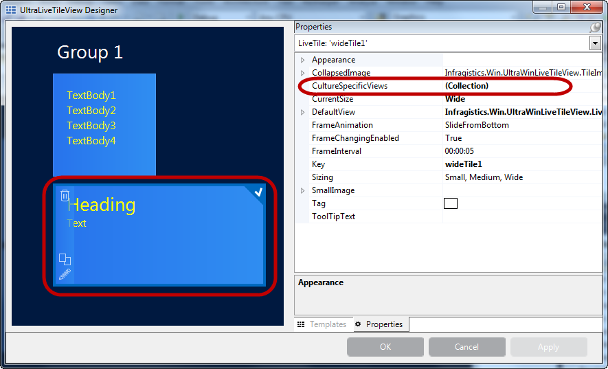
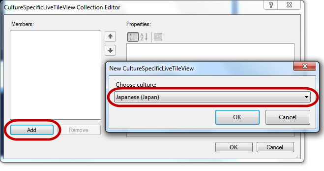
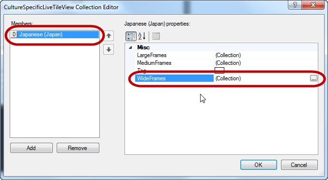
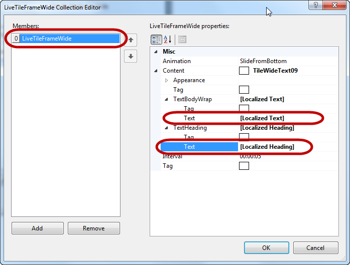
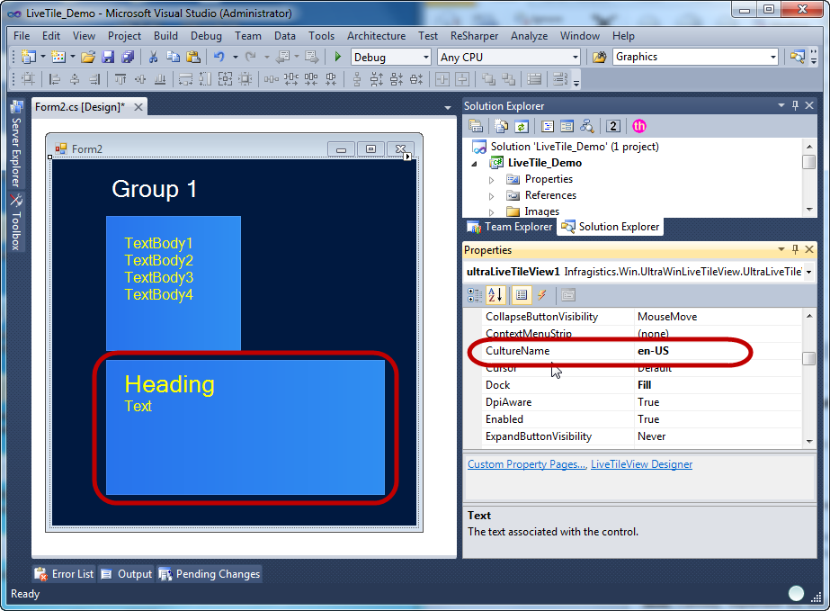
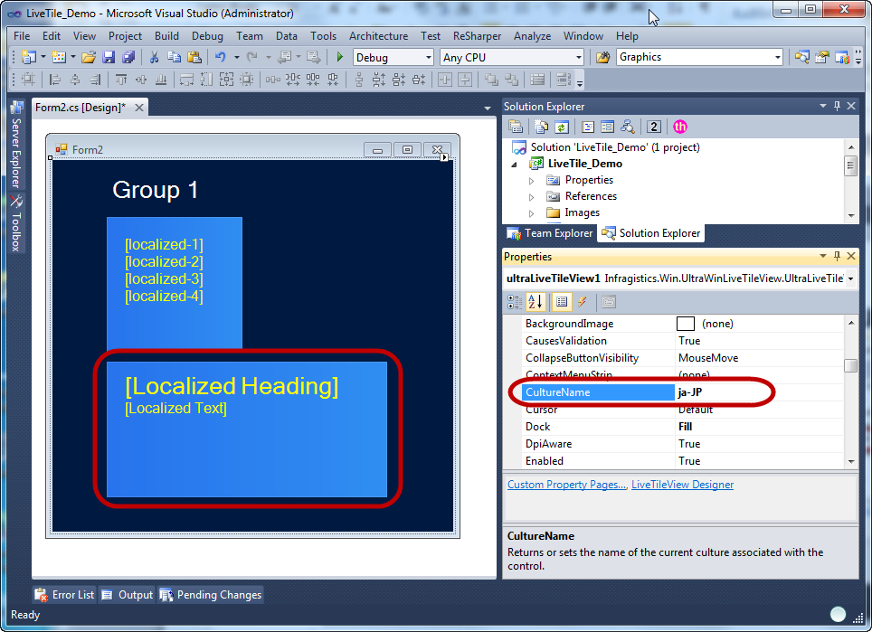

////

|metadata|
{
    "name": "winlivetileview-winlivetileview-localization",
    "controlName": [],
    "tags": [],
    "guid": "97884b1f-6792-45e2-a7ab-a36b526a8e5c",  
    "buildFlags": [],
    "createdOn": "2013-09-15T23:23:58.6147596Z"
}
|metadata|
////

= WinLiveTileView Localization

== Topic Overview

=== Purpose

This topic demonstrates how to configure the  _WinLiveTileView_™ control's localization.

=== In this topic

This topic contains the following sections:

* <<_Ref366569641,Overview>>
* <<_Ref366569648,Configuring the Localization Using the Designer>>
** <<_Ref366569670,Introduction>>
** <<_Ref366569677,Steps>>

* <<_Ref366569683,Configuring the Localization in Code-Behind>>
** <<_Ref366569689,Code example>>

* <<_Ref366365606,Related Content>>

[[_Ref366569641]]
== Overview

=== Overview

Another key aspect of the Windows8 tile paradigm deals with the localization. The XML schema for Windows8 tile notifications recognizes a “`lang`” attribute, to which a language code can be assigned. This controls which language the tile text is displayed for. For example, specifying “`fr-FR`” for one string and “`ja-JP`” for another, results in a different string being displayed for the French and Japanese language.

Windows8 also applies this methodology to images, so that a different image can be displayed for different language as well.

_WinLiveTileView_   provides a similar mechanism via a keyed collection which stores tile content with a reference to the language to which it applies. This makes localization of tile content simple and straightforward, eliminating the need for maintaining resource files for each language.

[[_Ref366569648]]
== Configuring the Localization Using the Designer

[[_Ref366569670]]

=== Introduction

To configure the localization you need to create individual views for the language, and add them to live tile’s link:{ApiPlatform}win.ultrawinlivetileview{ApiVersion}~infragistics.win.ultrawinlivetileview.livetile~culturespecificviews.html[CultureSpecificViews] collection. In this collection the culture name is the key. The link:{ApiPlatform}win.ultrawinlivetileview{ApiVersion}~infragistics.win.ultrawinlivetileview.ultralivetileview_members.html[UltraLiveTileView] reads this table against the current culture, and displays the appropriate text and images accordingly.

The following sections illustrate the steps to configuring a culture specific text.

[[_Ref366569677]]

=== Steps

1. Click on the tile and select link:{ApiPlatform}win.ultrawinlivetileview{ApiVersion}~infragistics.win.ultrawinlivetileview.livetile~culturespecificviews.html[CultureSpecificViews] using the  *Properties*  grid.

2. The `CultureSpecificView` prompts another dialog window to add a culture code from a drop-down list of available localizable cultures.

3. After selecting and adding a culture code, a frame must now be added. The available frames for live tiles are `Medium`, `Wide` and `Large`. This example uses the wide frame and, depending on a template, the frame content may contain text, images or combination of both.

4. Frames are added the same way as for non-localized contents. The difference is that these settings take effect when the culture-specific code matched the local culture. In this example we used “`ja-JP`” to represent Japanese culture and a different text within square brackets […] for demonstration purposes.

5. At this point the `culture-specific` setting is complete; however as you can see in the following screenshot the text on the tile is not localized. This is because the current culture is still English, it does not match with the Japanese code “`ja-JP`”.

6. Change the current link:{ApiPlatform}win.ultrawinlivetileview{ApiVersion}~infragistics.win.ultrawinlivetileview.culturespecificlivetileview~culturename.html[CultureName] to “`ja-JP`”, or you can also use your computer’s regional settings to change the culture, resulting in this result.

[[_Ref366365518]]
[[_Ref366569683]]
== Configuring the Localization in Code-Behind

[[_Ref366569689]]

=== Code example

The following code example demonstrates setting the localization in code behind.

*In C#:*

[source,csharp]
----
// Create an instance referencing an existing tile.
LiveTile liveTile = (LiveTile)ultraLiveTileView1.Groups["Group 1"].Tiles["wideTile1"];
// Create an instance of a culture-specific tile view.
CultureSpecificLiveTileView cultureSpecificLiveTile = new CultureSpecificLiveTileView("ja-JP");
// Add the culture-specific view to the tile's collection.
liveTile.CultureSpecificViews.Add(cultureSpecificLiveTile);
// Create a frame and add to the tiles's collecion
LiveTileFrameWide frame = cultureSpecificLiveTile.WideFrames.Add();
// Create a content (template) and set with localized text.
TileWideText09 content = new TileWideText09();
content.TextHeading.Text = "[Localized Heading]";
content.TextBodyWrap.Text = "[Localized Text]";
// Add the content to the frame
frame.Content = content;
// Change the current culture name for Japanese culture "ja-JP"
ultraLiveTileView1.CultureName = "ja-JP";
----

*In Visual Basic:*

[source,vb]
----
' Create an instance referencing an existing tile.
Dim liveTile As LiveTile = DirectCast(ultraLiveTileView1.Groups("Group 1").Tiles("wideTile1"), LiveTile)
' Create an instance of a culture-specific tile view.
Dim cultureSpecificLiveTile As New CultureSpecificLiveTileView("ja-JP")
' Add the culture-specific view to the tile's collection.
liveTile.CultureSpecificViews.Add(cultureSpecificLiveTile)
' Create a frame and add to the tiles's collecion
Dim frame As LiveTileFrameWide = cultureSpecificLiveTile.WideFrames.Add()
' Create a content (template) and set with localized text.
Dim content As New TileWideText09()
content.TextHeading.Text = "[Localized Heading]"
content.TextBodyWrap.Text = "[Localized Text]"
' Add the content to the frame
frame.Content = content
' Change the current culture name for Japanese culture "ja-JP"
ultraLiveTileView1.CultureName = "ja-JP"
----

Optionally, run the application to verify the final result.

[[_Ref366365606]]
== Related Content

=== Topics

The following topics provide additional information related to this topic.

[options="header", cols="a,a"]
|====
|Topic|Purpose

| link:winlivetileview.html[WinLiveTileView]
|The topics in this group introduce the latest _WinLivetileView_ control, along with instructions on its use and configuration. This control is similar to Microsoft 8 operating system’s tiles start screen.

|====