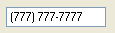

////

|metadata|
{
    "name": "winmaskededit-about-winmaskededit",
    "controlName": ["WinMaskedEdit"],
    "tags": ["Getting Started"],
    "guid": "{19038547-8C2F-48A9-AFBF-2DFD75C522C1}",  
    "buildFlags": [],
    "createdOn": "0001-01-01T00:00:00Z"
}
|metadata|
////

= About WinMaskedEdit

WinMaskedEdit™ is a Windows Forms control that provides extensive and customizable input masking in a Windows form.

* Appearance Support -- Full appearance support including alpha-blending, gradients, images, etc.
* Mask Input -- A customized input mask can be used so that you can control which format is assigned to the data that your end user enters in the form.

