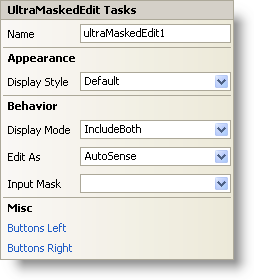

////

|metadata|
{
    "name": "winmaskededit-smart-tag",
    "controlName": ["WinMaskedEdit"],
    "tags": ["Getting Started"],
    "guid": "{DDD628A2-1EC0-4FAC-A7AF-D4FC7F92022A}",  
    "buildFlags": [],
    "createdOn": "2005-11-11T00:00:00Z"
}
|metadata|
////

= WinMaskedEdit Smart Tag

In Visual Studio 2005 (.NET Framework 2.0), each Infragistics Windows Forms control/component is equipped with a Smart Tag. By simply selecting the control/component, a Smart Tag anchor appears. When you click this anchor, a pop-up panel appears, providing you with quick and easy access to the most common properties and settings of the control/component.

The WinMaskedEdit™ Smart Tag contains the name of the control, as well as the following sections:

* Appearance -- Provides common tasks involving the appearance, look, and feel of the control.
* Behavior -- Provides easy access to properties that govern how the control behaves on the form.
* Misc -- Provides various options that will enhance the overall look or performance of the control.

See below for a description of the item (e.g., field, drop-down list, checkbox) in each section, as well as the item's corresponding property in the properties grid.

[options="header", cols="a,a,a"]
|====
|Appearance|Description|Corresponding Property

|Display Style
|Change the style of the WinMaskedEdit to make it look like Office 2000, Office XP, Office 2003, Visual Studio 2005, Office 2007.
| pick:[win-forms="link:infragistics4.win.ultrawinmaskededit.v{ProductVersion}~infragistics.win.ultrawinmaskededit.ultramaskededit~displaystyle.html[DisplayStyle]"] 

|====

[options="header", cols="a,a,a"]
|====
|Behavior|Description|Corresponding Property

|Display Mode
|This option determines how the mask is applied when the control is not in edit mode.
| pick:[win-forms="link:infragistics4.win.ultrawinmaskededit.v{ProductVersion}~infragistics.win.ultrawinmaskededit.ultramaskededit~displaymode.html[DisplayMode]"] 

|Edit As
|Specify which type of mask to use. Choose from currency, date, integer, double, and several others. Selecting AutoSense will let the control decide based on user input.
| pick:[win-forms="link:infragistics4.win.ultrawinmaskededit.v{ProductVersion}~infragistics.win.ultrawinmaskededit.ultramaskededit~editas.html[EditAs]"] 

|Input Mask
|This sets the input mask used by the editor.
| pick:[win-forms="link:infragistics4.win.ultrawinmaskededit.v{ProductVersion}~infragistics.win.ultrawinmaskededit.ultramaskededit~inputmask.html[InputMask]"] 

|====

[options="header", cols="a,a,a"]
|====
|Misc|Description|Corresponding Property

|Buttons Left
|Click the ellipsis (...) to open the ButtonsLeft collection. This is a collection of custom buttons that can be placed on the left of the editor.
| pick:[win-forms="link:infragistics4.win.v{ProductVersion}~infragistics.win.ultrawineditors.editorbuttoncontrolbase~buttonsleft.html[ButtonsLeft]"] 

|Buttons Right
|Click the ellipsis (...) to open the ButtonsRight collection. This is a collection of custom buttons that can be placed on the right of the editor.
| pick:[win-forms="link:infragistics4.win.v{ProductVersion}~infragistics.win.ultrawineditors.editorbuttoncontrolbase~buttonsright.html[ButtonsRight]"] 

|====