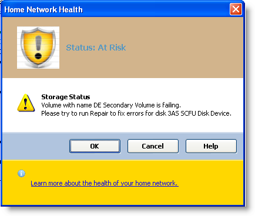

////

|metadata|
{
    "name": "winmessageboxmanager-working-with-winmessageboxmanager",
    "controlName": ["WinMessageBoxManager"],
    "tags": ["Getting Started","How Do I"],
    "guid": "{3A575438-9E26-452C-A3CD-43441B41699A}",  
    "buildFlags": [],
    "createdOn": "0001-01-01T00:00:00Z"
}
|metadata|
////

= Working with WinMessageBoxManager

The WinMessageBoxManager™ component can be used to show a message box that can contain text, buttons and symbols to inform and instruct the user. You can format each section of the MessageBoxManager, such as the header, the content area and the footer.

The following example code shows you the customization options available with this component.

This topic assumes that you have an UltraMessageBoxManager component and an ImageList dropped onto the component tray. For this example the ImageList is populated with two sample images: a security warning icon and an information icon. Drop a button onto your form and write the following code in the button’s click event.

*In Visual Basic:*

----
Dim messageinfo As New UltraMessageBoxInfo()
messageinfo.Style = MessageBoxStyle.Vista 
messageinfo.Buttons = MessageBoxButtons.OKCancel 
messageinfo.Icon = MessageBoxIcon. Error
' Set the Button that is selected by default
messageinfo.DefaultButton = MessageBoxDefaultButton.Button1 
messageinfo.ButtonAppearance.FontData.Bold = DefaultableBoolean.True
messageinfo.ButtonAreaAppearance.BackColor = Color.LightSteelBlue
' Caption 
Dim captionmsg As String = "Home Network Health"
messageinfo.Caption = captionmsg 
' Header 
messageinfo.HeaderAppearance.BackColor = Color.Tan 
messageinfo.HeaderAppearance.Image = Me.imageList1.Images(0) 
Dim headermsg As String = " Status: At Risk"
messageinfo.Header = headermsg 
' Content Area 
Dim contentmsg As String = " Storage Status  Volume with name DE Secondary Volume is failing. Please try to run Repair to fix errors for disk 3AS SCFU Disk Device."
messageinfo.TextFormatted = contentmsg 
' Help Button 
messageinfo.ShowHelpButton = DefaultableBoolean.[True] 
Dim helpmsg As String = " http://www.infragistics.com"
Dim helpinfo As New HelpInfo(helpmsg, HelpNavigator.Index)
messageinfo.HelpInfo = helpinfo 
' Footer 
messageinfo.FooterAppearance.BackColor = Color.Gold 
messageinfo.HeaderAppearance.Image = Me.imageList1.Images(1) 
Dim footermsg As String = " <a href = 'www.infragistics.com'>Learn more about the health of your home network.</a>"
messageinfo.FooterFormatted = footermsg 
' Aligns the buttons to the right 
Me.ultraMessageBoxManager1.ButtonAlignment = HAlign.Right 
Me.ultraMessageBoxManager1.ShowMessageBox(messageinfo)
----

*In C#:*

----
UltraMessageBoxInfo messageinfo = new UltraMessageBoxInfo();
messageinfo.Style = MessageBoxStyle.Vista;
messageinfo.Buttons = MessageBoxButtons.OKCancel;
messageinfo.Icon = MessageBoxIcon. Error;
// Set the Button to be selected by default
messageinfo.DefaultButton = MessageBoxDefaultButton.Button1;
messageinfo.ButtonAppearance.FontData.Bold = DefaultableBoolean.True;
messageinfo.ButtonAreaAppearance.BackColor = Color.LightSteelBlue;
// Caption
string captionmsg = "Home Network Health";
messageinfo.Caption = captionmsg;
// Header
messageinfo.HeaderAppearance.BackColor = Color.Tan;
messageinfo.HeaderAppearance.Image = this.imageList1.Images[0];
string headermsg = " Status: At Risk";
messageinfo.Header = headermsg;
// Content Area
string contentmsg = " Storage Status  Volume with name DE Secondary Volume is failing. Please try to run Repair to fix errors for disk 3AS SCFU Disk Device.";
messageinfo.TextFormatted = contentmsg;
// Help Button
messageinfo.ShowHelpButton = DefaultableBoolean.True;
string helpmsg = "http://www.infragistics.com";
HelpInfo helpinfo = new HelpInfo(helpmsg, HelpNavigator.Index);
messageinfo.HelpInfo = helpinfo;
// Footer
messageinfo.FooterAppearance.BackColor = Color.Gold;
messageinfo.HeaderAppearance.Image = this.imageList1.Images[1];
string footermsg = " <a href ='www.infragistics.com'>Learn more about the health of your home network.</a>";
messageinfo.FooterFormatted = footermsg;
// Aligns the buttons to the right
this.ultraMessageBoxManager1.ButtonAlignment = HAlign.Right;
this.ultraMessageBoxManager1.ShowMessageBox(messageinfo);
----

