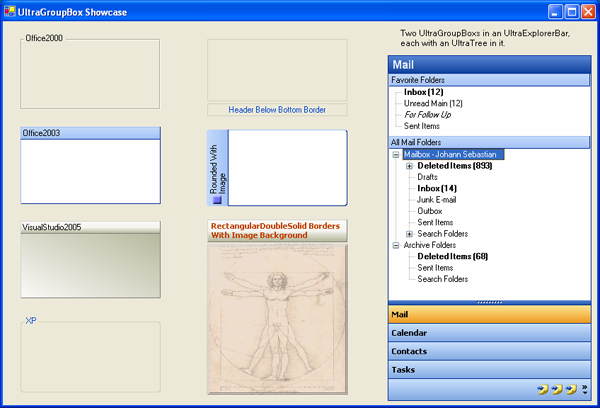

////

|metadata|
{
    "name": "winmisc-whats-new-2005-1",
    "controlName": [],
    "tags": [],
    "guid": "{C7613E12-5C65-4759-B2B6-48DC466E5B46}",  
    "buildFlags": [],
    "createdOn": "0001-01-01T00:00:00Z"
}
|metadata|
////

= WinMisc 2005.1

== UltraGroupBox and UltraExpandableGroupBox

Both of the new GroupBox controls have the ability to show a header which includes a caption, image, and expansion indicator (only in the WinExpandableGroupBox™). The UltraExpandableGroupBox is collapsible, which means that its content area can be hidden from view. When the control is collapsed, all of its child controls will be hidden and the control's size will decrease to the size of its header.

The following picture shows the UltraExpandableGroupBox using the Office2003 ViewStyle in both the expanded and collapsed state. For more information, see link:wngroupbox-changing-the-style-and-appearance-of-wingroupbox.html[Changing the Style and Appearance of WinGroupBox] and link:winexpandablegroupbox-changing-the-style-and-appearance-of-winexpandablegroupbox.html[Changing the Style and Appearance of WinExpandableGroupBox].

== UltraPrintPreview And UltraPrintPreviewThumbnail

The WinPrintPreviewControl™ includes a superset of the functionality of the .NET PrintPreviewControl. The WinPrintPreviewThumbnail™ control is used in conjunction with the UltraPrintPreviewControl to provide a thumbnail view of the generated pages similar to the thumbnails you might see in Microsoft Word or Adobe Acrobat.

== UltraPrintPreviewDialog

The WinPrintPreviewDialog™ is a component that utilizes the new UltraPrintPreviewControl and UltraPrintPreviewThumbnail controls along with the WinToolbarsManager™ and WinStatusBar™ to provide a Microsoft Office style print preview dialog. This component exists in a separate assembly (Infragistics.Win.UltraWinPrintPreviewDialog.v{ProductVersion}).

== Related Topics

link:winprintpreviewdialog-winscheduleprintdocument-using-winprintpreviewdialog-with-winscheduleprintdocument.html[Using WinPrintPreviewDialog with WinSchedulePrintDocument]

link:winprintpreviewdialog-wingridprintdocument-using-winprintpreviewdialog-with-wingridprintdocument.html[Using WinPrintPreviewDialog with WinGridPrintDocument]