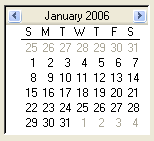

////

|metadata|
{
    "name": "winmonthviewmulti-about-winmonthviewmulti",
    "controlName": ["WinMonthViewMulti"],
    "tags": ["Getting Started"],
    "guid": "{DB10D99F-3E65-4D28-BA32-A17E4DC8F970}",  
    "buildFlags": [],
    "createdOn": "0001-01-01T00:00:00Z"
}
|metadata|
////

= About WinMonthViewMulti

WinMonthViewMulti™ control displays several months all at one time. The following is a list of the functionalities available in WinMonthViewMulti:

* Viewing -- Allows end users to view appointments, notes, owners, and other items over a multi-month time span.
* Appearance Support -- Full appearance support including alpha-blending, gradients, images. Some appearances can be set at the control level, the others are set using the WinCalendarLook component.
* Built-in Theming -- Supports Standard, Office 2003, Visual Studio 2005 and Office 2007 themes via the WinCalendarLook component.

