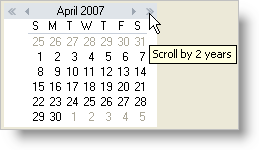

////

|metadata|
{
    "name": "winmonthviewmulti-display-the-year-scroll-buttons",
    "controlName": ["WinMonthViewMulti"],
    "tags": ["How Do I"],
    "guid": "{663B1492-A9A7-4FC3-B90B-F66BD5C75F46}",  
    "buildFlags": [],
    "createdOn": "0001-01-01T00:00:00Z"
}
|metadata|
////

= Display the Year Scroll Buttons

Adding year scroll buttons to your WinMonthViewMulti™ is a simple property change. By default, the year scroll buttons are hidden; all that is displayed is the month scroll buttons. By setting the  pick:[win-forms="link:{ApiPlatform}win.ultrawinschedule{ApiVersion}~infragistics.win.ultrawinschedule.ultramonthviewmultibase~yearscrollbuttonsvisible.html[YearScrollButtonsVisible]"]  property to True, the year scroll buttons will appear on the outside edge of the month scroll buttons. You can also change how many years are scrolled when the end user clicks the year scroll buttons by setting the  pick:[win-forms="link:{ApiPlatform}win.ultrawinschedule{ApiVersion}~infragistics.win.ultrawinschedule.ultramonthviewmultibase~yearscrollchange.html[YearScrollChange]"]  property.

The following code forces the year scroll buttons to display, while each click of the buttons will scroll two years.

*In Visual Basic:*

----
Imports Infragistics.Win
...
' Show the year scroll buttons.
Me.UltraMonthViewMulti1.YearScrollButtonsVisible = DefaultableBoolean.True
' Each click of the year scroll buttons will scroll 2 years.
Me.UltraMonthViewMulti1.YearScrollChange = 2
----

*In C#:*

----
using Infragistics.Win;
...
// Show the year scroll buttons.
this.ultraMonthViewMulti1.YearScrollButtonsVisible = DefaultableBoolean.True;
// Each click of the year scroll buttons will scroll 2 years.
this.ultraMonthViewMulti1.YearScrollChange = 2;
----

