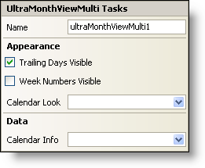

////

|metadata|
{
    "name": "winmonthviewmulti-smart-tag",
    "controlName": ["WinMonthViewMulti"],
    "tags": ["Getting Started"],
    "guid": "{8BAFD328-AA9A-4DD7-98BB-850D8E38C3BD}",  
    "buildFlags": [],
    "createdOn": "0001-01-01T00:00:00Z"
}
|metadata|
////

= WinMonthViewMulti Smart Tag

In Visual Studio 2005 (.NET Framework 2.0), each Infragistics Windows Forms control/component is equipped with a Smart Tag. By simply selecting the control/component, a Smart Tag anchor appears. When you click this anchor, a pop-up panel appears, providing you with quick and easy access to the most common properties and settings of the control/component.

The WinMonthViewMulti™ Smart Tag contains the name of the control, as well as the following sections:

* Appearance -- Provides common tasks involving the appearance, look, and feel of the control.
* Data -- Refers to any underlying data the control is using such as data sources and data members.

See below for a description of the item (e.g., field, drop-down list, checkbox) in each section, as well as the item's corresponding property in the properties grid.

[options="header", cols="a,a,a"]
|====
|Appearance|Description|Corresponding Property

|Trailing Days Visible
|Trailing days are days of the week that are not a part of the current month. In Microsoft Outlook, they are usually visible and faded out. Selecting this check box will cause the trailing days to display. Clearing the check box will hide them.
| pick:[win-forms="link:{ApiPlatform}win.ultrawinschedule{ApiVersion}~infragistics.win.ultrawinschedule.ultramonthviewmultibase~trailingdaysvisible.html[TrailingDaysVisible]"] 

|Week Numbers Visible
|Selecting this check box will display week numbers to the right of the calendar. These numbers count the number of weeks in a year.
| pick:[win-forms="link:{ApiPlatform}win.ultrawinschedule{ApiVersion}~infragistics.win.ultrawinschedule.ultramonthviewmultibase~weeknumbersvisible.html[WeekNumbersVisible]"] 

|Calendar Look
|Upon clicking the drop-down, all available WinCalendarLook controls on the form will be displayed.
| pick:[win-forms="link:{ApiPlatform}win.ultrawinschedule{ApiVersion}~infragistics.win.ultrawinschedule.ultraschedulecontrolbase~calendarlook.html[CalendarLook]"] 

|====

[options="header", cols="a,a,a"]
|====
|Data|Description|Corresponding Property

|Calendar Info
|Upon clicking the drop-down, all available WinCalendarInfo controls on the form will be displayed.
| pick:[win-forms="link:{ApiPlatform}win.ultrawinschedule{ApiVersion}~infragistics.win.ultrawinschedule.ultraschedulecontrolbase~calendarinfo.html[CalendarInfo]"] 

|====