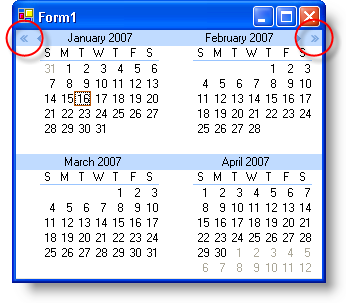

////

|metadata|
{
    "name": "winmonthviewmulti-year-scroll-buttons-now-available-whats-new-20071",
    "controlName": [],
    "tags": [],
    "guid": "{B27281DC-554E-4C20-99A7-831D039BBB03}",  
    "buildFlags": [],
    "createdOn": "0001-01-01T00:00:00Z"
}
|metadata|
////

= Year Scroll Buttons Now Available

Before this release, WinMonthViewMulti™ only supported Month scrolling in the month header of the calendar. However, since you're already viewing entire months at a time, it may be convenient to be able to scroll through years as well. Now you can! With the new  pick:[win-forms="link:{ApiPlatform}win.ultrawinschedule{ApiVersion}~infragistics.win.ultrawinschedule.ultramonthviewmultibase~yearscrollbuttonsvisible.html[YearScrollButtonsVisible]"]  property, you can display year scroll buttons directly beside the month scroll buttons. You can even change how many years are scrolled with the  pick:[win-forms="link:{ApiPlatform}win.ultrawinschedule{ApiVersion}~infragistics.win.ultrawinschedule.ultramonthviewmultibase~yearscrollchange.html[YearScrollChange]"]  property. These year scroll buttons also support all the ViewStyles such as OfficeXP or Office2007. And let's not forget the  pick:[win-forms="link:{ApiPlatform}win.ultrawinschedule{ApiVersion}~infragistics.win.ultrawinschedule.ultramonthviewmultibase~yearscrollbuttonappearance.html[YearScrollButtonAppearance]"]  object which makes it simple to style these buttons in AppStylist®.

== Related Topic

link:winmonthviewmulti-display-the-year-scroll-buttons.html[Display the Year Scroll Buttons]