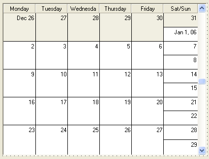

////

|metadata|
{
    "name": "winmonthviewsingle-about-winmonthviewsingle",
    "controlName": ["WinMonthViewSingle"],
    "tags": ["Getting Started"],
    "guid": "{9FFEC56E-B788-4FB2-B0C6-CD3393E42331}",  
    "buildFlags": [],
    "createdOn": "0001-01-01T00:00:00Z"
}
|metadata|
////

= About WinMonthViewSingle

The WinMonthViewSingle™ control shows a one-month time span at a time. The following is a list of some of the functionalities available in WinMonthViewSingle:

* Viewing -- Allows end users to view appointments, notes, owners, and other items over a one-month time span.
* Adding/Updating/Removing -- Allows end users to add, update, and remove appointments, notes, owners, and other items using the WinCalendarInfo component.
* Appearance Support -- Full appearance support including alpha-blending, gradients, images. Some appearances can be set at the control level, the others are set using the WinCalendarLook component.
* Built-in Theming -- Supports Standard, Office 2003, Visual Studio 2005 and Office 2007 themes via the WinCalendarLook component.

