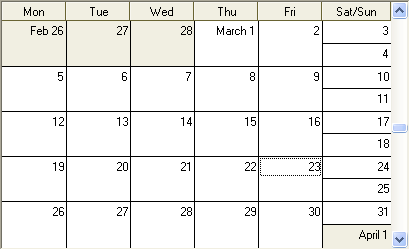
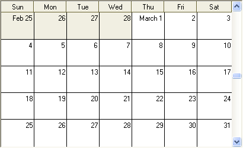

////

|metadata|
{
    "name": "winmonthviewsingle-display-weekends-as-full-days",
    "controlName": ["WinMonthViewSingle"],
    "tags": ["How Do I","Layouts"],
    "guid": "{70CC0478-5EB9-48DC-9A44-F430916CAFCB}",  
    "buildFlags": [],
    "createdOn": "2005-07-07T00:00:00Z"
}
|metadata|
////

= Display Weekends As Full Days

By default WinMonthViewSingle™ displays Saturday and Sunday as nested days, as the following screen shot shows.

You can change this default setting so that Saturday and Sunday are displayed as full days, like the other days of the week. The following example code shows how make such a change.

*In Visual Basic:*

----
Imports Infragistics.Win.UltraWinSchedule
...
Me.UltraMonthViewSingle1.WeekendDisplayStyle = WeekendDisplayStyleEnum.Full
----

*In C#:*

----
using Infragistics.Win.UltraWinSchedule;
...
this.ultraMonthViewSingle1.WeekendDisplayStyle = WeekendDisplayStyleEnum.Full;
----

Using the above code snippet results in the WinMonthViewSingle appearing similar to the following.

