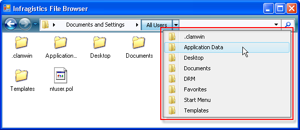
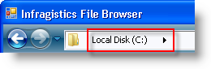
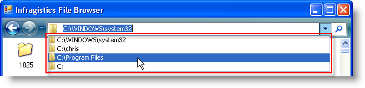
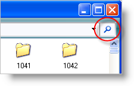

////

|metadata|
{
    "name": "winnavigationbar-about-winnavigationbar",
    "controlName": ["WinNavigationBar"],
    "tags": ["Getting Started","Navigation"],
    "guid": "{C2BC0E5F-5D9A-4371-93BF-6BB9F701B185}",  
    "buildFlags": [],
    "createdOn": "0001-01-01T00:00:00Z"
}
|metadata|
////

= About WinNavigationBar

WinNavigationBar™ is a navigation control that behaves like a breadcrumb control, keeping track of the trail you followed through whatever hierarchical data the control is bound to. WinNavigationBar also closely resembles a tree-type control, such as WinTree™. Each button, representing a Location, can be thought of as a Node in a tree. When you click the button, you will see all of the location's children in a drop-down list.

== Locations

pick:[win-forms="link:{ApiPlatform}win.misc{ApiVersion}~infragistics.win.misc.ultranavigationbarlocation.html[Locations]"]  are to WinNavigationBar as  pick:[win-forms="link:{ApiPlatform}win.ultrawintree{ApiVersion}~infragistics.win.ultrawintree.ultratreenode.html[Nodes]"]  are to WinTree. You can think of WinNavigationBar as a flat tree that only displays the path taken at any one time. Each location in WinNavigationBar includes its own collection of  pick:[win-forms="link:{ApiPlatform}win.misc{ApiVersion}~infragistics.win.misc.navigationbarlocationscollection.html[locations]"] , giving the control a node-like hierarchical structure.

The  pick:[win-forms="link:{ApiPlatform}win.misc{ApiVersion}~infragistics.win.misc.ultranavigationbarrootlocation.html[root location]"]  is yet another location; however, only one root location can exist per WinNavigationBar control. The root location is the top-most location and is not a child location of any other location.

== Previous Locations

The  pick:[win-forms="link:{ApiPlatform}win.misc{ApiVersion}~infragistics.win.misc.navigationbarpreviouslocationscollection.html[previous locations]"]  collection keeps track of each location that you visit. WinNavigationBar accomplishes this by adding each visited location to a custom collection of locations. This collection is then exposed to the end user through a drop-down button to the right of the control. Clicking the drop-down button will display a drop-down list containing the full path of all previously visited locations.

== Action Buttons

WinNavigationBar allows you to add custom buttons to the right of itself. With the help of  pick:[win-forms="link:{ApiPlatform}win.misc{ApiVersion}~infragistics.win.misc.ultranavigationbaractionbutton.html[Action buttons]"] , you could add favorite locations to your application, refresh WinNavigationBar's representation of the file system, or search for a specific location.

