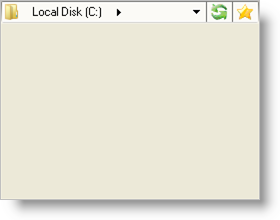

////

|metadata|
{
    "name": "winnavigationbar-add-an-action-button-to-winnavigationbar",
    "controlName": ["WinNavigationBar"],
    "tags": ["Navigation"],
    "guid": "{FA057EDF-FB13-4867-80E9-54939C55D4AF}",  
    "buildFlags": [],
    "createdOn": "0001-01-01T00:00:00Z"
}
|metadata|
////

= Add an Action Button to WinNavigationBar

It's always a pleasant feature to have a dedicated collection of buttons, encapsulated inside a control, to keep your project clean and organized; WinNavigationBar's™  pick:[win-forms="link:{ApiPlatform}win.misc{ApiVersion}~infragistics.win.misc.navigationbaractionbuttonscollection.html[ActionButtons]"]  collection helps you do just that. Located always on the right-hand side of the control, the Action buttons enable you to perform any task through WinNavigationBar's  pick:[win-forms="link:{ApiPlatform}win.misc{ApiVersion}~infragistics.win.misc.ultranavigationbar~actionbuttonclicked_ev.html[ActionButtonClicked]"]  event. You can add a button that will refresh the file system that you’re using WinNavigationBar to navigate through. You can add buttons that serve as favorite items in the navigation history. Because of the nature of these buttons, you can do anything that your application requires.

The following code adds two Action buttons in two different ways. The first method demonstrated below is the  pick:[win-forms="link:{ApiPlatform}win.misc{ApiVersion}~infragistics.win.misc.navigationbaractionbuttonscollection~add(string).html[second overload]"]  of the  pick:[win-forms="link:{ApiPlatform}win.misc{ApiVersion}~infragistics.win.misc.navigationbaractionbuttonscollection~add.html[Add]"]  method off the ActionButtons collection. Using this overload, you can first instantiate the button, modify its properties, and then add it to the collection. The second method, using the  pick:[win-forms="link:{ApiPlatform}win.misc{ApiVersion}~infragistics.win.misc.navigationbaractionbuttonscollection~add(ultranavigationbaractionbutton).html[first overload]"]  of the Add method, allows you to simply add a new Action button and let WinNavigationBar worry about instantiating it. However, if you need to access this button later (i.e. in another method or event), you’ll need to retrieve a reference to it, which is also demonstrated below.

 

*In Visual Basic:*

----
Imports Infragistics.Win.Misc
' Create an Action button in code.
Dim refreshButton As UltraNavigationBarActionButton = _
    New UltraNavigationBarActionButton("Refresh")
' Add the action button to the ActionButtons collection.
Me.UltraNavigationBar1.ActionButtons.Add(refreshButton)
' Add a new Action button and have WinNavigationBar
' instantiate it for you.
Me.UltraNavigationBar1.ActionButtons.Add("MyFavorites")
' If you need to access the MyFavorites button later...
Dim myFavorites As UltraNavigationBarActionButton = _
    Me.UltraNavigationBar1.ActionButtons("MyFavorites")
----

*In C#:*

----
using Infragistics.Win.Misc;
// Create an Action button in code.
UltraNavigationBarActionButton refreshButton = 
	new UltraNavigationBarActionButton("Refresh");
// Add the action button to the ActionButtons collection.
this.ultraNavigationBar1.ActionButtons.Add(refreshButton);
// Add a new Action button and have WinNavigationBar
// instantiate it for you.
this.ultraNavigationBar1.ActionButtons.Add("MyFavorites");
// If you need to access the MyFavorites button later...
UltraNavigationBarActionButton myFavorites =
	this.ultraNavigationBar1.ActionButtons["MyFavorites"]
	as UltraNavigationBarActionButton;
----