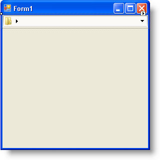
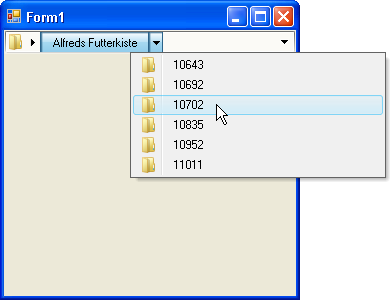

////

|metadata|
{
    "name": "winnavigationbar-binding-winnavigationbar-to-a-dataset",
    "controlName": ["WinNavigationBar"],
    "tags": ["How Do I"],
    "guid": "{66DF3CF4-99C2-4807-9189-5EDDB88FCF8B}",  
    "buildFlags": [],
    "createdOn": "0001-01-01T00:00:00Z"
}
|metadata|
////

= Binding WinNavigationBar to a DataSet

== Before You Begin

WinNavigationBar™ can display any type of hierarchical data. The most common form of data is the DataSet. A DataSet can consist of a single table or multiple tables with complex data relations. Binding WinNavigationBar to a single data table isn't going to be very impressive; but if that data table contains data relations, you can display a row's child rows fairly easily. Displaying data relations is going to require a few Foreach loops to loop through DataRows, DataRelations, and more DataRows (representing child rows). If you don't know how many relations there are, you could create a method which gets a row's child rows recursively. However, this topic is only going to focus on one data relation between a row and its children.

== What You Will Accomplish

When you finish reading this walkthrough, you will be able to setup your form with the Northwind data source (specifically the Customers and Orders tables) and load that hierarchical data into WinNavigationBar's locations.

== Follow these Steps

[start=1]
. *Configure your data source* .

.. In a new C# or Visual Basic project, click the Data menu item on the main menu at the top of the Visual Studio IDE. Click Add New Data Source... from the resulting menu. The Data Source Configuration Wizard appears.
.. Ensure that Database is selected in the Wizard and click Next.
.. Click the New Connection button on the Choose Your Data Connection page. The Add Connection dialog box appears.
.. Click the Change... button. The Change Data Source dialog box appears.
.. Select Microsoft Access Database File from the list of Data sources and click OK, dismissing the dialog box.
.. Click the Browse... button. The Select Microsoft Access Database File dialog box appears. For this example, we will be using the Northwind database (NWind.mdb), which is available as part of the Infragistics Professional SDK install. By default, the NWind.mdb file is located in the following installation folder, depending on your operating system:

*** XP -- {InstallPathXP}{ProductNameVersion}\Samples\Win\Data
*** Vista -- {InstallPathVista}{ProductNameVersion}\Samples\Win\Data

.. Click OK to dismiss the Add Connection dialog box.
.. Click Next in the Data Source Configuration Wizard. A dialog box will appear asking if you’d like to copy the database file to your project and modify the connection. Click Yes to continue.
.. Click Next to save the connection as NWindConnectionString.
[start=10]
.. The next page in the Wizard allows you to choose your database objects. Expand Tables and select both Customers and Orders.
[start=11]
.. Click Finish to close the Wizard. NWindDataSet is added to your project in the Solution Explorer.
[start=12]
.. Press F6 to build your project. In the Visual Studio toolbox, three components are created under the ProjectName Components tab.
[start=13]
.. Double-click NWindDataSet, CustomersTableAdapter, and OrdersTableAdapter; all three components are added to the component tray.

[start=2]
. *Add WinNavigationBar to your form* .

.. Locate UltraNavigationBar in the Visual Studio toolbox and double-click it. UltraNavigationBar is added to your form.
.. While UltraNavigationBar is selected, locate the Dock property in the Properties window and set it to Top. Your form should look similar to the following screen shot.

.. Double-click the form's header to create the form's Load event. The Load event is created and you are now in code view.

[start=3]
. *Fill the DataSet*

If the following two lines of code aren't already in your form's Load event, add them now. You’ll need these two lines of code to fill the Customers and Orders tables with data.

*In Visual Basic:*

----
Me.CustomersTableAdapter1.Fill(Me.NWindDataSet1.Customers)
Me.OrdersTableAdapter1.Fill(Me.NWindDataSet1.Orders)
----

*In C#:*

----
this.customersTableAdapter1.Fill(this.nWindDataSet1.Customers);
this.ordersTableAdapter1.Fill(this.nWindDataSet1.Orders);
----

[start=4]
. *Load the data into WinNavigationBar's locations* .

Set the  pick:[win-forms="link:{ApiPlatform}win.misc{ApiVersion}~infragistics.win.misc.ultranavigationbarlocation~displaytext.html[DisplayText]"]  of WinNavigationBar's  pick:[win-forms="link:{ApiPlatform}win.misc{ApiVersion}~infragistics.win.misc.ultranavigationbar~rootlocation.html[RootLocation]"]  to "Customers". This is the first location your end user will see and every location stems off of this location just like it would in a Tree-type control. To populate the root location's locations, you need to iterate through each row in the Customers table and instantiate a new  pick:[win-forms="link:{ApiPlatform}win.misc{ApiVersion}~infragistics.win.misc.ultranavigationbarlocation.html[Location]"]  object for each row. You can use a Foreach loop to accomplish this task.

As you are loading each row into the proper location, you can use another Foreach loop to identify any data relationship between the current row and any child rows. For each DataRelation that you find between the current row and its child rows, you're going to loop through the child rows and add each one as a separate location under the current row. We are only going one level deep, but if you were to also have the OrderDetails table, you could have another DataRelation with more child rows between the Orders and OrderDetails tables.

.Note
[NOTE]
====
If you are unsure as to how many levels you need to populate, it may be best to create a method that populates WinNavigationBar recursively.
====

Place the following code after the table adapter Fill methods.

*In Visual Basic:*

----
Me.UltraNavigationBar1.RootLocation.DisplayText = "Customers"
' Instantiate a location but don't set it yet.
Dim location As Infragistics.Win.Misc.UltraNavigationBarLocation
' Loop through each row in the Customers table.
For Each row As DataRow In NWindDataSet1.Tables("Customers").Rows
	' Get an array of items for the current row.
	Dim items As Object() = row.ItemArray
	' Create the location and set its key to the customer's name.
	location = New Infragistics.Win.Misc.UltraNavigationBarLocation _
		(items(1).ToString())
	' Add the location to the root of WinNavigationBar.
	Me.UltraNavigationBar1.RootLocation.Locations.Add(location)
	' Loop through all the data relations between
	' the current row and it's children.
	For Each relation As DataRelation In row.Table.ChildRelations
		' Create an array of DataRows containing all the
		' current row's child rows.
		Dim childRows As DataRow() = row.GetChildRows(relation)
		' Loop through the child rows and add them to 
		' the locations collection representing the
		' current row.
		For Each childRow As DataRow In childRows
			' Get an array of items for the child row.
			Dim childItems As Object() = childRow.ItemArray
			' Add the order number as the key of the child location.
			location.Locations.Add(childItems(0).ToString())
		Next
	Next
Next
----

*In C#:*

----
this.ultraNavigationBar1.RootLocation.DisplayText = "Customers";
// Instantiate a location but don't set it yet.
Infragistics.Win.Misc.UltraNavigationBarLocation location;
// Loop through each row in the Customers table.
foreach (DataRow row in nWindDataSet1.Tables["Customers"].Rows)
{
	// Get an array of items for the current row.
	object[] items = row.ItemArray;
	// Create the location and set its key to the customer's name.
	location = new Infragistics.Win.Misc.UltraNavigationBarLocation
		(items[1].ToString());
	// Add the location to the root of WinNavigationBar.
	this.ultraNavigationBar1.RootLocation.Locations.Add(location);
	// Loop through all the data relations between
	// the current row and it's children.
	foreach (DataRelation relation in row.Table.ChildRelations)
	{
		// Create an array of DataRows containing all the
		// current row's child rows.
		DataRow[] childRows = row.GetChildRows(relation);
		// Loop through the child rows and add them to 
		// the locations collection representing the
		// current row.
		foreach (DataRow childRow in childRows)
		{
			// Get an array of items for the child row.
			object[] childItems = childRow.ItemArray;
			// Add the order number as the key of the child location.
			location.Locations.Add(childItems[0].ToString());
		}
	}
}
----

[start=5]
. *Run the application* .

When you run the application, you will see WinNavigationBar with just one location named Customers. Once you click the arrow to the right of Customers, you will see a drop-down list populated with customer names. Click on any of the customer names and that name will fill the text box above. Click the arrow to the right of that customer name and the drop-down list will populate with that customer's orders.

