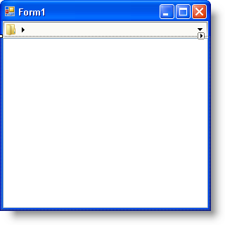
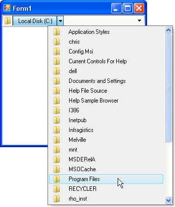
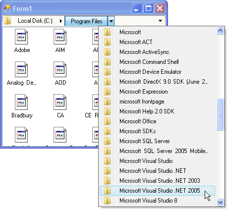

////

|metadata|
{
    "name": "winnavigationbar-browsing-the-file-system-with-winnavigationbar",
    "controlName": ["WinNavigationBar"],
    "tags": ["How Do I","Navigation"],
    "guid": "{51BF580E-3580-44DA-865A-42B31D7E6009}",  
    "buildFlags": [],
    "createdOn": "0001-01-01T00:00:00Z"
}
|metadata|
////

= Browsing the File System with WinNavigationBar

== Before You Begin

WinNavigationBar™ is a very useful tool for navigating hierarchical structures, especially file systems. Because of WinNavigationBar's unique design, it can pull apart an address path and separate it into individual, usable locations; each one able to navigate to all its child destinations alone. For those familiar with Windows® Vista™, you will notice that WinNavigationBar bears a striking resemblance to the Windows Vista Windows Explorer address bar. This familiarity makes it even easier for your end users to use WinNavigationBar as a file explorer.

== What You Will Accomplish

This walkthrough aims to provide you with the shortest route possible to creating a file browsing application with WinNavigationBar. This application uses WinNavigationBar and WinListView synchronously to display files and folders.

== Follow these Steps

[start=1]
. *Setup your form* .

.. After creating a new Visual Studio® Visual Basic or C# project, locate the UltraNavigationBar control in the Visual Studio toolbox and double-click it. WinNavigationBar is added to your form.
.. With WinNavigationBar still selected, find the Dock property in the properties window and set it to Top.
.. Locate the UltraListView control in the Visual Studio toolbox and double-click it. WinListView is added to your form.
.. With WinListView still selected, find the Dock property in the properties window and set it to Fill. Your form should now look something like this:

.. Double-click the form's header. This will take you to code-behind view and also add an event handler for the form's Load event.

[start=2]
. *Add directives* .

Add the following using/Imports directives so you don't always have to type out fully-qualified names.

*In Visual Basic:*

----
Imports System.IO
Imports Infragistics.Win
Imports Infragistics.Win.Misc
Imports Infragistics.Win.Misc.UltraWinNavigationBar
Imports Infragistics.Win.UltraWinListView
----

*In C#:*

----
using System.IO;
using Infragistics.Win;
using Infragistics.Win.Misc;
using Infragistics.Win.Misc.UltraWinNavigationBar;
using Infragistics.Win.UltraWinListView;
----

[start=3]
. *Add code to the form's Load event.*

In the form's Load event, you are going to initialize a few basic, yet important properties of WinNavigationBar. This code will focus on the link:{ApiPlatform}win.misc{ApiVersion}~infragistics.win.misc.ultranavigationbar~rootlocation.html[RootLocation], as it is the only location that requires you to hard-code.

*In Visual Basic:*

----
Private Sub Form1_Load(ByVal sender As System.Object, _
  ByVal e As System.EventArgs) Handles MyBase.Load
        ' The text that will display to the end user.
        Me.UltraNavigationBar1.RootLocation.DisplayText = "Local Disk (C:)"
        ' The text that WinNavigationBar will use when parsing
        ' the full path of a child location (or itself).
        Me.UltraNavigationBar1.RootLocation.Text = "C:"
End Sub
----

*In C#:*

----
private void Form1_Load(object sender, EventArgs e)
{
	// The text that will display to the end user.
	this.ultraNavigationBar1.RootLocation.DisplayText = "Local Disk (C:)";
	// The text that WinNavigationBar will use when parsing
	// the full path of a child location (or itself).
	this.ultraNavigationBar1.RootLocation.Text = "C:";
}
----

[start=4]
. *Write code to lazily load each folder into WinNavigationBar's locations* .

Lazy loading means that you will only load the required amount of data at the required time. This concept is in contrast to fully loading all of WinNavigationBar's locations at the same time with folders from the file system. Fully loading might take place in a separate method call inside the form's Load event. Lazy loading for WinNavigationBar takes place in the  pick:[win-forms="link:{ApiPlatform}win.misc{ApiVersion}~infragistics.win.misc.ultranavigationbar~initializelocations_ev.html[InitializeLocations]"]  event.

InitializeLocations fires the first time the  pick:[win-forms="link:{ApiPlatform}win.misc{ApiVersion}~infragistics.win.misc.ultranavigationbarlocation~locations.html[Locations]"]  collection of a particular  pick:[win-forms="link:{ApiPlatform}win.misc{ApiVersion}~infragistics.win.misc.ultranavigationbarlocation.html[Location]"]  is accessed; in other words, when the end user clicks a location's drop-down button. This event gives you an opportunity to populate that location's child locations. InitializeLocations exposes the currently-being-accessed location as an event argument. To fill that location with folders from the file system, you can instantiate an array of DirectoryInfo objects using the parent location's FullPath property. Once you have the array of directories, you can iterate through them with a Foreach loop and add a new location to the parent location using the directory's FullName as the  pick:[win-forms="link:{ApiPlatform}shared{ApiVersion}~infragistics.shared.keyedsubobjectbase~key.html[key]"]  and its Name as the  pick:[win-forms="link:{ApiPlatform}win.misc{ApiVersion}~infragistics.win.misc.ultranavigationbarlocation~text.html[text]"] . Create a handler for the InitializeLocations event and place the following code inside it.

*In Visual Basic:*

----
Private Sub UltraNavigationBar1_InitializeLocations(ByVal sender As Object, _
  ByVal e As InitializeLocationsEventArgs) _
  Handles UltraNavigationBar1.InitializeLocations
    ' Populate an array of DirectoryInfos with the
    ' subdirectories of the parent location's path.
    Dim dirs As DirectoryInfo() = _
        New DirectoryInfo _
            (e.ParentLocation.GetFullPath _
            (FullPathFormat.EditMode) _
            + "\").GetDirectories()
    ' Loop through each subdirectory...
    For Each dir As DirectoryInfo In dirs
        ' ...add a new location to WinNavigationBar.
        ' The subdirectory's full path will be the key 
        ' and the name will be the Text.
        e.ParentLocation.Locations.Add(dir.FullName, dir.Name)
    Next
End Sub
----

*In C#:*

----
private void ultraNavigationBar1_InitializeLocations
	(object sender, InitializeLocationsEventArgs e)
{
	// Populate an array of DirectoryInfos with the
	// subdirectories of the parent location's path.
	DirectoryInfo[] dirs =
		new DirectoryInfo
		(e.ParentLocation.GetFullPath
			(FullPathFormat.EditMode)
			+ "\\").GetDirectories();
	// Loop through each subdirectory...
	foreach (DirectoryInfo dir in dirs)
	{
		// ...add a new location to WinNavigationBar.
		// The subdirectory's full path will be the key 
		// and the name will be the Text.
		e.ParentLocation.Locations.Add(dir.FullName, dir.Name);
	}
}
----

At this point, if you run the application, your form will look similar to the following screen shot.

[start=5]
. *Populate WinListView with files and folders* .

A file explorer is only half complete if all you can do is navigate to a folder – you need to see the folder's contents as well. Populate WinListView with files and folders associated with each location the end user selects. To do this, create a method that populates WinListView and call the method in WinNavigationBar's  pick:[win-forms="link:{ApiPlatform}win.misc{ApiVersion}~infragistics.win.misc.ultranavigationbar~selectedlocationchanged_ev.html[SelectedLocationChanged]"]  event (covered in the next step). Calling the method in the SelectedLocationChanged event ensures that the location is valid, because WinNavigationBar's  pick:[win-forms="link:{ApiPlatform}win.misc{ApiVersion}~infragistics.win.misc.ultranavigationbar~navigationpathparseerror_ev.html[NavigationPathParsingError]"]  fires before the SelectedLocationChanged event in the case that the path was invalid. To handle path-parsing errors, see link:winnavigationbar-handle-a-navigation-path-parsing-error.html[Handle a Navigation Path Parsing Error].

Populating WinListView with files and folders is actually quite simple. You will need a reference to the path that you populate WinListView with; get this reference through the SelectedLocationChangedEventArgs.SelectedLocation. pick:[win-forms="link:{ApiPlatform}win.misc{ApiVersion}~infragistics.win.misc.ultranavigationbarlocation~getfullpath.html[GetFullPath]"]  method. Pass this string into your method and the rest of the work is simply iterating through collections of DirectoryInfos and FileInfos.

*In Visual Basic:*

----
Private Sub LoadFilesAndFolders(ByVal path As String)
    ' Populate an array of DirectoryInfos with the
    ' subdirectories of the selected location's path.
    Dim dirs As DirectoryInfo() = _
      New DirectoryInfo _
      (path + "\").GetDirectories()
    ' Get the files associated with the selected location.
    Dim files As FileInfo() = _
      New DirectoryInfo _
      (path + "\").GetFiles()
    ' Clear the previous location’s items from WinListView.
    Me.UltraListView1.Items.Clear()
    Dim item As UltraListViewItem = Nothing
    ' Populate WinListView with folders and files.
    For Each dir As DirectoryInfo In dirs
        item = Me.UltraListView1.Items.Add(dir.FullName, dir.Name)
        item.Tag = dir
        ' At this point, you can assign an image
        ' to the folder items with a line of code
        ' similar to the following...
        'item.Appearance.Image = this.imageListLarge.Images[0];
    Next
    For Each file As FileInfo In files
        item = Me.UltraListView1.Items.Add(file.FullName, file.Name)
        item.Tag = file
    Next
End Sub
----

*In C#:*

----
private void LoadFilesAndFolders( string path )
{
	// Populate an array of DirectoryInfos with the
	// subdirectories of the selected location's path.
	DirectoryInfo[] dirs =
		new DirectoryInfo
		(path + "\\").GetDirectories();
	// Get the files associated with the selected location.
	FileInfo[] files =
		new DirectoryInfo
		(path + "\\").GetFiles();
	// Clear the previous location’s items from WinListView.
	this.ultraListView1.Items.Clear();
	UltraListViewItem item = null;
	// Populate WinListView with folders and files.
	foreach (DirectoryInfo dir in dirs)
	{
		item = this.ultraListView1.Items.Add(dir.FullName, dir.Name);
		item.Tag = dir;
		// At this point, you can assign an image
		// to the folder items with a line of code
		// similar to the following...
		//item.Appearance.Image = this.imageListLarge.Images[0];
	}
	foreach (FileInfo file in files)
	{
		item = this.ultraListView1.Items.Add(file.FullName, file.Name);
		item.Tag = file;
	}
}
----

[start=6]
. *Call the LoadFilesAndFolders method in the SelectedLocationChanged event* .

As mentioned in the previous step, you will need to call the LoadFilesAndFolders method in the SelectedLocationChanged event and pass in the FullPath of the  pick:[win-forms="link:{ApiPlatform}win.misc{ApiVersion}~infragistics.win.misc.ultrawinnavigationbar.selectedlocationchangedeventargs~selectedlocation.html[SelectedLocation]"] . Passing the FullPath to the method at this point will populate WinListView with the files and folders of the location that the end user just navigated to. Create an event handler for WinNavigationBar's SelectedLocationChanged event either in the properties window if using C#, or in the drop-down lists above the code-view if using Visual Basic.

*In Visual Basic:*

----
Private Sub UltraNavigationBar1_SelectedLocationChanged( _
  ByVal sender As Object, _
  ByVal e As SelectedLocationChangedEventArgs) _
  Handles UltraNavigationBar1.SelectedLocationChanged
    Me.LoadFilesAndFolders(e.SelectedLocation.GetFullPath _
      (Infragistics.Win.Misc.FullPathFormat.EditMode))
End Sub
----

*In C#:*

----
private void ultraNavigationBar1_SelectedLocationChanged
	(object sender, SelectedLocationChangedEventArgs e)
{
	this.LoadFilesAndFolders(e.SelectedLocation.GetFullPath
		(Infragistics.Win.Misc.FullPathFormat.EditMode));
}
----

At this point, if you run the application, your form will look similar to the following screen shot.

[start=7]
. *Handle the ItemDoubleClick event to open a file or navigate to a folder* .

So far, you have a way to navigate through the folder structure and display files and folders; but what if your end user wants to navigate by double-clicking on folders, or open files by double-clicking them as well? WinListView exposes an  pick:[win-forms="link:{ApiPlatform}win.ultrawinlistview{ApiVersion}~infragistics.win.ultrawinlistview.ultralistview~itemdoubleclick_ev.html[ItemDoubleClick]"]  event which fires every time the end user double-clicks an item. You can place code in this event that navigates to the appropriate folder, or opens the appropriate file.

To determine if the end user clicked a folder or file, test the item's  pick:[win-forms="link:{ApiPlatform}shared{ApiVersion}~infragistics.shared.subobjectbase~tag.html[Tag]"]  property. If the Tag property is a DirectoryInfo object, the end user double-clicked a folder – if the Tag property is a FileInfo object, the end user double-clicked a file. If the end user double-clicked a folder, call WinNavigationBar's NavigateTo method, passing in the item's Key as the path. If the end user double-clicked a file, open that file using the System.Diagnostics.Process.Start method.

*In Visual Basic:*

----
Private Sub UltraListView1_ItemDoubleClick(ByVal sender As Object, _
  ByVal e As ItemDoubleClickEventArgs) Handles UltraListView1.ItemDoubleClick
    If TypeOf e.Item.Tag Is DirectoryInfo Then
        Me.UltraNavigationBar1.NavigateTo(e.Item.Key, True)
    ElseIf TypeOf e.Item.Tag Is FileInfo Then
        System.Diagnostics.Process.Start(e.Item.Key)
    End If
End Sub
----

*In C#:*

----
private void ultraListView1_ItemDoubleClick
	(object sender, ItemDoubleClickEventArgs e)
{
	if (e.Item.Tag is DirectoryInfo)
	{
		this.ultraNavigationBar1.NavigateTo(e.Item.Key, true);
	}
	else if (e.Item.Tag is FileInfo)
	{
		System.Diagnostics.Process.Start(e.Item.Key);
	}
}
----

[start=8]
. *Run the application* .

When you run the application, you will be able to navigate through your computer's C: drive using either WinNavigationBar or WinListView. Both controls will be update whenever the other navigates. Double clicking on a folder in WinListView will navigate to the folder. Double clicking a file in WinListView will open that file.