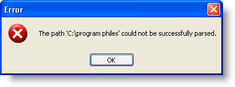
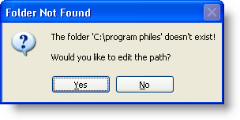

////

|metadata|
{
    "name": "winnavigationbar-handle-a-navigation-path-parsing-error",
    "controlName": ["WinNavigationBar"],
    "tags": ["Navigation"],
    "guid": "{D04659DE-792F-4E02-9BDD-0FA15DF1A9EC}",  
    "buildFlags": [],
    "createdOn": "0001-01-01T00:00:00Z"
}
|metadata|
////

= Handle a Navigation Path Parsing Error

There will be times when your end user will try to navigate to a path that doesn't exist; when this happens, the  pick:[win-forms="link:{ApiPlatform}win.misc{ApiVersion}~infragistics.win.misc.ultranavigationbar~navigationpathparseerror_ev.html[NavigationPathParsingError]"]  event fires. By default, when this event fires, a dialog box appears with a message stating that the particular path the end user navigated to could not be parsed. When the end user clicks OK, WinNavigationBar™ returns to the last successfully parsed location and exits edit mode. The following screen shot is the default parsing error dialog box.

Through the NavigationPathParsingError's event arguments, you can access several features of this particular error and modify them to your application's needs. For example, you can prevent the standard dialog box from appearing and create your own custom dialog box. You can determine whether or not you want WinNavigationBar to remain in edit mode. This can be useful if you need to force the end user to type in a valid location. Through the event arguments, you also have access to the error's caption and text, as well as the path that failed to parse correctly.

The following code will modify the default parsing error dialog box, similar to the screen shot above.

*In Visual Basic:*

----
Imports Infragistics.Win.Misc.UltraWinNavigationBar
Private Sub UltraNavigationBar1_NavigationPathParseError( _
  ByVal sender As System.Object, _
  ByVal e As NavigationPathParseErrorEventArgs) _
  Handles UltraNavigationBar1.NavigationPathParseError
    e.DisplayErrorMessage = False
    Dim result As System.Windows.Forms.DialogResult = MessageBox.Show _
    ( _
        "The folder '" + e.Path + "' doesn't exist!" _
        + vbCrLf + "Would you like to edit the path?", _
        "Folder Not Found", _
        MessageBoxButtons.YesNo, _
        MessageBoxIcon.Question _
    )
    If result = System.Windows.Forms.DialogResult.Yes Then
        e.StayInEditMode = True
    ElseIf result = System.Windows.Forms.DialogResult.No Then
        e.StayInEditMode = False
    End If
End Sub
----

*In C#:*

----
using Infragistics.Win.Misc.UltraWinNavigationBar;
private void ultraNavigationBar1_NavigationPathParseError
  (object sender, NavigationPathParseErrorEventArgs e)
{
	e.DisplayErrorMessage = false;
	DialogResult result = MessageBox.Show
	(
		"The folder '" + e.Path + "' doesn't exist!" 
		+ "\n\n" + "Would you like to edit the path?", 
		"Folder Not Found", 
		MessageBoxButtons.YesNo, 
		MessageBoxIcon.Question
	);
	if (result == DialogResult.Yes)
		e.StayInEditMode = true;
	else if (result == DialogResult.No)
		e.StayInEditMode = false;
}
----