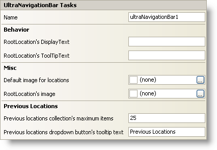

////

|metadata|
{
    "name": "winnavigationbar-smart-tag",
    "controlName": ["WinNavigationBar"],
    "tags": ["Getting Started","Navigation"],
    "guid": "{E278E4CB-B09F-4384-8AAD-73655A792265}",  
    "buildFlags": [],
    "createdOn": "0001-01-01T00:00:00Z"
}
|metadata|
////

= WinNavigationBar Smart Tag

In Visual Studio 2005 (.NET Framework 2.0), each Infragistics Windows Forms control/component is equipped with a Smart Tag. By simply selecting the control/component, a Smart Tag anchor appears. When you click this anchor, a pop-up panel appears, providing you with quick and easy access to the most common properties and settings of the control/component.

The WinNavigationBar™ Smart Tag contains the name of the control, as well as the following sections:

* Behavior -- Provides easy access to properties that govern how the control behaves on the form.
* Misc -- Provides easy access to properties dealing with images for locations and the root location.
* Previous Locations -- Offers quick access to common properties which affect the previous locations collection.

See below for a description of the item (e.g., field, drop-down list, checkbox) in each section, as well as the item's corresponding property in the properties grid.

[options="header", cols="a,a,a"]
|====
|Behavior|Description|Corresponding Property

|RootLocation's DisplayText
|Modify the text that displays in the breadcrumb when WinNavigationBar is not in edit mode.
| pick:[win-forms="link:{ApiPlatform}win.misc{ApiVersion}~infragistics.win.misc.ultranavigationbarlocation~displaytext.html[DisplayText]"] 

|RootLocation's ToolTipText
|Set the root location's tooltip text (this can be link:winformattedlinklabel-formatting-text-and-hyperlinks.html[formatted text]).
| pick:[win-forms="link:{ApiPlatform}win.misc{ApiVersion}~infragistics.win.misc.ultranavigationbarlocation~tooltiptext.html[ToolTipText]"] 

|====

[options="header", cols="a,a,a"]
|====
|Misc|Description|Corresponding Property

|Default image for locations
|When set, each location's image will display with the chosen image.
| pick:[win-forms="link:{ApiPlatform}win{ApiVersion}~infragistics.win.appearance~image.html[Image]"] 

|RootLocation's image
|When set, the root location's image will display with the chosen image.
| pick:[win-forms="link:{ApiPlatform}win{ApiVersion}~infragistics.win.appearance~image.html[Image]"] 

|====

[options="header", cols="a,a,a"]
|====
|Data|Description|Corresponding Property

|Previous locations collection's maximum items
|Set the maximum amount of locations to store in the previous locations collection.
| pick:[win-forms="link:{ApiPlatform}win.misc{ApiVersion}~infragistics.win.misc.ultranavigationbarpreviouslocationssettings~maximumitems.html[MaximumItems]"] 

|Previous locations drop-down button's tooltip text
|Set the previous location's drop-down button tooltip text (this can be formatted text).
| pick:[win-forms="link:{ApiPlatform}win.misc{ApiVersion}~infragistics.win.misc.ultranavigationbarpreviouslocationssettings~dropdownbuttontooltiptext.html[DropDownButtonToolTipText]"] 

|====