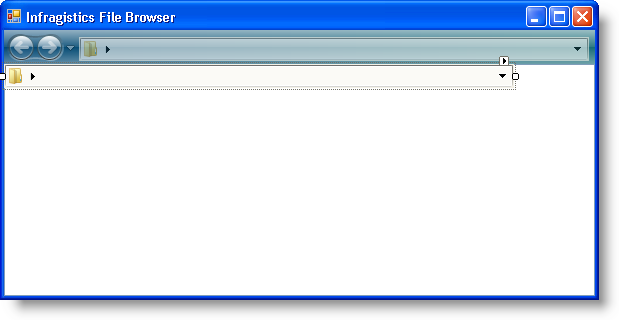
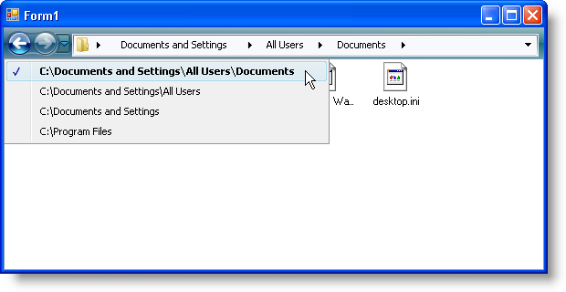

////

|metadata|
{
    "name": "winnavigationbar-using-winnavigationbar-with-the-navigation-toolbar",
    "controlName": ["WinNavigationBar"],
    "tags": ["How Do I","Navigation"],
    "guid": "{FCB08AD2-23D8-4C3A-81EF-95F97DE21744}",  
    "buildFlags": [],
    "createdOn": "0001-01-01T00:00:00Z"
}
|metadata|
////

= Using WinNavigationBar with the Navigation Toolbar

== Before You Begin

This help topic builds on the link:winnavigationbar-browsing-the-file-system-with-winnavigationbar.html[Browsing the File System with WinNavigationBar] topic; please read that topic for more information.

In the Browsing the File System with WinNavigationBar topic, you learned how to setup WinNavigationBar™ to navigate through a folder structure on your system. The Navigation toolbar was developed with navigation structures in mind; therefore, it only seems logical to use these two controls together.

The WinNavigationBar control exposes a  pick:[win-forms="link:{ApiPlatform}win.misc{ApiVersion}~infragistics.win.misc.ultranavigationbar~selectedlocationchanged_ev.html[SelectedLocationChanged]"]  event that fires after the end user changes locations. WinNavigationBar will only fire this event if the location is a valid one, so this is a great place to update the Navigation toolbar by adding the new location to the Navigation toolbar's navigation history. You can add an item to the navigation history by simply calling the  pick:[win-forms="link:{ApiPlatform}win.misc{ApiVersion}~infragistics.win.misc.ultranavigationbar~navigateto.html[NavigateTo]"]  method. To update WinNavigationBar when the end user navigates through the Navigation toolbar's history, you can use WinToolbarsManager's™  pick:[win-forms="link:{ApiPlatform}win.ultrawintoolbars{ApiVersion}~infragistics.win.ultrawintoolbars.ultratoolbarsmanager~afternavigation_ev.html[AfterNavigation]"]  event. This event fires after the end user navigates by clicking the Back or Forward buttons, or if you programmatically navigate through code. In the AfterNavigation event, you can call the WinNavigationBar's NavigateTo method, synchronizing the two controls.

It's important to realize that when you call each control's respective NavigateTo method, either the SelectedLocationChanged or AfterNavigation event will fire, depending on the control. You will need to disable these events before you call the NavigateTo method; otherwise, your application will be stuck in an infinite loop.

== What You Will Accomplish

This walkthrough demonstrates how you can synchronize WinNavigationBar and the Navigation toolbar. The Navigation toolbar will keep a history of items the end user visits with the WinNavigationBar control. When the end user visits a new location with WinNavigationBar, that location is added to the Navigation toolbar's history. Win the end user navigates through the Navigation toolbar's navigation history, WinNavigationBar is updated with the current item in the navigation history.

== Follow these Steps

[start=1]
. *Add the Navigation toolbar to your form* .

.. In design view, locate  pick:[win-forms="link:{ApiPlatform}win.ultrawintoolbars{ApiVersion}~infragistics.win.ultrawintoolbars.ultratoolbarsmanager.html[UltraToolbarsManager]"]  in the Visual Studio toolbox and double-click it. A dialog box will appear -- Click Yes to dismiss the dialog box. The ultraToolbarsManager1 component is added to the component tray.
.. With the ultraToolbarsManager1 component still selected, locate the  pick:[win-forms="link:{ApiPlatform}win.ultrawintoolbars{ApiVersion}~infragistics.win.ultrawintoolbars.navigationtoolbar.html[NavigationToolbar]"]  object in the properties window and set its Visible property to True. The Navigation toolbar appears at the top of the form.
.. On the Navigation toolbar, click Insert New Tool, and then click Insert New Tool... from the resulting popup menu. The New Tool dialog box appears.
.. In the New Tool dialog box, change the Tool Type to Control Container and click Add. A ControlContainerTool is added to the Navigation toolbar.
.. Click Close to close the New Tool dialog box.
.. Right-click [control not set] on the Navigation toolbar. Hover over Control on the resulting popup menu and select ultraNavigationBar1 from the fly-out menu. The  pick:[win-forms="link:{ApiPlatform}win.ultrawintoolbars{ApiVersion}~infragistics.win.ultrawintoolbars.controlcontainertool.html[ControlContainerTool]"]  is now hosting the WinNavigationBar control.
.. In the properties window with ultraToolbarsManager1 still selected, set ControlContainerTool1's  pick:[win-forms="link:{ApiPlatform}win.ultrawintoolbars{ApiVersion}~infragistics.win.ultrawintoolbars.sharedprops~spring.html[Spring]"]  property to True and set the  pick:[win-forms="link:{ApiPlatform}win.ultrawintoolbars{ApiVersion}~infragistics.win.ultrawintoolbars.toolbarsettings~fillentirerow.html[ToolbarSettings.FillEntireRow]"]  property to True.
.. Select ultraNavigationBar1 in the designer and set its Dock property to None in the properties window.
.. Change the width of the form to at least 600 pixels so you can see the WinNavigationBar control a little better.

Your form should now look something like the following screen shot. Don't worry about the extra WinNavigationBar control displaying overtop WinListView; it will not display once you run the project.

[start=2]
. *Add the selected location to the navigation history* .

If you've performed the steps in the Browsing the File System with WinNavigationBar topic, you should already have handled the SelectedLocationChanged event. You will want to call the Navigation toolbar's NavigateTo method after you call the LoadFilesAndFolders method. However, when you call the NavigateTo method, the AfterNavigation method fires and will perform the code in that event. This is how an infinite loop gets started. You need to disable the AfterNavigation event before you call NavigateTo, and then you can enable it again once you call the method. Add the following code to the SelectedLocationChanged event after the LoadFilesAndFolders method call.

*In Visual Basic:*

----
' Disable the AfterNavigation event so it doesn't fire
' during the next line of code.
Me.UltraToolbarsManager1.EventManager.SetEnabled _
  (Infragistics.Win.UltraWinToolbars.ToolbarEventIds.AfterNavigation, False)
' Have NavigationToolbar navigate to the full path of 
' the location that just changed. 
Me.UltraToolbarsManager1.NavigationToolbar.NavigateTo _
  (e.SelectedLocation.GetFullPath _
  (Infragistics.Win.Misc.FullPathFormat.EditMode), Nothing)
' Reenable the AfterNavigation event so the end user
' can navigate with the Navigation toolbar.
Me.UltraToolbarsManager1.EventManager.SetEnabled _
  (Infragistics.Win.UltraWinToolbars.ToolbarEventIds.AfterNavigation, True)
----

*In C#:*

----
// Disable the AfterNavigation event so it doesn't fire
// during the next line of code.
this.ultraToolbarsManager1.EventManager.SetEnabled
	(Infragistics.Win.UltraWinToolbars.ToolbarEventIds.AfterNavigation, 
	false);
// Have NavigationToolbar navigate to the full path of 
// the location that just changed. 
this.ultraToolbarsManager1.NavigationToolbar.NavigateTo
	(e.SelectedLocation.GetFullPath
		(Infragistics.Win.Misc.FullPathFormat.EditMode), null);
// Reenable the AfterNavigation event so the end user
// can navigate with the Navigation toolbar.
this.ultraToolbarsManager1.EventManager.SetEnabled
	(Infragistics.Win.UltraWinToolbars.ToolbarEventIds.AfterNavigation, 
	true);
----

[start=3]
. *Synchronize WinNavigationBar when the end user navigates through the navigation history* .

When the end user navigates through Navigation toolbar's navigation history, the AfterNavigation event is called. In this event, you need to update WinNavigationBar's location. To do this, call WinNavigationBar's NavigateTo method and pass in the Navigation toolbar's  pick:[win-forms="link:{ApiPlatform}win.ultrawintoolbars{ApiVersion}~infragistics.win.ultrawintoolbars.afternavigationeventargs~currentitem.html[current item]"]  off the  pick:[win-forms="link:{ApiPlatform}win.ultrawintoolbars{ApiVersion}~infragistics.win.ultrawintoolbars.afternavigationeventargs.html[EventArgs]"] . Again, you will need to disable the SelectedLocationChanged event as navigating will cause it to fire. Create an AfterNavigation event handler either through the lightning bolt in the properties window if using C#, or in the drop-down boxes at the top of code view if using Visual Basic. Add the following code to the AfterNavigation event.

*In Visual Basic:*

----
Private Sub UltraToolbarsManager1_AfterNavigation(ByVal sender As Object, _
  ByVal e As Infragistics.Win.UltraWinToolbars.AfterNavigationEventArgs) _
  Handles UltraToolbarsManager1.AfterNavigation
    ' Disable the SelectedLocationChanged event. When you
    ' call the NavigateTo method below, it would normally
    ' fire the SelectedLocationChanged event, calling
    ' the NavigationToolbar's NavigateTo method, thus
    ' trigering this event again.
    Me.UltraNavigationBar1.EventManager.Disable _
      (UltraNavigationBarEventIds.SelectedLocationChanged)
    ' When the end user clicks the Back or Forward buttons,
    ' Have WinNavigationBar navigate to the associated path.
    Me.UltraNavigationBar1.NavigateTo(e.CurrentItem.Text, True)
    ' Reenable SelectedLocationChanged again so the end user
    ' can navigate with WinNavigationBar again.
    Me.UltraNavigationBar1.EventManager.Enable _
      (UltraNavigationBarEventIds.SelectedLocationChanged)
End Sub
----

*In C#:*

----
private void ultraToolbarsManager1_AfterNavigation
	(object sender, 
	Infragistics.Win.UltraWinToolbars.AfterNavigationEventArgs e)
{
	// Disable the SelectedLocationChanged event. When you
	// call the NavigateTo method below, it would normally
	// fire the SelectedLocationChanged event, calling
	// the NavigationToolbar's NavigateTo method, thus
	// trigering this event again.
	this.ultraNavigationBar1.EventManager.Disable
		(UltraNavigationBarEventIds.SelectedLocationChanged);
	// When the end user clicks the Back or Forward buttons,
	// Have WinNavigationBar navigate to the associated path.
	this.ultraNavigationBar1.NavigateTo(e.CurrentItem.Text, true);
	// Reenable SelectedLocationChanged again so the end user
	// can navigate with WinNavigationBar again.
	this.ultraNavigationBar1.EventManager.Enable
		(UltraNavigationBarEventIds.SelectedLocationChanged);
}
----

[start=4]
. *Run the application.*

When you run the application, you will see the WinNavigationBar control inside the Navigation toolbar. Navigate to a few locations with the WinNavigationBar. Click the drop-down button to the right of the Forward button on the Navigation toolbar. You will see the locations you visited in the list. Now navigate through the navigation history with the Navigation toolbar. The WinNavigationBar control is updated with the item from the history.

