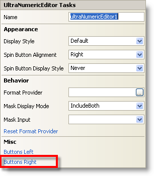
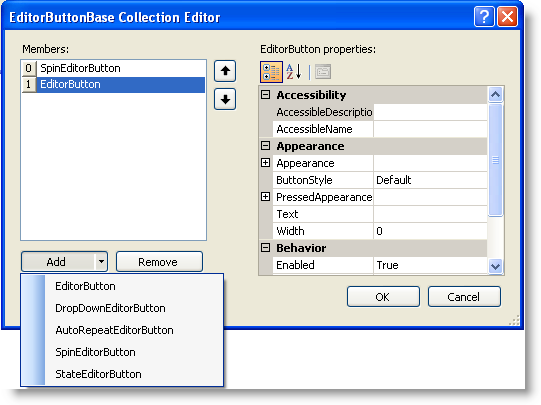

////
|metadata|
{
    "name": "winnumericeditor-custom-buttons-and-events",
    "controlName": ["WinNumericEditor"],
    "tags": ["Events","How Do I"],
    "guid": "{162E4F86-3EAA-4C0A-80D2-31B28F93ED1B}",
    "buildFlags": [],
    "createdOn": "2009-08-12T14:19:16Z"
}
|metadata|
////

= Custom Buttons and Events

Various custom buttons are available on the WinNumericEditor™ control such as: EditorButton, DropDownEditorButton, AutoRepeatEditorButton, SpinEditorButton, and StateEditorButton. These buttons can be added either to the left or right of the control and there are events corresponding to these buttons.

This topic shows you how to use the link:infragistics4.win.v{ProductVersion}~infragistics.win.ultrawineditors.editorbuttoncontrolbase~editorspinbuttonclick_ev.html[EditorSpinButtonClick] and the link:infragistics4.win.v{ProductVersion}~infragistics.win.ultrawineditors.editorbuttoncontrolbase~editorbuttonclick_ev.html[EditorButtonClick] events of the SpinEditorButton and EditorButton objects.

== Follow These Steps:

1. From the Microsoft® Visual Studio® Toolbox drag and drop the UltraNumericEditor control onto your form.

2. Click the control’s smart tag and click the Buttons Right button to add the custom button to the right of NumericEditor. This brings up the EditorButtonBase Collection Editor Dialog window.

3. Click the Add button, and from the drop down list, select SpinEditorButton and also EditorButton. Click the OK button to close the dialog.

5. Handle the following events for the SpinEditorButton and EditorButton objects.

*In Visual Basic:*
[source, vb]
Private Sub ultraNumericEditor1_EditorSpinButtonClick(ByVal sender As Object, ByVal e As Infragistics.Win.UltraWinEditors.SpinButtonClickEventArgs) Handles ultraNumericEditor1.EditorSpinButtonClick
    Dim ed As UltraNumericEditor = TryCast(sender, UltraNumericEditor)
    Dim theVal As Integer = CInt(ed.Value)
    If e.ButtonType = SpinButtonItem.NextItem AndAlso theVal < 10 Then
       theVal += 1
       ed.Value = theVal
    ElseIf e.ButtonType = SpinButtonItem.PreviousItem AndAlso theVal > 0 Then
       theVal -= 1
       ed.Value = theVal
    Else
       MessageBox.Show("You cannot increment any more")
    End If
End Sub
Private Sub ultraNumericEditor1_EditorButtonClick(ByVal sender As Object, ByVal e As Infragistics.Win.UltraWinEditors.EditorButtonEventArgs) Handles ultraNumericEditor1.EditorButtonClick
    System.Diagnostics.Debug.WriteLine(e.Context.ToString())
End Sub

*In C#:*
[source, csharp]
private void ultraNumericEditor1_EditorSpinButtonClick(object sender, Infragistics.Win.UltraWinEditors.SpinButtonClickEventArgs e)
{
    UltraNumericEditor ed = sender as UltraNumericEditor;
    int theVal = (int)ed.Value;
    if (e.ButtonType == SpinButtonItem.NextItem &&  theVal < 10)
    {
         theVal += 1;
         ed.Value = theVal;
    }
    else if (e.ButtonType == SpinButtonItem.PreviousItem && theVal >0)
    {
         theVal -= 1;
         ed.Value = theVal;
    }
    else
    {
        MessageBox.Show("You cannot increment any more");
    }
}
private void ultraNumericEditor1_EditorButtonClick(object sender, Infragistics.Win.UltraWinEditors.EditorButtonEventArgs e)
{
   System.Diagnostics.Debug.WriteLine(e.Context.ToString());
}