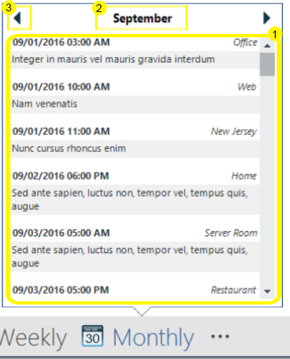

= Peek Window

The peek window allows you to show a control as the user hovers over any item within the
link:{ApiPlatform}win.ultrawinofficenavbar{ApiVersion}~infragistics.win.ultrawinofficenavbar.ultraofficenavbar.html[WinOfficeNavBar].
The peek window features the following parts:

. PeekContent--features the control assigned to the peek window, and displays the majority of the UI that the peek window will convey. The content control is assigned to the
link:{ApiPlatform}win.ultrawinofficenavbar{ApiVersion}~infragistics.win.ultrawinofficenavbar.navbaritem~peekcontent.html[PeekContent]
property on the
link:{ApiPlatform}win.ultrawinofficenavbar{ApiVersion}~infragistics.win.ultrawinofficenavbar.navbaritem.html[NavBarItem]
or the eventArgs of the
link:{ApiPlatform}win.ultrawinofficenavbar{ApiVersion}~infragistics.win.ultrawinofficenavbar.ultraofficenavbar~peekopening_ev.html[PeekOpening]
event.

* PeekContent property
[source, csharp]
ultraOfficeNavBar1.Items[0].PeekContent = ultraGrid1;

* PeekOpening event
[source, csharp]
private void ultraOfficeNavBar1_PeekOpening(object sender, PeekOpeningEventArgs e)
{
	e.PeekContent = ultraGrid1;
}

+
The PeekContent is the minimum requirement for an NavBarItem's peek window to show; a peek window will show without a caption or left/right buttons, but no window will show as long as the PeekContent is not set.

. PeekCaption--specifies the text displayed at the top of the Peek window. This is done by setting the
link:{ApiPlatform}win.ultrawinofficenavbar{ApiVersion}~infragistics.win.ultrawinofficenavbar.navbaritem~peekcaption.html[PeekCaption]
property on the NavBarItem.

. Left/Right PeekCaptionButtons--Peek caption buttons can be displayed at the top of the Peek window to provide additional functionality.
link:{ApiPlatform}win.ultrawinofficenavbar{ApiVersion}~infragistics.win.ultrawinofficenavbar.itemsettings~peekcaptionbuttonsleft.html[PeekCaptionButtonsLeft]
and
link:{ApiPlatform}win.ultrawinofficenavbar{ApiVersion}~infragistics.win.ultrawinofficenavbar.itemsettings~peekcaptionbuttonsright.html[PeekCaptionButtonsRight]
collections are exposed off the
link:{ApiPlatform}win.ultrawinofficenavbar{ApiVersion}~infragistics.win.ultrawinofficenavbar.itemsettings.html[ItemSettings]
class. Any
link:{ApiPlatform}win{ApiVersion}~infragistics.win.ultrawineditors.editorbutton.html[EditorButtons]
added to these collections are displayed at the top of the Peek window. Additionally, clicking any
link:{ApiPlatform}win{ApiVersion}~infragistics.win.ultrawineditors.editorbutton.html[EditorButton]
in these collections will fire the
link:{ApiPlatform}win.ultrawinofficenavbar{ApiVersion}~infragistics.win.ultrawinofficenavbar.ultraofficenavbar~peekbuttonclicked_ev.html[PeekCaptionButtonClicked]
event on the WinOfficeNavBar control. +
+
Note: PeekCaptionEditorButton collection are not merged; For example, if buttons are added to the PeekCaptionButtonsLeft collection on the ItemSettings of both the NavBarItem and the WinOfficeNavBar, only the buttons in the collection off of the NavBarItem’s ItemSettings will be displayed. +
 +
The following is an example of adding a button to the left collection:

* to the WinOfficeNavBar:
[source, csharp]
var leftButton = new PeekCaptionEditorButton() { Key = "left" };
ultraOfficeNavBar1.ItemSettings.PeekCaptionButtonsLeft.Add(leftButton);

* to the NavBarItem:
[source, csharp]
var leftButton = new PeekCaptionEditorButton() { Key = "left" };
ultraOfficeNavBar1.Items[0].Settings.PeekCaptionButtonsLeft.Add(leftButton);

The peek window can be suppressed by setting
link:{ApiPlatform}win.ultrawinofficenavbar{ApiVersion}~infragistics.win.ultrawinofficenavbar.itemsettings~displaypeekonhover.html[DisplayPeekOnHover]
to false.
