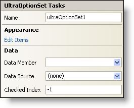

////

|metadata|
{
    "name": "winoptionset-smart-tag",
    "controlName": ["WinOptionSet"],
    "tags": ["API","Design Environment"],
    "guid": "{0A305E5F-DA25-411E-8C8C-B8AFC2895C8B}",  
    "buildFlags": [],
    "createdOn": "2005-09-11T00:00:00Z"
}
|metadata|
////

= WinOptionSet Smart Tag

In Visual Studio 2005 (.NET Framework 2.0), each Infragistics Windows Forms control/component is equipped with a Smart Tag. By simply selecting the control/component, a Smart Tag anchor appears. When you click this anchor, a pop-up panel appears, providing you with quick and easy access to the most common properties and settings of the control/component.

The WinOptionSet™ Smart Tag contains the name of the control, as well as the following sections:

* Appearance -- Provides common tasks involving the appearance, look, and feel of the control.
* Data -- Refers to any underlying data the control is using such as data sources and data members.

See below for a description of the item (e.g., field, drop-down list, checkbox) in each section, as well as the item's corresponding property in the properties grid.

[options="header", cols="a,a,a"]
|====
|Appearance|Description|Corresponding Property

|Edit Items
|The WinOptionSet works like a group of radio buttons where you can only choose one item. Clicking Edit Items will open the Items collection where you can edit the choices of the option set.
| pick:[win-forms="link:infragistics4.win.ultrawineditors.v{ProductVersion}~infragistics.win.ultrawineditors.ultraoptionset~items.html[Items]"] 

|====

[options="header", cols="a,a,a"]
|====
|Data|Description|Corresponding Property

|Data Member
|Once you have selected a valid data source, you can select all available data members from this drop-down.
| pick:[win-forms="link:infragistics4.win.ultrawineditors.v{ProductVersion}~infragistics.win.ultrawineditors.ultraoptionset~datamember.html[DataMember]"] 

|Data Source
|Click the drop-down and all available data sources in your project will be displayed. If you do not have a data source set up, you can select, "Add Project Data Source..." to create one.
| pick:[win-forms="link:infragistics4.win.ultrawineditors.v{ProductVersion}~infragistics.win.ultrawineditors.ultraoptionset~datasource.html[DataSource]"] 

|Checked Index
|This will set the selected item's index.
| pick:[win-forms="link:infragistics4.win.ultrawineditors.v{ProductVersion}~infragistics.win.ultrawineditors.ultraoptionset~checkedindex.html[CheckedIndex]"] 

|====