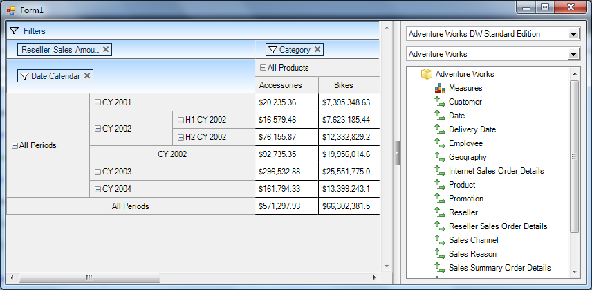

////

|metadata|
{
    "name": "winpivotgrid-adding-mdxdataselector",
    "controlName": ["MdxDataSelector"],
    "tags": [],
    "guid": "8d07e979-7113-4249-b865-f04523329223",  
    "buildFlags": [],
    "createdOn": "2014-09-12T03:40:43.55059Z"
}
|metadata|
////

= Adding MdxDataSelector

=== Overview

Although a separate control, the data selector ( link:{ApiPlatform}win.ultrawinpivotgrid{ApiVersion}~infragistics.win.ultrawinpivotgrid.dataselector.mdxdataselector_members.html[MdxDataSelector]) is an essential mechanism for the  _WinPivotGrid_  control; binding the data selector to the same data source as the pivot grid. The  _WinPivotGrid_  displays the list of dimensions and measures that the user can interact with at runtime by adding them to the pivot grid.

.Note:
[NOTE]
====
If the data selector is not present at runtime, you will not be able to add the dimensions. You can only remove them from the pivot grid.
====

The following code example demonstrates binding data selector to the same data source as the pivot grid, using the data source object illustrated in the previous examples.

*In C#:*

[source,csharp]
----
mdxDataSelector1.DataSource = xmlaDs;
----

*In Visual Basic:*

[source,vb]
----
mdxDataSelector1.DataSource = xmlaDs
----

The following screenshot illustrates the pivot grid with data selector both bound to XMLA data source. The same approach applied to ADOMD data source.

