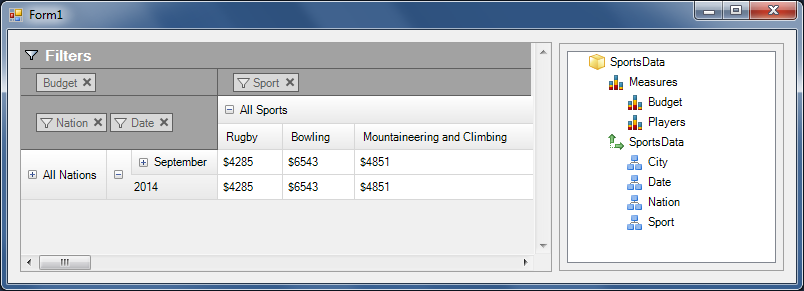

////

|metadata|
{
    "name": "winpivotgrid-adding-olapdataselector",
    "controlName": ["OlapDataSelector"],
    "tags": [],
    "guid": "cef8e684-2781-4f4c-ad5f-7895176cbe6e",  
    "buildFlags": [],
    "createdOn": "2014-09-12T02:44:59.7144189Z"
}
|metadata|
////

= Adding OlapDataSelector

=== Overview

Although a separate control, the data selector link:{ApiPlatform}win.ultrawinpivotgrid{ApiVersion}~infragistics.win.ultrawinpivotgrid.dataselector.olapdataselector_members.html[OlapDataSelector], Similar to the `MdxDataSelector`, is an essential mechanism for the  _WinPivotGrid_  control when used with FlatDataSource. Binding the data selector to the same data source as the pivot grid, the  _WinPivotGrid_  displays the list of dimensions and measures that the user can interact with at runtime by adding them to the pivot grid.

.Note:
[NOTE]
====
If the data selector is not present at runtime, you will not be able to add the dimensions. You can only remove them from the pivot grid.
====

