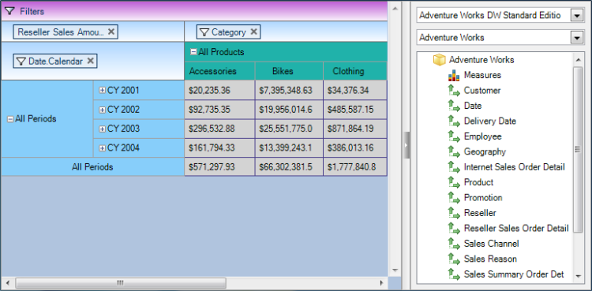
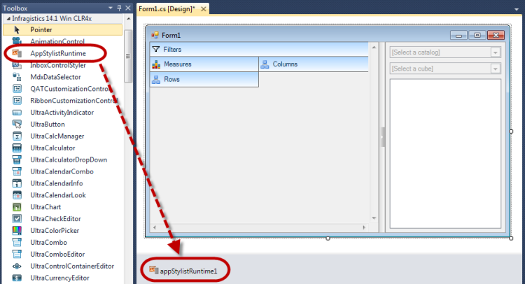
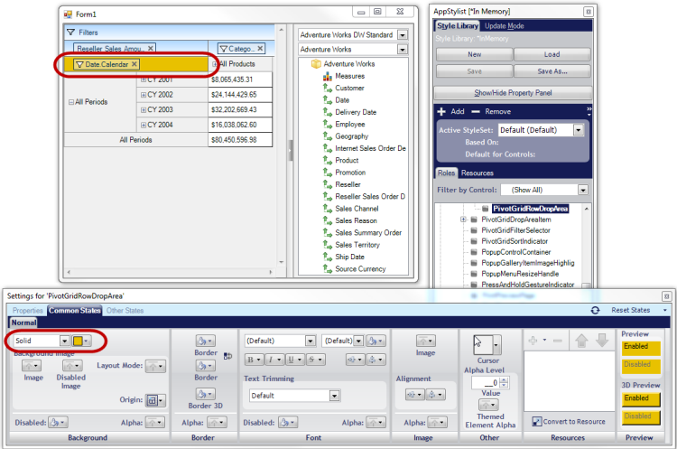
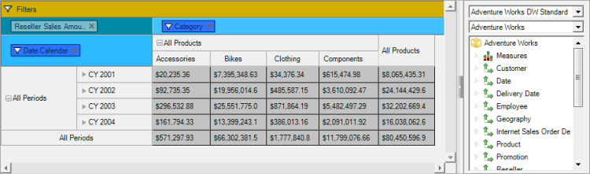

////

|metadata|
{
    "name": "winpivotgrid-styling-winpivotgrid",
    "controlName": [],
    "tags": [],
    "guid": "c107d1be-5b64-45fa-a8e0-ff13dacb6657",  
    "buildFlags": [],
    "createdOn": "2014-03-13T21:35:20.9438837Z"
}
|metadata|
////

= Styling WinPivotGrid

== Topic Overview

=== Purpose

This topic illustrates, with screenshots, the available options and configurations in customizing the appearance of the  _WinPivotGrid_™ control.

=== In this topic

This topic contains the following sections:

* <<_Ref381024372,Styling WinPivotGrid>>

** <<_Ref381024381,Introduction>>
** <<_Ref382343824,Styling the elements>>

* <<_Ref382343835,Using AppStylist>>

** <<_Ref382343847,Using AppStylist at runtime>>
** <<_Ref382343857,Using AppStylist library>>

* <<_Ref381024436,Related Content>>

[[_Ref381024372]]
== Styling WinPivotGrid

[[_Ref381024381]]

=== Introduction

There are several ways to style the appearances of the  _WinPivotGrid_   control’s visual elements. The appearance of each element can be changed using the control’s `appearance` property. The  _WinPivotGrid_   also supports  _AppStylist,_   used to create a style library file with desired styles for each of the elements and save it as a theme file for your pivot grid.  _AppStylist_   also comes with existing library files. Use these to model from and customize the  _WinPivotGrid_  .

[[_Ref382343824]]

=== Styling the elements

Elements such as rows, columns, cells, drop areas, and control have appearance properties that can be customized as demonstrated in the following code:

*In C#:*

[source,csharp]
----
ultraPivotGrid1.RowHeaderAppearance.Normal.BackColor = Color.LightSkyBlue;
ultraPivotGrid1.ColumnHeaderAppearance.Normal.BackColor = Color.LightSeaGreen;
ultraPivotGrid1.CellAppearance.Normal.BackColor = Color.LightGray;
ultraPivotGrid1.CellAppearance.Normal.BorderColor = Color.DarkSlateBlue;
ultraPivotGrid1.Appearance.BackColor = Color.LightSteelBlue;
ultraPivotGrid1.FilterDropArea.Appearance.Normal.BackColor = Color.MediumOrchid;
----

*In Visual Basic:*

[source,vb]
----
ultraPivotGrid1.RowHeaderAppearance.Normal.BackColor = Color.LightSkyBlue
ultraPivotGrid1.ColumnHeaderAppearance.Normal.BackColor = Color.LightSeaGreen
ultraPivotGrid1.CellAppearance.Normal.BackColor = Color.LightGray
ultraPivotGrid1.CellAppearance.Normal.BorderColor = Color.DarkSlateBlue
ultraPivotGrid1.Appearance.BackColor = Color.LightSteelBlue
ultraPivotGrid1.FilterDropArea.Appearance.Normal.BackColor = Color.MediumOrchid
----

The result.

[[_Ref382343835]]
== Using AppStylist

[[_Ref382343847]]

=== Using AppStylist at runtime

AppStylist at runtime requires adding the link:{ApiPlatform}win.appstylistsupport{ApiVersion}~infragistics.win.appstyling.runtime.appstylistruntime_members.html[AppStylistRuntime] control on to the form and calling a method, in code, to start up the AppStylist when the application starts running. The following two steps demonstrates this:

1. Drop the `AppStylistRuntime` control on to the form.

2. Use the following code to start up the AppStylist.

*In C#:*

[source,csharp]
----
appStylistRuntime1.ShowRuntimeApplicationStylingEditor(this, "AppStylist");
----

*In Visual Basic:*

[source,vb]
----
appStylistRuntime1.ShowRuntimeApplicationStylingEditor(Me, "AppStylist")
----

The following screenshot illustrates  _AppStylist_   at runtime customizing the pivot grid row drop area.

For more details on how to style your application with  _AppStylist_   please refer to the link:styling-guide-setting-up-your-application-for-styling.html[Setting Up Your Application for Styling] topic.

[[_Ref382343857]]

=== Using AppStylist library

Using  _AppStylist_   library file is a convenient way of styling the control. The style library file can be created and saved, and can be added in any application that uses  _WinPivotGrid_  . After creating an  _AppStylist_   library file, add it to your application and use the following code to load it.

*In C#:*

[source,csharp]
----
Infragistics.Win.AppStyling.StyleManager.Load("..\\PivotGridStyleSet.isl");
----

*In Visual Basic:*

[source,vb]
----
Infragistics.Win.AppStyling.StyleManager.Load("..\PivotGridStyleSet.isl")
----

The final result.

[[_Ref381024436]]
== Related Content

=== Topics

The following topics provide additional information related to this topic.

[options="header", cols="a,a"]
|====
|Topic|Purpose

| link:winpivotgrid-binding-data-to-winpivotgrid.html[Binding Data to WinPivotGrid]
|This topic explains and demonstrates the _WinPivotGrid_ data binding to each supported data Source/Provider.

| link:winpivotgrid-glossary.html[Glossary]
|This section lists common terms used in pivot grid topics.

|====