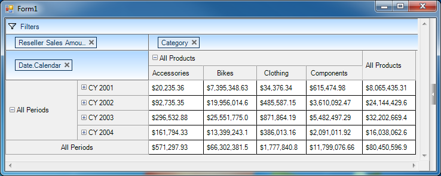

////

|metadata|
{
    "name": "winpivotgrid-using-xmla",
    "controlName": ["MdxDataSelector"],
    "tags": [],
    "guid": "92b6f0b7-e773-4e5c-b79e-57c382f8ce49",  
    "buildFlags": [],
    "createdOn": "2014-09-12T01:55:23.6634189Z"
}
|metadata|
////

= Using XMLA

== Topic Overview

=== Purpose

This topic explains and demonstrates the  _WinPivotGrid_™ data binding to XMLA data Source/Provider.

=== Application Requirements

Start with a Windows Forms project.

Ensure that your application is created based on  *.Net Framework 4* , not  *.Net Framework 4 Client Profile*  that does not include  _System.Web.Extensions_  .

=== In this topic

This topic contains the following sections:

* <<_Ref381022240,Using XMLA>>

** <<_Ref398230515,Preview>>
** <<_Ref398230523,Requirements>>
** <<_Ref381022255,XMLA settings>>
** <<_Ref381022262,Code>>

* <<_Ref398233342,Adding MdxDataSelector>>
* <<_Ref381022312,Related Content>>

[[_Ref381022240]]
== Using XMLA

[[_Ref398230515]]

=== Preview

The following screenshot is the preview of the result from XMLA data binding example in this topic:

[[_Ref398230523]]

=== Requirements

To complete the procedure you need the following:

[options="header", cols="a,a"]
|====
|Requirement category|Requirement listing

|Assemblies
|{ApiPlatform}Olap.Core.v{ProductVersion} 

{ApiPlatform}Olap.DataSource.v{ProductVersion} 

{ApiPlatform}Olap.DataSource.Xmla.v{ProductVersion} 

{ApiPlatform}Olap.DataSource.Mdx.v{ProductVersion} 

{ApiPlatform}Shared.v{ProductVersion} 

{ApiPlatform}Win.UltraWinPivotGrid.v{ProductVersion} 

{ApiPlatform}Win.v{ProductVersion}

|Using/Imports
|Add the following _Using/Imports_ statement in your application form: 

Infragistics.Olap.Xmla

|====

[[_Ref381022255]]

=== XMLA settings

XMLA settings require the following configuration including the dimensions (rows, columns and measures) of the cube. The binding code example below contains these settings.

[options="header", cols="a,a"]
|====
|Parameter|Description

|ServerUrl
|Specifies the server instance ( *Required* ). 

`ServerUrl = "http://sampledata.infragistics.com/olap``/msmdpump.dll"`

| _catalog_ 
|Specifies the name of the Analysis Services database ( *Required* ). 

`Catalog = "Adventure Works DW Standard Edition"`

| _cube_ 
|Cube name ( *Required* ). 

`Cube = "Adventure Works"`

| _Rows_ 
|Rows dimensions. 

`Rows = "[Date].[Calendar]"`

| _Columns_ 
|Column dimensions. 

`Columns = "[Product].[Category] "`

| _Measures_ 
|Measures dimensions. 

`Measures = "[Measures].[Reseller Sales Amount]"`

|====

[[_Ref381022262]]

=== Code

Used to access any standard multidimensional data source residing on the web; XMLA is the native protocol for Microsoft SQL Server Analysis Services.

.Note:
[NOTE]
====
This topic uses Infragistics sample data for demonstration purposes.
====

This example uses the data from the Infragistics OLAP server.

*In C#:*

[source,csharp]
----
XmlaInitialSettings settings = new XmlaInitialSettings
{
    ServerUrl = "http://sampledata.infragistics.com/olap/msmdpump.dll",
    Catalog = "Adventure Works DW Standard Edition",
    Cube = "Adventure Works",
    Rows = "[Date].[Calendar]",
    Columns = "[Product].[Category]",
    Measures = "[Measures].[Reseller Sales Amount]"
};
XmlaDataSource xmlaDs = new XmlaDataSource(settings);
ultraPivotGrid1.DataSource = xmlaDs;
----

*In Visual Basic:*

[source,vb]
----
Dim settings As New XmlaInitialSettings() With { _
      .ServerUrl = "http://sampledata.infragistics.com/olap/msmdpump.dll", _
      .Catalog = "Adventure Works DW Standard Edition", _
      .Cube = "Adventure Works", _
      .Rows = "[Date].[Calendar]", _
      .Columns = "[Product].[Category]", _
      .Measures = "[Measures].[Reseller Sales Amount]" _
}
Dim xmlaDs As New XmlaDataSource(settings)
ultraPivotGrid1.DataSource = xmlaDs
----

[[_Ref398233342]]

include::winpivotgrid-adding-mdxdataselector.adoc[]

[[_Ref381022312]]
== Related Content

=== Topics

The following topics provide additional information related to this topic.

[options="header", cols="a,a"]
|====
|Topic|Purpose

| link:winpivotgrid.html[WinPivotGrid]
|This section contains topics covering the _WinPivotGrid_™ control for Infragistics® Windows Forms®.

| link:winpivotgrid-using-adomd.html[Using ADOMD]
|This topic explains and demonstrates the _WinPivotGrid_™ data binding to ADOMD data Source/Provider.

| link:winpivotgrid-using-flatdatasource.html[Using FlatDataSource]
|This topic explains how to use the FlatDataSource class for displaying _IEnumerable_ data in the _WinPivotGrid_™.

| link:winpivotgrid-glossary.html[Glossary]
|This section lists common terms used in pivot grid topics.

|====