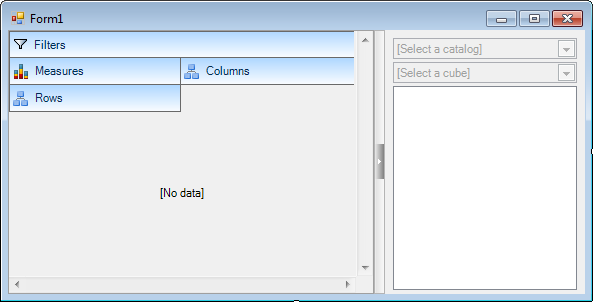
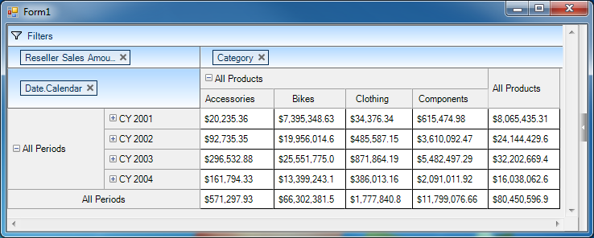
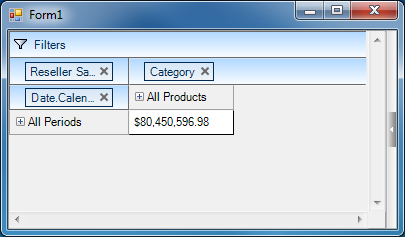
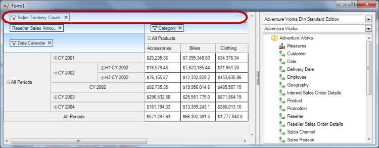
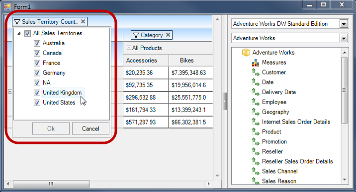
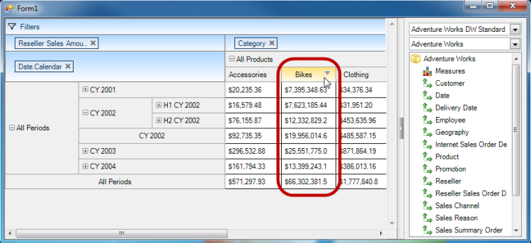
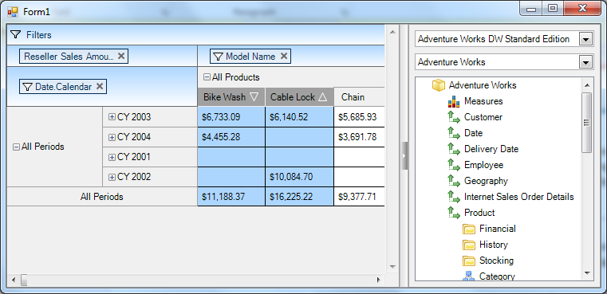
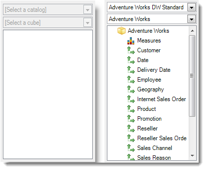
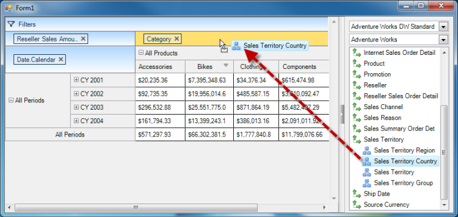
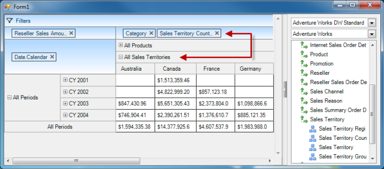

////

|metadata|
{
    "name": "winpivotgrid-winpivotgrid-overview",
    "controlName": ["MdxDataSelector"],
    "tags": [],
    "guid": "ba514e15-6723-40c2-99ae-0ad407485026",  
    "buildFlags": [],
    "createdOn": "2014-03-13T21:16:05.1423151Z"
}
|metadata|
////

= WinPivotGrid Overview

== Topic Overview

=== Purpose

This topic provides an overview of the  _WinPivotGrid_™ control and its main features.

=== Required background

The following table lists the concept required as a prerequisite to understanding this topic.

[options="header", cols="a,a"]
|====
|Type|Content

|Concept
|Online Analytical Processing ( link:http://en.wikipedia.org/wiki/Online_analytical_processing[OLAP]) is a method of retrieving answers to complex analytical queries from multidimensional data cubes. 

XML for Analysis ( link:http://msdn.microsoft.com/en-us/library/bb522619(v=sql.120).aspx[XMLA]) provides open access to multidimensional data from varied data sources - any client platform to any server platform - through web services that are supported by multiple vendors. 

ActiveX Data Objects, multidimensional ( link:http://msdn.microsoft.com/en-us/library/ms123483(v=sql.120).aspx[ADOMD]) is a Microsoft .Net framework data provider.

|====

=== In this topic

This topic contains the following sections:

* <<_Ref381024372,WinPivotGrid Control>>

** <<_Ref381024381,Introduction>>
** <<_Ref381024389,Control elements>>

* <<_Ref381024396,Main Features>>

** <<_Ref381024407,Expandable Row/Column headers>>
** <<_Ref381024417,Assigning rows, columns and measures>>
** <<_Ref381264884,Filtering>>
** <<_Ref381024427,Sorting>>
** <<_Ref381277473,Data Selector>>

* <<_Ref381024436,Related Content>>

[[_Ref381024372]]
== WinPivotGrid Control

[[_Ref381024381]]

=== Introduction

The link:{ApiPlatform}win.ultrawinpivotgrid{ApiVersion}~infragistics.win.ultrawinpivotgrid.ultrapivotgrid_members.html[UltraWinPivotGrid] control can serve as a tool for summarizing your data, and allows you to create complex business analysis applications. It uses OLAP to present the results of multidimensional data, making it easy to visualize the data in a sliced dimension.

[[_Ref381024389]]

=== Control elements

The four crucial elements of the  _WinPivotGrid_   control are the following areas known as drop areas:

* Rows – Drop area for rows
* Columns – Drop area for columns
* Measures – Drop area for numeric values queried for given rows and columns
* Filters – (optional) Drop area for filtered criteria that help to narrow down the data to display as part of the query

The data area is reserved to represent the Rows/Columns; RowColumn headers and cell values for measures.

[[_Ref381024396]]
== Main Features

[[_Ref381024407]]

=== Expandable row/column headers

By default, when Rows/Columns are dropped in the drop areas dimensions collapse. The ‘+’ sign located in the Row/Column header allows to Expand/Collapse.

[[_Ref381024417]]

=== Assigning rows, columns and measures

Assignment of the Rows/Columns is either performed automatically, dropping them on the form, or manually when adding the dimensions for Rows/Columns via code, for example:

`Rows = "[Date].[Calendar]"`

`Columns = "[Product].[Category]"`

`Measures = "[Measures].[Reseller Sales Amount]"`

==== Related Topics:

* link:winpivotgrid-binding-data-to-winpivotgrid.html[Binding WinPivotGrid to Data]

[[_Ref381264884]]

=== Filtering

Filtering is an essential feature that allows narrowing down the summarized data into more specific fields for statistics as it is illustrated in the following screenshot:

`Filters="[Sales Territory].[Sales Territory Country]"`

Filtering also provides runtime capability with a dropdown menu allowing the user to filter out columns by clicking the filter icon and using the checkboxes to select/unselect columns.

[[_Ref381024427]]

=== Sorting

The column headers allow sorting, and as it is illustrated in the following screenshot with  *Bikes*  column, when you hover the mouse point over the column header the sort indicator appears:

Multi-column sorting is another sort feature that you can perform by pressing down the `shift` key on the keyboard and clicking the sort indicator located on a column header.

The following screenshot illustrates multi-column sorting with “Model Name” column dimansion that contains multiple columns. The two highlighted columns below are sorted individually in Descending / Ascending order.

[[_Ref381277473]]

=== Data Selector

The  _WinPivotGrid_   allows data binding directly to a data source, and also using the link:{ApiPlatform}win.ultrawinpivotgrid{ApiVersion}~infragistics.win.ultrawinpivotgrid.dataselector.mdxdataselector.html[MdxDataSelector]. The Multidimensional Expression (MDX) data selector functions as a provider for the multidimensional data from OLAP data services.

The `MdxDataSelector` consists of two dropdowns for data catalogs and OLAP cubes, and a tree structure to display the measures and dimensions.

The following screenshot illustrates selecting and dropping a dimension from data selector onto the pivot column drop area.

[[_Ref381024436]]
== Related Content

=== Topics

The following topics provide additional information related to this topic.

[options="header", cols="a,a"]
|====
|Topic|Purpose

| link:winpivotgrid-binding-data-to-winpivotgrid.html[Binding WinPivotGrid to Data]
|This topic explains and demonstrates the _WinPivotGrid_™ data binding to each supported data Source/Provider.

| link:winpivotgrid-styling-winpivotgrid.html[Styling WinPivotGrid]
|This topic illustrates, with screenshots, the available options and configurations in customizing the appearance of the _WinPivotGrid_™ control.

| link:winpivotgrid-glossary.html[Glossary]
|This section lists common terms used in pivot grid topics.

|====