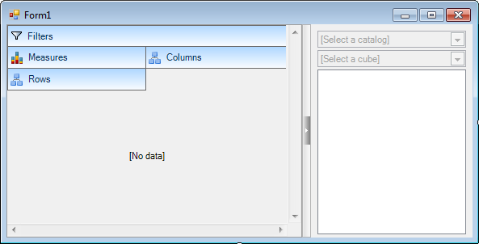

////

|metadata|
{
    "name": "winpivotgrid",
    "controlName": [],
    "tags": [],
    "guid": "5cb5135a-4cb0-4059-8c78-bbe1eb79cd0b",  
    "buildFlags": [],
    "createdOn": "2014-03-13T21:15:03.795181Z"
}
|metadata|
////

= WinPivotGrid

== In This Group of Topics

=== Introduction

This section contains topics covering the  _WinPivotGrid_™ control for Infragistics® Windows Forms®.

The link:{ApiPlatform}win.ultrawinpivotgrid{ApiVersion}~infragistics.win.ultrawinpivotgrid.ultrapivotgrid_members.html[UltraPivotGrid] control provides the ability to present multidimensional (rows and columns) data to an end user.

Visual Studio’s designer view of the control.

Runtime view of the control bound to data.

image::images/WinPivotGrid_2.png[]

=== Topics

[options="header", cols="a,a"]
|====
|Topic|Purpose

| link:winpivotgrid-winpivotgrid-overview.html[WinPivotGrid Overview]
|This topic provides an overview of the _WinPivotGrid_™ control and its main features.

| link:winpivotgrid-using-winpivotgrid.html[Using WinPivotGrid]
|This section contains topics on how to use the _WinPivotGrid_™ control.

| link:winpivotgrid-glossary.html[Glossary]
|This section lists common terms used in pivot grid topics.

| link:winpivotgrid-api-overview.html[API Overview]
|This section lists the namespaces and key classes of the _WinPivotGrid_™ control.

|====