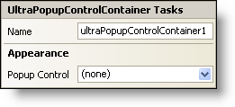

////

|metadata|
{
    "name": "winpopupcontrolcontainer-smart-tag",
    "controlName": ["WinPopupControlContainer"],
    "tags": ["Getting Started"],
    "guid": "{859BF82F-307C-48CD-9858-A8F30D2908B0}",  
    "buildFlags": [],
    "createdOn": "2005-07-11T00:00:00Z"
}
|metadata|
////

= WinPopupControlContainer Smart Tag

In Visual Studio 2005 (.NET Framework 2.0), each Infragistics Windows Forms control/component is equipped with a Smart Tag. By simply selecting the control/component, a Smart Tag anchor appears. When you click this anchor, a pop-up panel appears, providing you with quick and easy access to the most common properties and settings of the control/component.

The WinPopupControlContainer™ Smart Tag contains the name of the component, as well as the following section:

* Appearance -- Provides common tasks involving the appearance, look, and feel of the control.

See below for a description of the item (e.g., field, drop-down list, checkbox) in each section, as well as the item's corresponding property in the properties grid.

[options="header", cols="a,a,a"]
|====
|Appearance|Description|Corresponding Property

|Popup Control
|You can use the drop-down list to select one of the available controls currently on your form. This control is displayed in a popup window when the control's Show method is invoked.
| pick:[win-forms="link:infragistics4.win.misc.v{ProductVersion}~infragistics.win.misc.ultrapopupcontrolcontainer~popupcontrol.html[PopupControl]"] 

|====