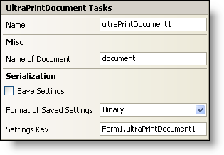

////

|metadata|
{
    "name": "winprintdocument-smart-tag",
    "controlName": ["WinPrintDocument"],
    "tags": ["API","Design Environment","Printing"],
    "guid": "{DBD45B88-8AEA-4B37-A0CA-41EE4B7C59FA}",  
    "buildFlags": [],
    "createdOn": "2005-11-11T00:00:00Z"
}
|metadata|
////

= WinPrintDocument Smart Tag

In Visual Studio 2005 (.NET Framework 2.0), each Infragistics Windows Forms control/component is equipped with a Smart Tag. By simply selecting the control/component, a Smart Tag anchor appears. When you click this anchor, a pop-up panel appears, providing you with quick and easy access to the most common properties and settings of the control/component.

The WinPrintDocument™ Smart Tag contains the name of the component, as well as the following sections:

* Misc -- Provides various options that will enhance the overall look or performance of the control.
* Serialization -- Provides quick access to properties used in the IPersistComponentSettings interface (new in Visual Studio 2005).

See below for a description of the item (e.g., field, drop-down list, checkbox) in each section, as well as the item's corresponding property in the properties grid.

[options="header", cols="a,a,a"]
|====
|Misc|Description|Corresponding Property

|Name of Document
|Enter a name for the document that will be shown to the user.
|DocumentName

|====

[options="header", cols="a,a,a"]
|====
|Serialization|Description|Corresponding Property

|Save Settings
|If you select this checkbox, the component will automatically load/save its property settings with the application's settings.
| pick:[win-forms="link:{ApiPlatform}win{ApiVersion}~infragistics.win.printing.ultraprintdocument~savesettings.html[SaveSettings]"] 

|Format of Saved Settings
|The component can save its settings in either binary or XML format.
| pick:[win-forms="link:{ApiPlatform}win{ApiVersion}~infragistics.win.printing.ultraprintdocument~savesettingsformat.html[SaveSettingsFormat]"] 

|Settings Key
|You can specify the settings key that will be used to uniquely identify the settings' values that will be loaded/saved. By default, Visual Studio 2005 sets the settings key value based on the name of the containing form/control and the name of the component.
| pick:[win-forms="link:{ApiPlatform}win{ApiVersion}~infragistics.win.printing.ultraprintdocument~settingskey.html[SettingsKey]"] 

|====