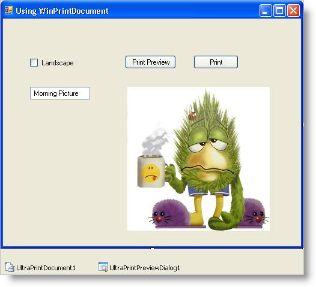

////

|metadata|
{
    "name": "winprintdocument-using-winprintdocument",
    "controlName": ["WinPrintDocument"],
    "tags": [],
    "guid": "{41E77E5A-7175-4967-9480-5B896DD48ADD}",  
    "buildFlags": [],
    "createdOn": "0001-01-01T00:00:00Z"
}
|metadata|
////

= Using WinPrintDocument

The WinPrintDocument™ component derives from the  pick:[win-forms="link:{ApiPlatform}win{ApiVersion}~infragistics.win.printing.ultraprintdocument.html[PrintDocument]"]  class and provides properties for dealing with page headers and footers. Using Header and Footer properties like  pick:[win-forms="link:{ApiPlatform}win{ApiVersion}~infragistics.win.printing.headerfooterpagesection~textleft.html[TextLeft]"] ,  pick:[win-forms="link:{ApiPlatform}win{ApiVersion}~infragistics.win.printing.headerfooterpagesection~textright.html[TextRight]"] , and  pick:[win-forms="link:{ApiPlatform}win{ApiVersion}~infragistics.win.printing.headerfooterpagesection~textcenter.html[TextCenter]"] , you can create headers and footers for your print documents without having to calculate text size.

[start=1]
. *Start a new project in Visual Studio.*

Add a UltraCheckBox control to the form and name it "chkLandscape" and set the Text property to "Landscape". This will determine whether the printing is done in landscape or portrait mode.

Add an UltraButton to the form and call it "btnPrintPreview". Set the Text of the button to "Print Preview". This button will launch the Print Preview dialog.

Add another button and name it "btnPrint". Set the Text of this button to "Print". This button will print to the printer.

Add a UltraTextEditor to the form and call it "txtCenterText". The control's Text property will be printed as centered text in the header and footer of the print document.

Add a UltraPictureBox control to the form and name it "pbPrintImage". The image in this PictureBox is what will be printed.

Finally, add an UltraPrintDocument and a UltraPrintPreviewDialog component to the form.
[start=2]
. *Assigning an Image*

You can print anything with the WinPrintDocument. For the purposes of this example, you will use an image. Set the Image property of 'pbPrintImage' to whatever image file you like, and specify a some text in the WinTextEditor.

The form should now look something like this:

[start=3]
. *Initializing properties.*

In order for the PrintPreviewDialog component to work with the ultraPrintDocument, you simply assign it as the Document property. Add the following code in the Form_Load event.

*In Visual Basic:*

----
Private Sub Using_WinPrintDocument_Load(ByVal sender As Object, _
  ByVal e As System.EventArgs) Handles MyBase.Load
	' Set the PrintPreview dialog to use the 
	' UltraPrintDocument. 			
	Me.UltraPrintPreviewDialog1.Document = Me.UltraPrintDocument1
End Sub
----

*In C#:*

----
private void Using_WinPrintDocument_Load(object sender, EventArgs e)
{
	// Set the PrintPreview dialog to use the 
	// UltraPrintDocument. 	
	this.ultraPrintPreviewDialog1.Document = this.ultraPrintDocument1;
}
----

[start=4]
. *Show page numbers.*

The headers and footers of the ultraPrintDocument can automatically display the current page number using a replacement code of "[Page #]". Add the following code to the Form_Load event to display page numbers on the right side of the header and footer.

*In Visual Basic:*

----
' Set the TextRight on the Header and Footer of 
' the UltraPrintDocument to display the page number. 
' This is set in Form_Load, because it won't change.
' TextCenter and TextRight are variable, and so they
' will be set in the BeginPrint event of the 
' UltraPrintDocument. 
Me.ultraPrintDocument1.Header.TextRight = "Page: [Page #]"
Me.ultraPrintDocument1.Footer.TextRight = "Page: [Page #]"
----

*In C#:*

----
// Set the TextRight on the Header and Footer of 
// the UltraPrintDocument to display the page number. 
// This is set in Form_Load, because it won't change.
// TextCenter and TextRight are variable, and so they
// will be set in the BeginPrint event of the 
// UltraPrintDocument. 
this.ultraPrintDocument1.Header.TextRight = "Page: [Page #]";
this.ultraPrintDocument1.Footer.TextRight = "Page: [Page #]";
----

[start=5]
. *Showing the PrintPreview dialog.*

Handle the click event of 'btnPrintPreview' and add the following code.

*In Visual Basic:*

----
Private Sub btnPrintPreview_Click(ByVal sender As Object, _
  ByVal e As System.EventArgs) Handles btnPrintPreview.Click
	' Show the PrintPreview dialog. 
	Me.UltraPrintPreviewDialog1.ShowDialog(Me)
End Sub
----

*In C#:*

----
private void btnPrintPreview_Click(object sender, EventArgs e)
{
	// Show the PrintPreview dialog.
	this.ultraPrintPreviewDialog1.ShowDialog(this);
}
----

[start=6]
. *Calling the Print method.*

To print, call the Print method on the UltraPrintDocument component directly. Handle the click event of 'btnPrint'.

*In Visual Basic:*

----
Private Sub btnPrint_Click(ByVal sender As Object, _
  ByVal e As System.EventArgs) Handles btnPrint.Click
	' Print the ultraPrintDocument
	Me.UltraPrintDocument1.Print()
End Sub
----

*In C#:*

----
private void btnPrint_Click(object sender, EventArgs e)
{
	// Print the ultraPrintDocument
	this.ultraPrintDocument1.Print();
}
----

[start=7]
. *Run the application.*

If you run the application at this point and click the Print Preview, the Print Preview dialog will display. There will be a single page with some header and footer text aligned to the right side of the page indication that this is Page 1.
[start=8]
. *The BeginPrint event.*

The BeginPrint event of the UltraPrintDocument component is a good place to initialize print settings that may change depending on the state of the application. For example, the name of the file being printed may be different. Or you may want to print the time and date of the print operation. Or you might want to print in Landscape or portrait based on some other settings, like the CheckBox which you added to the form in Step 1.

Handle the BeginPrint event and add the following code.

*In Visual Basic:*

----
Private Sub UltraPrintDocument1_BeginPrint(ByVal sender As Object, _
  ByVal e As System.Drawing.Printing.PrintEventArgs) _
  Handles UltraPrintDocument1.BeginPrint
	' Set the TextLeft on the Header and Footer to display 
	' the Date and Time.
	Me.UltraPrintDocument1.Header.TextLeft = DateTime.Now.ToShortDateString() + _
	  " " + DateTime.Now.ToShortTimeString()
	Me.UltraPrintDocument1.Footer.TextLeft = DateTime.Now.ToShortDateString() + _
	  " " + DateTime.Now.ToShortTimeString()
	' Set the TextCenter to show whatever is in txtCenterText
	' on the form. This simulates setting the text to some
	' variable that might change each time you print. 
	Me.UltraPrintDocument1.Header.TextCenter = Me.txtCenterText.Text
	Me.UltraPrintDocument1.Footer.TextCenter = Me.txtCenterText.Text
	' Set the LandScape property on the DefaultPageSetting
	' based on the chkLandScape checkbox. 
	Dim landScape As Boolean = Me.chkLandscape.Checked
	Me.UltraPrintDocument1.DefaultPageSettings.Landscape = landScape
End Sub
----

*In C#:*

----
private void ultraPrintDocument1_BeginPrint(object sender, 
  System.Drawing.Printing.PrintEventArgs e)
{
    // Set the TextLeft on the Header and Footer to display 
    // the Date and Time.
    this.ultraPrintDocument1.Header.TextLeft = DateTime.Now.ToShortDateString() + 
      " " + DateTime.Now.ToShortTimeString();
    this.ultraPrintDocument1.Footer.TextLeft = DateTime.Now.ToShortDateString() + 
      " " + DateTime.Now.ToShortTimeString();
    // Set the TextCenter to show whatever is in txtCenterText
    // on the form. This simulates setting the text to some
    // variable that might change each time you print. 
    this.ultraPrintDocument1.Header.TextCenter = this.txtCenterText.Text;
    this.ultraPrintDocument1.Footer.TextCenter = this.txtCenterText.Text;
    // Set the LandScape property on the DefaultPageSetting
    // based on the chkLandScape checkbox. 
    bool landScape = this.chkLandscape.Checked;			
    this.ultraPrintDocument1.DefaultPageSettings.Landscape = landScape;
}
----

[start=9]
. *Run the application*

Run the application and click Print Preview. The Print Preview dialog will display. There is still only one empty page to print, but now there are three sections in the header and footer. On the left is the current date and time of the print operation. In the middle is the filename, or whatever text you entered into the 'txtCenterText' TextBox control.

If you check the Landscape CheckBox and press Print Preview again, you will see the preview displays the page oriented in landscape mode.
[start=10]
. *Draw the image.*

To draw the actual content of the print operation (in this case the image), you can use the PrintPage event. This event will fire once by default, and the event arguments give you the margin information and a graphics object onto which you can draw using any GDI+ drawing method.

The event will fire only once by default. If there are more pages to print after the first, you must set the HasMorePages property on the event arguments to true. In which case, the event will fire again and keep firing until HasMorePages is false.

First, declare a couple of variables on the form that will keep track of the last part of the image that was printed.

*In Visual Basic:*

----
' These variables will keep track of the left 
' and bottom-most pixels of the image that have 
' been printed, so we know where to start 
' printing on the next PrintPage event. 
Dim lastPrintX As Integer
Dim lastPrintY As Integer
----

*In C#:*

----
// These variables will keep track of the left 
// and bottom-most pixels of the image that have 
// been printed, so we know where to start 
// printing on the next PrintPage event. 
int lastPrintX;
int lastPrintY;
----

Initialize these variables in BeginPrint. Add this code to the end of the BeginPrint event.

*In Visual Basic:*

----
' These variables keep track of the left and bottom-most 
' pixels of the image that have been printed, so we know
' where to start printing on the next PrintPage event. 
' Initialize them to 0, since this is the start of a 
' print operation.
Me.lastPrintX = 0
Me.lastPrintY = 0
----

*In C#:*

----
// These variables keep track of the left and bottom-most 
// pixels of the image that have been printed, so we know
// where to start printing on the next PrintPage event. 
// Initialize them to 0, since this is the start of a 
// print operation.
this.lastPrintX = 0;
this.lastPrintY = 0;
----

Now handle the PrintPage event and draw the image (or as much as will fit on each page).

*In Visual Basic:*

----
Private Sub UltraPrintDocument1_PrintPage(ByVal sender As Object, _
  ByVal e As System.Drawing.Printing.PrintPageEventArgs) _
  Handles UltraPrintDocument1.PrintPage
	' Get the image to print
	Dim image As Image = Me.pbPrintImage.Image
	' Get the Image Size
	Dim imageSize As Size = image.Size
	' Get the starting X and Y based on the last portion 
	' of the image that was printed. 
	Dim startX As Integer = Me.lastPrintX
	Dim startY As Integer = Me.lastPrintY
	' Determine how much of the image remains to be printed 
	' from the starting point.
	Dim remainingImageWidth As Integer = imageSize.Width - startX
	Dim remainingImageHeight As Integer = imageSize.Height - startY
	' These variables will keep track of whether the height or
	' width were clipped. This will help us determine if more
	' pages need to be printed. 
	Dim wasWidthClipped As Boolean = False
	Dim wasHeightClipped As Boolean = False
	' Get the Size of the printable area of the page in Pixels.
	' MarginBounds returns the rect in hundredths of an inch. 
	Dim scaleX As Single = e.Graphics.DpiX / 100.0F
	Dim scaleY As Single = e.Graphics.DpiY / 100.0F
	Dim printableRect As Rectangle = New Rectangle( _
		CInt(e.MarginBounds.X $$*$$ scaleX), _
		CInt(e.MarginBounds.Y $$*$$ scaleY), _
		CInt(e.MarginBounds.Width $$*$$ scaleX), _
		CInt(e.MarginBounds.Height $$*$$ scaleY) _
	)
	' If the remaining image width is greater than 
	' the width of the printable area of the page, clip it.
	If (remainingImageWidth > printableRect.Width) Then
		remainingImageWidth = printableRect.Width
		wasWidthClipped = True
	End If
	' If the remaining image height is greater than 
	' the height of the printable area of the page, clip it.
	If (remainingImageHeight > printableRect.Height) Then
		remainingImageHeight = printableRect.Height
		wasHeightClipped = True
	End If
	' This rect will define a rect within the image that 
	' is to be printed on the current page. 
	Dim imagePrintRect As Rectangle = New Rectangle( _
		startX, _
		startY, _
		remainingImageWidth, _
		remainingImageHeight _
	)
	' Print the image segment onto the page.
	e.Graphics.DrawImage( _
		image, _
		e.MarginBounds.X, _
		e.MarginBounds.Y, _
		imagePrintRect, _
		GraphicsUnit.Pixel _
	)
	' Set up the variables for the next page
	If (wasWidthClipped) Then
    	' If the Width was clipped, it means we need to 
		' increment lastPrintX. 				
		Me.lastPrintX += (remainingImageWidth + 1)
		' Set HasMorePages to true so the UltraPrintDocument
		' knows there is more to print. 
		e.HasMorePages = True
	ElseIf (wasHeightClipped) Then
		' If the Width was not clipped, but the Height was, 
		' it means we need to move to the next line.
		Me.lastPrintX = 0
		Me.lastPrintY += (remainingImageHeight + 1)
		' Set HasMorePages to true so the UltraPrintDocument
		' knows there is more to print. 
		e.HasMorePages = True
	End If
End Sub
----

*In C#:*

----
private void ultraPrintDocument1_PrintPage(object sender, 
  System.Drawing.Printing.PrintPageEventArgs e)
{
    // Get the image to print
    Image image = (System.Drawing.Image)this.pbPrintImage.Image;
    // Get the Image Size
    Size imageSize = image.Size;
    // Get the starting X and Y based on the last portion 
    // of the image that was printed. 
    int startX = this.lastPrintX;
    int startY = this.lastPrintY;
    // Determine how much of the image remains to be printed 
    // from the starting point.
    int remainingImageWidth = imageSize.Width - startX;
    int remainingImageHeight = imageSize.Height - startY;
    // These variables will keep track of whether the height or
    // width were clipped. This will help us determine if more
    // pages need to be printed. 
    bool wasWidthClipped = false;
    bool wasHeightClipped = false;			
    // Get the Size of the printable area of the page in Pixels.
    // MarginBounds returns the rect in hundredths of an inch. 
    float scaleX = e.Graphics.DpiX / 100f;
    float scaleY = e.Graphics.DpiY / 100f;
    Rectangle printableRect = new Rectangle(
        (int)(e.MarginBounds.X $$*$$ scaleX), 
        (int)(e.MarginBounds.Y $$*$$ scaleY), 
        (int)(e.MarginBounds.Width $$*$$ scaleX), 
        (int)(e.MarginBounds.Height $$*$$ scaleY)
    );
    // If the remaining image width is greater than 
    // the width of the printable area of the page, clip it.
    if (remainingImageWidth > printableRect.Width)
    {
        remainingImageWidth = printableRect.Width;
        wasWidthClipped = true;
    }
    // If the remaining image height is greater than 
    // the height of the printable area of the page, clip it.
    if (remainingImageHeight > printableRect.Height)
    {
        remainingImageHeight = printableRect.Height;
        wasHeightClipped = true;
    }
    // This rect will define a rect within the image that 
    // is to be printed on the current page. 
    Rectangle imagePrintRect = new Rectangle(startX, startY, 
      remainingImageWidth, remainingImageHeight);
    // Print the image segment onto the page. 
    e.Graphics.DrawImage(image, e.MarginBounds.X, 
      e.MarginBounds.Y, imagePrintRect, GraphicsUnit.Pixel);
    // Set up the variables for the next page
    if (wasWidthClipped)
    {
        // If the Width was clipped, it means we need to 
        // increment lastPrintX. 
        this.lastPrintX += (remainingImageWidth + 1);
        // Set HasMorePages to true so the UltraPrintDocument
        // knows there is more to print. 
        e.HasMorePages = true;
    }
    else if (wasHeightClipped)
    {
        // If the Width was not clipped, but the Height was, 
        // it means we need to move to the next line.
        this.lastPrintX = 0;
        this.lastPrintY += (remainingImageHeight + 1);
        // Set HasMorePages to true so the UltraPrintDocument
        // knows there is more to print. 
        e.HasMorePages = true;
    }
}
----

[start=11]
. *Run the application.*

Run the application and click Print Preview. This time, the image (or as much of it as will fit) will be painted on the first page of the printout. If the image does not fit on one page, multiple pages will be available in the preview. Each page shows the headers and footers you assigned.

You can print by clicking the Print button from within the Print Preview dialog or by clicking Print on the form to print directly to the printer.