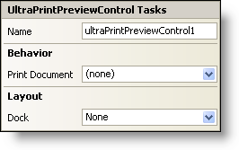

////

|metadata|
{
    "name": "winprintpreview-smart-tag",
    "controlName": ["WinPrintPreviewControl"],
    "tags": ["API","Design Environment","Printing"],
    "guid": "{03F33784-C6D9-4A78-889A-DCD51CC9EF2C}",  
    "buildFlags": [],
    "createdOn": "2005-07-11T00:00:00Z"
}
|metadata|
////

= WinPrintPreview Smart Tag

In Visual Studio 2005 (.NET Framework 2.0), each Infragistics Windows Forms control/component is equipped with a Smart Tag. By simply selecting the control/component, a Smart Tag anchor appears. When you click this anchor, a pop-up panel appears, providing you with quick and easy access to the most common properties and settings of the control/component.

The WinPrintPreview™ Smart Tag contains the name of the control, as well as the following sections:

* Behavior -- Provides easy access to properties that govern how the control behaves on the form.
* Layout -- Offers properties that will determine where and how the control is placed on the form.

See below for a description of the item (e.g., field, drop-down list, checkbox) in each section, as well as the item's corresponding property in the properties grid.

[options="header", cols="a,a,a"]
|====
|Behavior|Description|Corresponding Property

|Print Document
|After you drop a PrintDocument component in the component tray, you can select the PrintDocument component from the drop-down list.
| pick:[win-forms="link:infragistics4.win.misc.v{ProductVersion}~infragistics.win.printing.ultraprintpreviewcontrol~document.html[Document]"] 

|====

[options="header", cols="a,a,a"]
|====
|Layout|Description|Corresponding Property

|Dock
|Choose to dock the control to the top, right, bottom, left, full, or none.
|Dock

|====