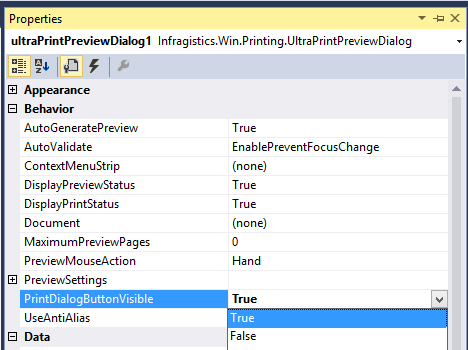

////

|metadata|
{
    "name": "winprintpreviewdialog-adding-printdialog-button-tool",
    "controlName": [],
    "tags": [],
    "guid": "28ada2fc-d5fc-4367-9314-2c08be3a2c9b",  
    "buildFlags": [],
    "createdOn": "2015-02-24T19:38:35.7259456Z"
}
|metadata|
////

= Adding PrintDialog Button Tool

== Adding PrintDialog Button Tool

=== Purpose

This topic introduces the ability for users to optionally display a PrintDialog button tool to choose a printer or change other printer settings.

=== Required background

The following topics are prerequisites to understanding this topic:

[options="header", cols="a,a"]
|====
|Topic|Purpose

| link:winprintpreviewdialog-wingridprintdocument-using-winprintpreviewdialog-with-wingridprintdocument.html[Using WinPrintPreviewDialog]
|Contains tutorials that demonstrate how to use the WinPrintPreviewDialog component.

|====

=== In this topic

This topic contains the following sections:

* <<AddingPrintDialogButtonTool,Adding PrintDialog Button Tool>>

** <<Overview,Overview>>
** <<Preview,Preview>>
** <<PrintDialogButtonToolPropertyandEvents,PrintDialog Button Tool Property and Events>>
** <<Example,Enable the PrintDialog Button Tool>>

* <<RelatedContent,Related Content>>

[[AddingPrintDialogButtonTool]]
== Adding PrintDialog Button Tool

[[Overview]]

=== Overview

The PrintDialog Button Tool allows you to modify printer settings including but not limited to choosing a printer, select the amount of copies per page, and setting a page range.

[[Preview]]

=== Preview

The following screenshot is a preview of the PrintDialog Button Tool with a mouse hover revealing its tooltip.

image::images/PrintPreviewDialogButton_01.png[]

[[PrintDialogButtonToolPropertyandEvents]]
== PrintDialog Button Tool Property and Events

=== Property summary

The PrintDialogButtonVisible property shows or hides the PrintDialog Button Tool on the toolbar of the WinPrintPreviewDialog.

[options="header", cols="a,a,a"]
|====
|Property Name|Property Type|Description

| link:infragistics4.win.ultrawinprintpreviewdialog.v{ProductVersion}~infragistics.win.printing.ultraprintpreviewdialog~printdialogbuttonvisible.html[PrintDialogButtonVisble]
|`Boolean`
|Returns or sets whether the PrintDialog Button Tool is visible.

|====

=== Events summary

The following events have been added to the UltraPrintPreviewDialog class.

[options="header", cols="a,a"]
|====
|Event|Event Description

| link:infragistics4.win.ultrawinprintpreviewdialog.v{ProductVersion}~infragistics.win.printing.ultraprintpreviewdialog~printdialogdisplaying_ev.html[PrintDialogDisplaying]
|This event occurs before the print dialog appears in order to override settings by using the *PrintDialog* property of the EventArgs argument. You can prevent the PrintDialog from appearing by setting the *Cancel* property of the EventArgs argument to _True_ .

| link:infragistics4.win.ultrawinprintpreviewdialog.v{ProductVersion}~infragistics.win.printing.ultraprintpreviewdialog~printdialogclosed_ev.html[PrintDialogClosed]
|This event occurs in response to a clicking on the close or cancel button on the PrintDialog.

|====

[[Example]]
== Enable the PrintDialog Button Tool

=== Example

The following table demonstrates how to programmatically set the PrintDialogButtonVisible property.

[options="header", cols="a,a"]
|====
|Property|Value

|PrintDialogButtonVisble
|True

|====

An example of enabling the PrintDialog Button in code behind.

*In C#:* 

[source,csharp]
---- 
ultraPrintPreviewDialog1.PrintDialogButtonVisible = true; 
---- 

*In Visual Basic:* 

[source,vb]
---- 
ultraPrintPreviewDialog1.PrintDialogButtonVisible = true
---- 

[[RelatedContent]]
== Related Content

=== Topics

The following topics provide additional information related to this topic:

[options="header", cols="a,a"]
|====
|Topic|Purpose

| link:winprintpreviewdialog-wingridprintdocument-using-winprintpreviewdialog-with-wingridprintdocument.html[Using WinPrintPreviewDialog]
|In this section, you'll find tutorials that walk you through common scenarios when using the WinPrintPreviewDialog™ component.

|====