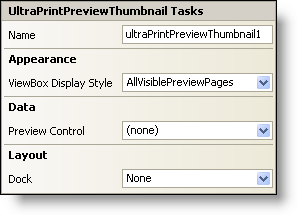

////

|metadata|
{
    "name": "winprintpreviewthumbnail-smart-tag",
    "controlName": ["WinPrintPreviewThumbnail"],
    "tags": ["Getting Started"],
    "guid": "{7CB00471-D1BF-48E3-80E8-1EF0FBE0A981}",  
    "buildFlags": [],
    "createdOn": "2005-07-11T00:00:00Z"
}
|metadata|
////

= WinPrintPreviewThumbnail Smart Tag

In Visual Studio 2005 (.NET Framework 2.0), each Infragistics Windows Forms control/component is equipped with a Smart Tag. By simply selecting the control/component, a Smart Tag anchor appears. When you click this anchor, a pop-up panel appears, providing you with quick and easy access to the most common properties and settings of the control/component.

The WinPrintPreviewThumbnail™ Smart Tag contains the name of the control, as well as the following sections:

* Appearance -- Provides common tasks involving the appearance, look, and feel of the control.
* Data -- Refers to any underlying data the control is using such as data sources and data members.
* Layout -- Offers properties that will determine where and how the control is placed on the form.

See below for a description of the item (e.g., field, drop-down list, checkbox) in each section, as well as the item's corresponding property in the properties grid.

[options="header", cols="a,a,a"]
|====
|Appearance|Description|Corresponding Property

|ViewBox Display Style
|The view box is the red box in the thumbnail that shows you what you are viewing in the PrintPreview control. From the drop-down list, you can specify if you want the view box to display all the preview pages or the current preview page only. Alternatively, you can specify that you want the view box to be hidden.
| pick:[win-forms="link:infragistics4.win.misc.v{ProductVersion}~infragistics.win.printing.ultraprintpreviewthumbnail~viewboxdisplaystyle.html[ViewBoxDisplayStyle]"] 

|====

[options="header", cols="a,a,a"]
|====
|Data|Description|Corresponding Property

|Preview Control
|From the drop-down list, you can select a PrintPreview control that has been dropped on the form. The preview pages of the selected PrintPreview control will be displayed within the thumbnail.
| pick:[win-forms="link:infragistics4.win.misc.v{ProductVersion}~infragistics.win.printing.ultraprintpreviewthumbnail~previewcontrol.html[PreviewControl]"] 

|====

[options="header", cols="a,a,a"]
|====
|Layout|Description|Corresponding Property

|Dock
|Choose to dock the control to the top, right, bottom, left, full, or none.
|Dock

|====