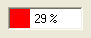

////

|metadata|
{
    "name": "winprogressbar-about-winprogressbar",
    "controlName": ["WinProgressBar"],
    "tags": ["Getting Started","Performance"],
    "guid": "{E0B0C2EA-DDFD-43DF-8540-DA02B4B75F57}",  
    "buildFlags": [],
    "createdOn": "0001-01-01T00:00:00Z"
}
|metadata|
////

= About WinProgressBar

The WinProgressBar™ control has many properties that allow you to control the display of progress. The colors of the progress bar can vary depending on the current percentage value. Alternatively, the progress bar can be displayed as a filled image.

* Appearance Support -- Full appearance support including alpha-blending, gradients, images, etc.
* Style -- you can define the style of the progress bar increments (e.g. display progress in segments, continuous, etc).

