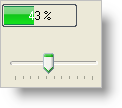
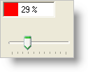
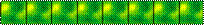
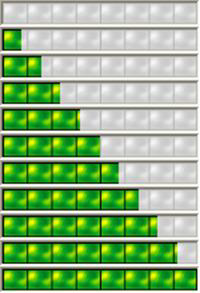

////

|metadata|
{
    "name": "winprogressbar-defining-the-style-of-winprogressbar",
    "controlName": ["WinProgressBar"],
    "tags": ["Performance","Styling"],
    "guid": "{4005FEF1-9A23-4317-A927-62F6839EE0DA}",  
    "buildFlags": [],
    "createdOn": "2005-08-09T00:00:00Z"
}
|metadata|
////

= Defining the Style of WinProgressBar

The WinProgressBar™ control has many properties for controlling the display of progress. It can vary the colors based on the current percentage value or display as a filled image.

[start=1]
. *Start a new project in Visual Studio and add controls to the form.*

For this walkthrough, you will use two UltraProgressBar controls and two TrackBar controls. Change the names of the controls to ultraProgressBarColors, ultraProgressBarImage, trackBarColors, and trackBarImage.
[start=2]
. Before you start writing any code, you should place using/imports directives in your code-behind so you don't need to always type out a member's fully qualified name.

*In Visual Basic:*

----
Imports Infragistics.Win.UltraWinProgressBar
Imports Infragistics.Win
----

*In C#:*

----
using Infragistics.Win.UltraWinProgressBar;
using Infragistics.Win;
----

[start=3]
. *In the Form_Load, place the following code:*

*In Visual Basic:*

----
Me.trackBarColors.Minimum = 0
Me.trackBarColors.Maximum = 100
Me.trackBarColors.TickFrequency = 10
Me.trackBarImage.Minimum = 0
Me.trackBarImage.Maximum = 100
Me.trackBarImage.TickFrequency = 10
----

*In C#:*

----
this.trackBarColors.Minimum = 0;
this.trackBarColors.Maximum = 100;
this.trackBarColors.TickFrequency = 10;
this.trackBarImage.Minimum = 0;
this.trackBarImage.Maximum = 100;
this.trackBarImage.TickFrequency = 10;
----

[start=4]
. *Handle the Scroll events of the trackbar.*

Handle the Scroll event of each trackbars and set the Value on the corresponding ProgressBar. This will allow you to see how the ProgressBar looks based on the value.

*In Visual Basic:*

----
Private Sub trackBarColors_Scroll(ByVal sender As System.Object, _
  ByVal e As System.EventArgs)_
  Handles trackBarColors.Scroll
    Dim tb As TrackBar = DirectCast(sender, TrackBar)
    Me.UltraProgressBarColors.Value = tb.Value
End Sub
Private Sub trackBarImage_Scroll(ByVal sender As System.Object, _
  ByVal e As System.EventArgs)_
  Handles trackBarImage.Scroll
    Dim tb As TrackBar = DirectCast(sender, TrackBar)
    Me.UltraProgressBarImage.Value = tb.Value
End Sub
----

*In C#:*

----
private void trackBarColors_Scroll(object sender, System.EventArgs e)
{
    TrackBar tb = sender as TrackBar;
    this.ultraProgressBarColors.Value = tb.Value;
}
private void trackBarImage_Scroll(object sender, System.EventArgs e)
{
    TrackBar tb = sender as TrackBar;
    this.ultraProgressBarImage.Value = tb.Value;
}
----

[start=5]
. *Initializing the Colors ProgressBar*

Set up a method that will initialize the properties of the ProgressBar that will show colors. Set the Minimum and Maximum for now.

*In Visual Basic:*

----
Private Sub InitializeProgressBarWithColors( _
  ByVal progressBar As UltraProgressBar)
    ' Set the Minimum and Maximum
    progressBar.Minimum = 0
    progressBar.Maximum = 100
End Sub
----

*In C#:*

----
private void InitializeProgressBarWithColors(UltraProgressBar progressBar)
{
    // Set the Minimum and Maximum
    progressBar.Minimum = 0;
    progressBar.Maximum = 100;                
}
----

Call this method from Form_Load.

*In Visual Basic:*

----
Me.InitializeProgressBarWithColors(Me.ultraProgressBarColors)
----

*In C#:*

----
this.InitializeProgressBarWithColors(this.ultraProgressBarColors);
----

[start=6]
. *Run the application*

If you run the application now, you can slide the Trackbars and see the effect that setting that value has on the ProgressBar. The ProgressBar now appears with the default (themed) look.

[start=7]
. *Assigning simple colors*

You can change the color of the control and the color of the filled area by using the Appearance and the FillAppearance respectively. Add the following code to the end of the InitializeProgressBarWithColors method.

*In Visual Basic:*

----
progressBar.UseOsThemes = DefaultableBoolean.False
' Set the BackColor of the control to White. 
progressBar.Appearance.BackColor = Color.White
' Set the Default FillAppearance to Red. This will
' be applied when the Value is below all of the 
' PercentSettings
progressBar.FillAppearance.BackColor = Color.Red
' The default FillAppearance.ForeColor is System.HighlightText. 
' This might not look good on a red background, depending on the 
' system settings, so make it white. 
progressBar.FillAppearance.ForeColor = Color.White
----

*In C#:*

----
progressBar.UseOsThemes = DefaultableBoolean.False;
// Set the BackColor of the control to White. 
progressBar.Appearance.BackColor = Color.White;
// Set the Default FillAppearance to Red. This will
// be applied when the Value is below all of the 
// PercentSettings
progressBar.FillAppearance.BackColor = Color.Red;     
// The default FillAppearance.ForeColor is System.HighlightText. 
// This might not look good on a red background, depending on the 
// system settings, so make it white. 
progressBar.FillAppearance.ForeColor = Color.White;
----

[start=8]
. *Run the application*

Run the application and you will see the ProgressBar appears using Red and White.

[start=9]
. *Initialize the Image ProgressBar*

Create a new method to initialize the second ProgressBar that you added to the form (ultraProgressBarImage).

*In Visual Basic:*

----
Private Sub InitializeProgressBarWithAnImage( _
  ByVal progressBar As UltraProgressBar)
    ' The ProgressBar will not honor appearance properties
    ' when themed, so turn off Themes. 
    progressBar.UseOsThemes = DefaultableBoolean.False
    ' Set the Minimum and Maximum
    progressBar.Minimum = 0
    progressBar.Maximum = 100        
End Sub
----

*In C#:*

----
private void InitializeProgressBarWithAnImage(UltraProgressBar progressBar)
{
    // The ProgressBar will not honor appearance properties
    // when themed, so turn off Themes. 
    progressBar.UseOsThemes = DefaultableBoolean.False;
    // Set the Minimum and Maximum
    progressBar.Minimum = 0;
    progressBar.Maximum = 100;                
}
----

Call this method from Form_Load.

*In Visual Basic:*

----
Me.InitializeProgressBarWithAnImage(Me.ultraProgressBarImage)
----

*In C#:*

----
this.InitializeProgressBarWithAnImage(this.ultraProgressBarImage);
----

[start=10]
. *Assigning Images*

If you run the project right now, ultraProgressBarImage will look very much like the ultraProgressbarColors did in step 7. It will display without themes, using the Windows highlight colors.

To display the ProgressBar with an image, you will set the FillAppearance.ImageBackGroup to a colorful image, and the Appearance.ImageBackGround will be set to the same image in grey-scale and slightly lightened. For the purposes of this tutorial, these are the two images that will be used:

ProgressBarFillImage:

ProgressBarImage:

Add the following code to the end of the InitializeProgressBarWithAnImage method.

*In Visual Basic:*

----
' Hide the text, because it doesn't show up well on 
' this particular image. 
progressBar.TextVisible = False
' An imageList is used to hold the two images shown above
' Set the ImageBackGround of the FillAppearance to a 
' colorful image
progressBar.FillAppearance.ImageBackground = Me.ImageList1.Images(0)
' Set the ImageBackGround of the control to a greyscale version 
' of the same image. As the progress bar value increases it will
' look as though the image is being colorized. 
progressBar.Appearance.ImageBackground = Me.ImageList1.Images(1)
----

*In C#:*

----
// Set the Minimum and Maximum
progressBar.Minimum = 0;
progressBar.Maximum = 100;    
// Hide the text, because it doesn't show up well on 
// this particular image. 
progressBar.TextVisible = false;
// An imageList is used to hold the two images shown above
// Set the ImageBackGround of the FillAppearance to a 
// colorful image
progressBar.FillAppearance.ImageBackground = this.imageList1.Images[0];
// Set the ImageBackGround of the control to a greyscale version 
// of the same image. As the progress bar value increases it will
// look as though the image is being colorized. 
progressBar.Appearance.ImageBackground = this.imageList1.Images[1];
----

[start=11]
. *Run the application*

With the images applied, the ProgressBar will now appear to fill the image with color as the value increases.

