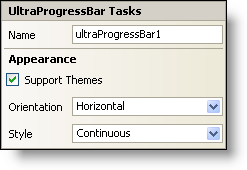

////

|metadata|
{
    "name": "winprogressbar-smart-tag",
    "controlName": ["WinProgressBar"],
    "tags": ["API","Design Environment"],
    "guid": "{FF3EE56B-0F47-47CC-978B-C4D87D99A8A7}",  
    "buildFlags": [],
    "createdOn": "0001-01-01T00:00:00Z"
}
|metadata|
////

= WinProgressBar Smart Tag

In Visual Studio 2005 (.NET Framework 2.0), each Infragistics Windows Forms control/component is equipped with a Smart Tag. By simply selecting the control/component, a Smart Tag anchor appears. When you click this anchor, a pop-up panel appears, providing you with quick and easy access to the most common properties and settings of the control/component.

The WinProgressBar™ Smart Tag contains the name of the control, as well as the following section:

* Appearance -- Provides common tasks involving the appearance, look, and feel of the control.

See below for a description of the item (e.g., field, drop-down list, checkbox) in each section, as well as the item's corresponding property in the properties grid.

[options="header", cols="a,a,a"]
|====
|Appearance|Description|Corresponding Property

|Support Themes
|Select this check box to support basic Microsoft OS themes; for example, Windows Classic theme versus Windows XP theme.
| pick:[win-forms="link:{ApiPlatform}win{ApiVersion}~infragistics.win.ultracontrolbase~supportthemes.html[SupportThemes]"] 

|Orientation
|Select either horizontal or vertical from the drop-down box to display the text on the progress bar horizontally or vertically.
| pick:[win-forms="link:{ApiPlatform}win{ApiVersion}~infragistics.win.ultrawinprogressbar.ultraprogressbar~orientation.html[Orientation]"] 

|Style
|You can change the style of the WinProgressBar to Continuous, Segmented, or SegmentedPartial. Note that this setting is ignored if the "Support Themes" checkbox is selected.
| pick:[win-forms="link:{ApiPlatform}win{ApiVersion}~infragistics.win.ultrawinprogressbar.ultraprogressbar~style.html[Style]"] 

|====