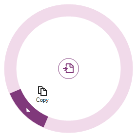
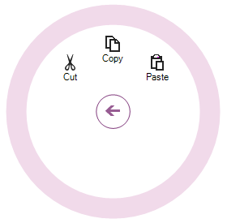
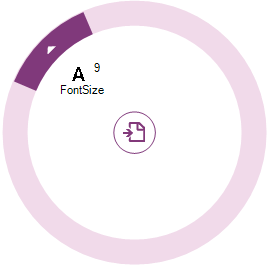
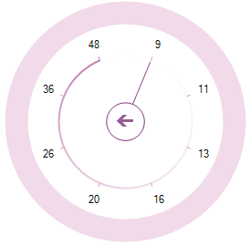
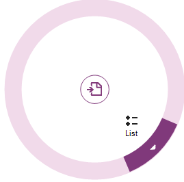
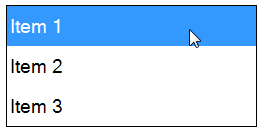

////

|metadata|
{
    "name": "winradialmenu-adding-radial-menu-using-the-code-behind",
    "controlName": [],
    "tags": [],
    "guid": "cbf16a03-e73a-4bbd-9324-867b1c357a24",  
    "buildFlags": [],
    "createdOn": "2013-09-15T22:10:39.1638209Z"
}
|metadata|
////

= Adding Radial Menu Using the Code-Behind

== Topic Overview

=== Purpose

This topic provides an overview of adding the link:{ApiPlatform}win.ultrawinradialmenu{ApiVersion}~infragistics.win.ultrawinradialmenu.ultraradialmenu_members.html[UltraRadialMenu]™ tools using the code-behind.

=== Required background

The following topic is a prerequisite to understanding this topic:

[options="header", cols="a,a"]
|====
|Topic|Purpose

| link:winradialmenu.html[WinRadialMenu]
|This topic introduces the 2013 Infragistics _WinRadialMenu_ component for Windows Forms with full touch support, similar to Microsoft’s OneNote MX 2013 radial menu.

|====

=== In this topic

This topic contains the following sections:

* <<_Ref365799293,Overview>>
* <<_Ref365799303,Adding Tools>>
** <<_Ref365799315,Adding  _WinRadialMenu_   to a form>>
** <<_Ref365799327,Adding RadialMenuTool>>
** <<_Ref365799335,Adding RadialMenuColorTool>>
** <<_Ref365799348,Adding RadialMenuNumericTool>>
** <<_Ref365799358,Adding RadialMenuListTool>>

* <<_Ref365799368,Related Content>>

[[_Ref365799293]]
== Overview

=== Overview

In this topic, you will learn how to add the  _WinRadialMenu_   tools using the code-behind.

[[_Ref365799303]]
== Adding Tools

[[_Ref365799315]]

=== Adding WinRadialMenu to a form

* Drop the link:{ApiPlatform}win.ultrawinradialmenu{ApiVersion}~infragistics.win.ultrawinradialmenu.ultraradialmenu_members.html[UltraRadialMenu] component from the toolbox area onto a form.

.Note:
[NOTE]
====
In order to show the menu, always call the overload of the  _Show_   method, which takes in a form passing the location as arguments.
====

* This can be either in the form’s load event or after the `Initialization`.

*In C#:*

[source,csharp]
----
ultraRadialMenu1.Show(this, new Point(Bounds.Right, Bounds.Top));
----

*In Visual Basic:*

[source,vb]
----
ultraRadialMenu1.Show(Me, New Point(Bounds.Right, Bounds.Top))
----

At this point if you run the application, you will see the radial menu in its collapsed state.

[[_Ref365799327]]

=== Adding RadialMenu Tool

The link:{ApiPlatform}win.ultrawinradialmenu{ApiVersion}~infragistics.win.ultrawinradialmenu.radialmenutool_members.html[RadialMenuTool] is the base class for all tool types. The button tool is of type link:{ApiPlatform}win.ultrawinradialmenu{ApiVersion}~infragistics.win.ultrawinradialmenu.radialmenutool_members.html[RadialMenuTool] representing tools such as Copy, Paste, Undo, Redo, Bold, Italic, among others. By default, the radial menu only contains the center tool without any child tools in its collection. First, you need to add tools to the center tool’s collection and then for each tool add child tools.

.Note:
[NOTE]
====
The center button tool is the parent of all tools on the menu.
====

The following code demonstrates how to add a link:{ApiPlatform}win.ultrawinradialmenu{ApiVersion}~infragistics.win.ultrawinradialmenu.radialmenutool_members.html[RadialMenuTool] parent `Copy` tool type to the center tool’s collection.

*In C#:*

[source,csharp]
----
var mainCopyTool = new RadialMenuTool("mainCopyTool")
{
    Text = "Copy",
    ChildToolCheckBehavior = ChildToolCheckBehavior.Any,
    VisiblePosition = 5
};
mainCopyTool.ToolSettings.Appearance.Image = // Your image path
ultraRadialMenu1.CenterTool.Tools.Add(mainCopyTool);
----

*In Visual Basic:*

[source,vb]
----
Dim mainCopyTool = New RadialMenuTool("mainCopyTool") With { _
      .Text = "Copy", _
      .ChildToolCheckBehavior = ChildToolCheckBehavior.Any, _
      .VisiblePosition = 5 _
}
mainCopyTool.ToolSettings.Appearance.Image = ' Your image path
ultraRadialMenu1.CenterTool.Tools.Add(mainCopyTool)
----

The following code demonstrates how to add a child `Cut`, `Copy` and `Paste` tools of the type link:{ApiPlatform}win.ultrawinradialmenu{ApiVersion}~infragistics.win.ultrawinradialmenu.radialmenutool_members.html[RadialMenuTool] to the parent Copy tool’s collection.

*In C#:*

[source,csharp]
----
// Add child Cut tool.
var cutTool = new RadialMenuTool("cutTool")
{
    Text = "Cut",
    VisiblePosition = 7
};
cutTool.ToolSettings.Appearance.Image = // Your image path
mainCopyTool.Tools.Add(cutTool);
// Add child Copy tool.
var copyTool = new RadialMenuTool("copyTool")
{
    Text = "Copy",
    VisiblePosition = 0
};
copyTool.ToolSettings.Appearance.Image = // Your image path
mainCopyTool.Tools.Add(copyTool);
// Add child Paste tool 
var pasteTool = new RadialMenuTool("pasteTool")
{
    Text = "Paste",
    VisiblePosition = 1
};
pasteTool.ToolSettings.Appearance.Image = // Your image path
mainCopyTool.Tools.Add(pasteTool);
----

*In Visual Basic:*

[source,vb]
----
' Add child Cut tool.
Dim cutTool = New RadialMenuTool("cutTool") With { _
      .Text = "Cut", _
      .VisiblePosition = 7 _
}
cutTool.ToolSettings.Appearance.Image = ' Your image path
mainCopyTool.Tools.Add(cutTool)
' Add child Copy tool.
Dim copyTool = New RadialMenuTool("copyTool") With { _
      .Text = "Copy", _
      .VisiblePosition = 0 _
}
copyTool.ToolSettings.Appearance.Image = ' Your image path
mainCopyTool.Tools.Add(copyTool)
' Add child Paste tool 
Dim pasteTool = New RadialMenuTool("pasteTool") With { _
      .Text = "Paste", _
      .Checkable = True, _
      .VisiblePosition = 1 _
}
pasteTool.ToolSettings.Appearance.Image = ' Your image path
mainCopyTool.Tools.Add(pasteTool)
----

Result of the parent (Copy) and child (Cut, Copy and Paste) tools.

[[_Ref365799335]]

=== Adding RadialMenu ColorTool

The following code creates a color tool similar to the Microsoft’s  _OneNote MX 2013_   color tool.

*In C#:*

[source,csharp]
----
ultraRadialMenu1.CenterTool.Tools.AddOneNoteMxColorTool("Color");
----

*In Visual Basic:*

[source,vb]
----
ultraRadialMenu1.CenterTool.Tools.AddOneNoteMxColorTool("Color")
----

[[_Ref365799348]]

=== Adding RadialMenu NumericTool

The following code creates a numeric tool using a numeric gauge tool representing the numeric value on a gauge.

*In C#:*

[source,csharp]
----
// Parent numeric tool for font sizes.
var fontSize = new RadialMenuNumericTool("FontSize")
{
    Text = Properties.Resources.FontSize,
    VisiblePosition = 7,
    Value = 9
};
fontSize.ToolSettings.Appearance.Image = // Your image path
ultraRadialMenu1.CenterTool.Tools.Add(fontSize);
// Child gauge tool with FontSize options.
_rangeTool = new RadialMenuNumericGaugeTool();
NumericGaugeToolTickmark tickmark = _rangeTool.Tickmarks.Add(9);
tickmark.ShowLabel = false;
_rangeTool.Tickmarks.Add(9);
_rangeTool.Tickmarks.Add(11);
_rangeTool.Tickmarks.Add(13);
_rangeTool.Tickmarks.Add(16);
_rangeTool.Tickmarks.Add(20);
_rangeTool.Tickmarks.Add(26);
_rangeTool.Tickmarks.Add(36);
_rangeTool.Tickmarks.Add(48);
fontSize.Tools.Add(_rangeTool);
----

*In Visual Basic:*

[source,vb]
----
' Parent numeric tool for font sizes.
Dim fontSize = New RadialMenuNumericTool("FontSize") With { _
    .Text = "Font Size", _
    .VisiblePosition = 7, _
    .Value = 9 _
}
fontSize.ToolSettings.Appearance.Image = ' Your image path
UltraRadialMenu1.CenterTool.Tools.Add(fontSize)
' Child gauge tool with FontSize options.
Dim _rangeTool As RadialMenuNumericGaugeTool = New RadialMenuNumericGaugeTool()
Dim tickmark As NumericGaugeToolTickmark = _rangeTool.Tickmarks.Add(9)
tickmark.ShowLabel = False
_rangeTool.Tickmarks.Add(9)
_rangeTool.Tickmarks.Add(11)
_rangeTool.Tickmarks.Add(13)
_rangeTool.Tickmarks.Add(16)
_rangeTool.Tickmarks.Add(20)
_rangeTool.Tickmarks.Add(26)
_rangeTool.Tickmarks.Add(36)
_rangeTool.Tickmarks.Add(48)
fontSize.Tools.Add(_rangeTool)
----

* Result of the numeric tool with numeric gauge tool.

[[_Ref365799358]]

=== Adding RadialMenu ListTool

The following code creates a list tool containing a list of items in its collection.

*In C#:*

[source,csharp]
----
var listTool = new RadialMenuListTool("List")
    {
        Text = "List",
        VisiblePosition = 3
    };
listTool.ToolSettings.Appearance.Image = // Your image path
ultraRadialMenu1.CenterTool.Tools.Add(listTool);
listTool.ValueList.ValueListItems.Add("Item 1");
listTool.ValueList.ValueListItems.Add("Item 2");
listTool.ValueList.ValueListItems.Add("Item 3");
----

*In Visual Basic:*

[source,vb]
----
Dim listTool = New RadialMenuListTool("List") With { _
      .Text = "List", _
      .VisiblePosition = 3 _
}
listTool.ToolSettings.Appearance.Image = ' Your image path
ultraRadialMenu1.CenterTool.Tools.Add(listTool)
listTool.ValueList.ValueListItems.Add("Item 1")
listTool.ValueList.ValueListItems.Add("Item 2")
listTool.ValueList.ValueListItems.Add("Item 3")
----

* Result of the list tool and its list of items.

* Clicking the List tool’s drill-down button displays the list of items in place of the radial menu, as shown below.

[[_Ref365799368]]
== Related Content

=== Topics

The following topics provide additional information related to this topic.

[options="header", cols="a,a"]
|====
|Topic|Purpose

| link:winradialmenu-adding-radial-menu-using-the-designer.html[Adding Radial Menu Using the Designer]
|This topic provides an overview of adding _WinRadialMenu_ tools using the component’s designer

|====