////

|metadata|
{
    "name": "winradialmenu-adding-radial-menu-using-the-designer",
    "controlName": [],
    "tags": [],
    "guid": "3d6229a9-f7d4-43f9-a68d-fd6245db8f4e",  
    "buildFlags": [],
    "createdOn": "2013-09-15T22:08:58.0357091Z"
}
|metadata|
////

= Adding Radial Menu Using the Designer

== Topic Overview

=== Purpose

This topic provides an overview of adding  _WinRadialMenu_™ tools using the component’s designer.

=== Required background

The following topic is a prerequisite to understanding this topic:

[options="header", cols="a,a"]
|====
|Topic|Purpose

| link:winradialmenu.html[WinRadialMenu]
|This topic introduces the 2013 Infragistics _WinRadialMenu_ component for Windows Forms with full touch support, similar to Microsoft’s OneNote MX 2013 radial menu.

|====

=== In this topic

This topic contains the following sections:

* <<_Ref365798779,Overview>>
* <<_Ref365798788,Adding Tools>>
** <<_Ref365798799,Adding  _WinRadialMenu_   to a form>>
** <<_Ref365798806,Adding RadialMenuTool>>
** <<_Ref365798820,Adding RadialMenuColorTool>>
** <<_Ref365798832,Adding RadialMenuNumericTool>>
** <<_Ref365798844,Adding RadialMenuListTool>>

* <<_Ref365798854,Related Content>>

[[_Ref365798779]]
== Overview

=== Overview

In this topic, you will learn how to add the  _WinRadialMenu_   tools through the component’s designer.

[[_Ref365798788]]
== Adding Tools

[[_Ref365798799]]

=== Adding WinRadialMenu to a form

The  _WinRadialMenu_   component can be added to forms using the form’s designer or in code. Either way requires calling the overload of  _Show_   method that takes in a form with specified location as the arguments in order to show the component when running the application.

Adding  _WinRadialMenu_   using the designer.

1. Create a new windows forms project.

2. Add the link:{ApiPlatform}win.ultrawinradialmenu{ApiVersion}~infragistics.win.ultrawinradialmenu.ultraradialmenu_members.html[UltraRadialMenu] component from the toolbox onto the form.

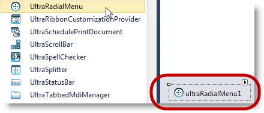

[start=3]
3. Use the radial menu’s smart tag (outlined below) on the component to display the component’s Tasks dialog window and click the `UltraRadialMenu` link to open the designer window.

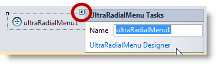

Alternatively, open the designer window using a `Right-click` on the component and select  *Radial Menu Designer*  from the context menu.

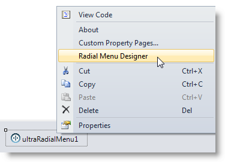

Designer window.

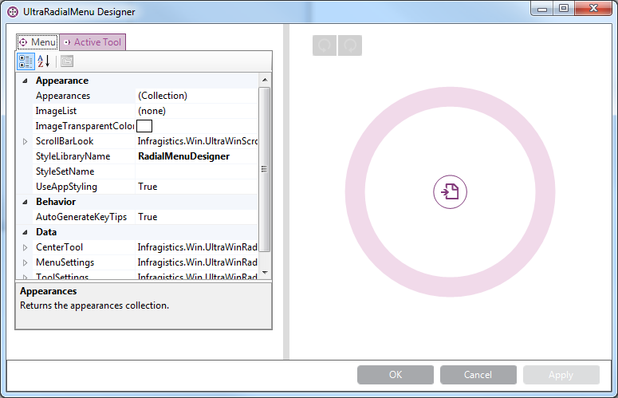

[start=4]
4. Move the mouse over the radial menu to enable the “New Tool” wedge for adding a new tool.

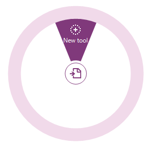

[[_Ref365798806]]

=== Adding RadialMenuTool

The link:{ApiPlatform}win.ultrawinradialmenu{ApiVersion}~infragistics.win.ultrawinradialmenu.radialmenutool_members.html[RadialMenuTool] is the base class for all tool types. The button tool is of type link:{ApiPlatform}win.ultrawinradialmenu{ApiVersion}~infragistics.win.ultrawinradialmenu.radialmenutool_members.html[RadialMenuTool] representing tools such as Copy, Paste, Undo, Redo, Bold, Italic, among others. The section of the topic walks you through using the component’s designer to add a button tool to a radial menu.

1. Click the “ *New Tool* ” on the menu that displays the following dialog.

2. Use the “ *Tool Type”*  drop-down to select the button tool.

3. Type in the “ *Text* ” (tool name).

4. Add the icon for the tool by clicking the “ *Edit Image…”*  button and navigating to your image source.

.Note:
[NOTE]
====
The standard image size for a radial menu tools is 22x22 pixels. This is not a requirement, only a recommendation and you are not limited to using this size.
====

[start=5]
5. Click Add.

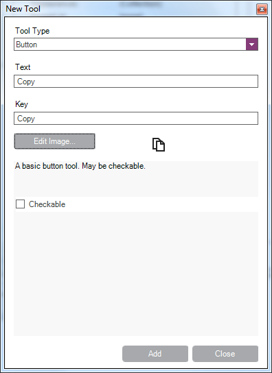

[[_Ref365798820]]

=== Adding RadialMenu ColorTool

Depending on the selected tool type, the options on the dialog window may vary to allow for appropriate property settings for the selected tool type.

Select tool type Color and supply a text and key to it. For Color tool there is a built-in `OneNoteMX style`,, enabled by default with three color tools: `Fill`, `Font` and `Highlight`. This tool type already contains the appropriate tool icons, but you can change them using the `Edit Image…` button.

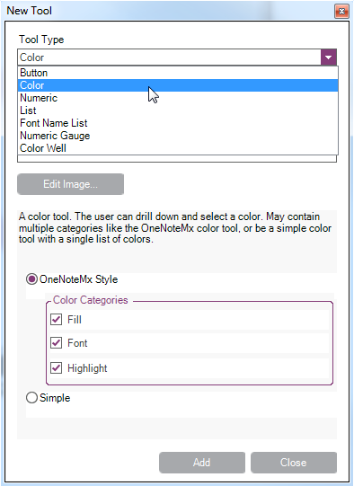

Added Color tool. Click Ok to close the designer and, for optional results, run the application and verify the results.

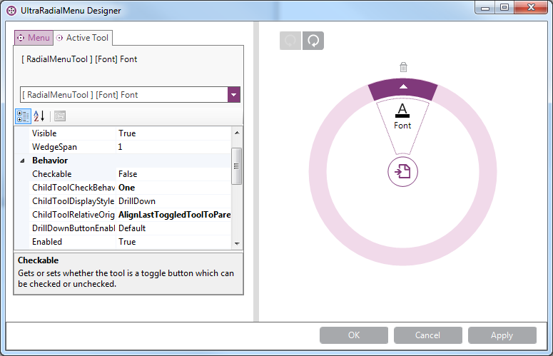

In the designer, you can rotate the tool’s position around the center button using the two rotate buttons. You can delete the tools using the delete button that appears for each tool.

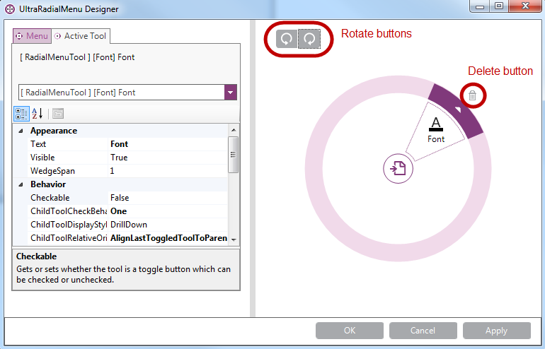

[[_Ref365798832]]

=== Adding RadialMenu NumericTool

The numeric tool requires numeric values. The design dialog provides you with initial set of values using numeric gauge tool. This topic uses the numeric tool to represent font sizes.

Choose a desired position in the menu and click on the “New Tool” wedge to create a numeric tool. This will pop up a dialog window.

Use the drop-down to select the “Numeric Tool” this opens up a configuration dialog window for filling out some of the common properties of the numeric tools.

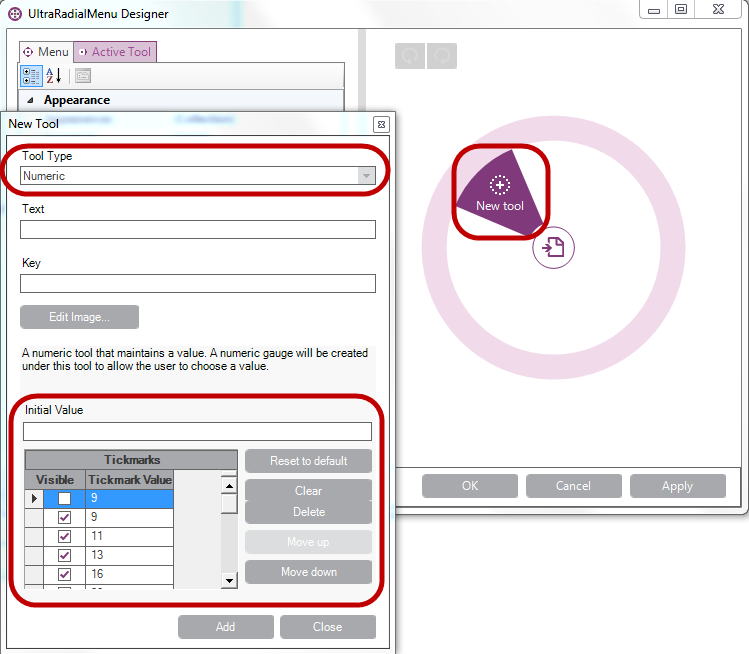

Fill out the Text field and add an image to the tool. You may add the initial value based the default values displayed on the dialog or you can edit the values, and click Add.

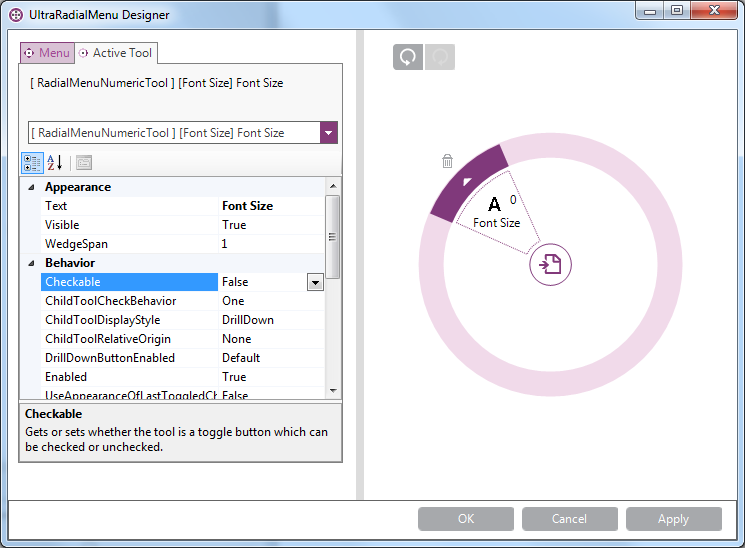

At this point, add the font size numeric tool. Clicking the drill-down button will display the numeric gauge tool that represents the numeric collection created in the previous step.

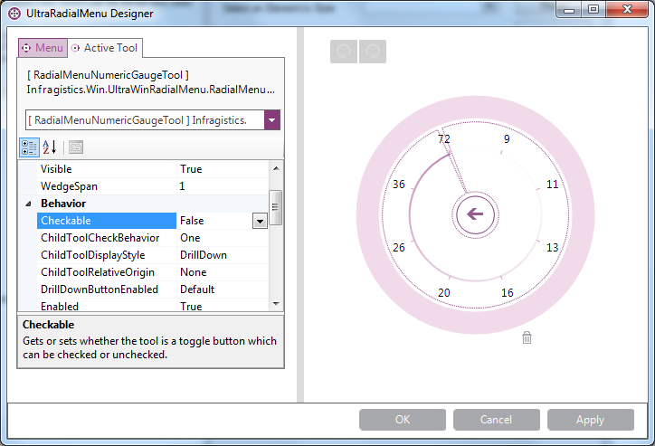

Click Ok to close the designer and (optionally) run the application to verify the result.

[[_Ref365798844]]

=== Adding RadialMenu ListTool

The list tool creates a list of items as a drop-down list. It does not contain any child tools, it only represents the collection’s items.

Click on the “New Tool” wedge and using the drop-down select the “List Tool”. This will enable the “Edit List Items…” button that allows you to create list of items.

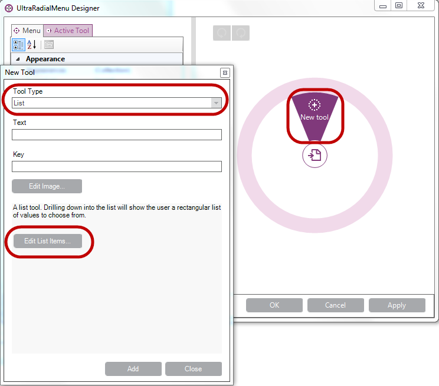

At this point the list tool is added. Clicking the drill-down button will display the list of items created above.

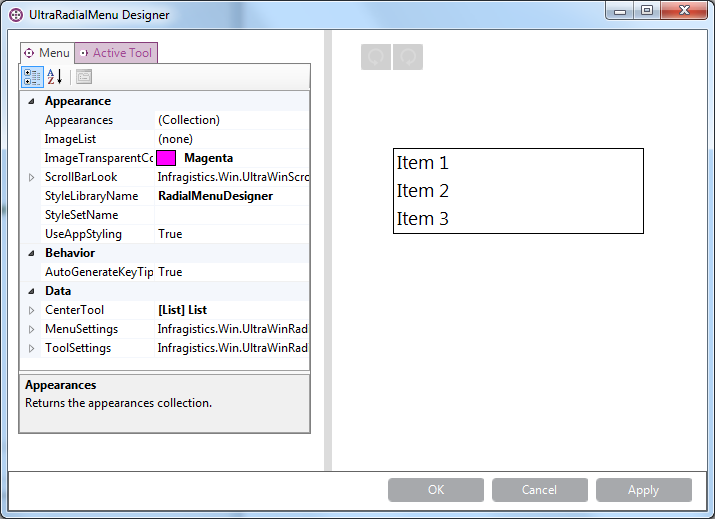

Click Ok to close the designer and run the application to verify the result.

[[_Ref365798854]]
== Related Content

=== Topics

The following topics provide additional information related to this topic.

[options="header", cols="a,a"]
|====
|Topic|Purpose

| link:winradialmenu-adding-radial-menu-using-the-code-behind.html[Adding Radial Menu Using the Code-Behind]
|This topic provides an overview of adding the _UltraRadialMenu_ tools using the code-behind.

|====