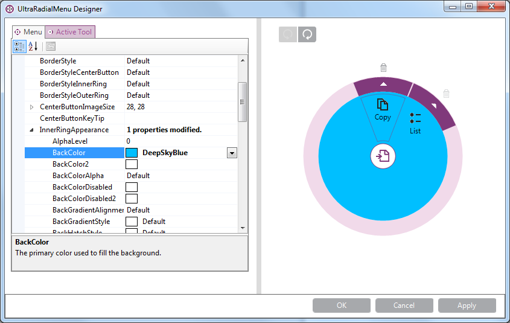
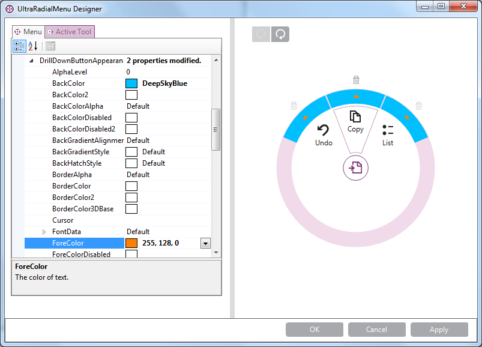

////

|metadata|
{
    "name": "winradialmenu-styling-considerations",
    "controlName": [],
    "tags": [],
    "guid": "d83add34-2904-4958-b200-645fe7526534",  
    "buildFlags": [],
    "createdOn": "2013-09-15T22:12:13.4982534Z"
}
|metadata|
////

= Styling Considerations

== Topic Overview

=== Purpose

This topic displays the link:{ApiPlatform}win.ultrawinradialmenu.v{ProductVersion}~infragistics.win.ultrawinradialmenu.ultraradialmenu_members.html[UltraRadialMenu]™ component’s visual elements and shows how to style different elements using Infragistics  _AppStyling_   framework.

=== Required background

The following topic is a prerequisite to understanding this topic:

[options="header", cols="a,a"]
|====
|Topic|Purpose

| link:winradialmenu.html[WinRadialMenu]
|This topic introduces the 2013 Infragistics _WinRadialMenu_ component for Windows Forms with full touch support, similar to Microsoft’s OneNote MX 2013 radial menu.

|====

=== In this topic

This topic contains the following sections:

* <<_Ref364618680,Introduction>>
* <<_Ref364618690,Styling  _WinRadialMenu_  >>
** <<_Ref364618720,Styling the  _WinRadialMenu_   using AppStylist>>
** <<_Ref364618793,Styling the  _WinRadialMenu_   with property settings>>

* <<_Ref367035763,MenuSettings>>
** <<_Ref364618815,Appearance>>
** <<_Ref364618825,OuterRingAppearance>>
** <<_Ref364618835,InnerRingAppearance>>

* <<_Ref364618996,ToolSettings>>
** <<_Ref364859460,ToolSettings appearance in RadialMenu>>
** <<_Ref364859473,ToolSettings appearance in Tool>>
** <<_Ref364618857,CenterButtonAppearance>>
** <<_Ref364618906,CenterBackButtonAppearance>>
** <<_Ref364619038,DrillDownButtonAppearance>>

* <<_Ref364619047,Related Content>>

[[_Ref364618680]]
== Introduction

=== Introduction

The  _WinRadialMenu_   component provides various methods for styling the appearances of its visual elements. Each element contains appearance properties that change their appearance through property settings. The  _WinRadialMenu_   also supports  _AppStylist_   allowing you to create a style library file with desired styles for the elements and save it as a theme file for your radial menu components.

[[_Ref364618690]]
== Styling  _WinRadialMenu_

[[_Ref364618720]]

=== Styling the WinRadialMenu using AppStylist

The link:{ApiPlatform}win.ultrawinradialmenu.v{ProductVersion}~infragistics.win.ultrawinradialmenu.ultraradialmenu_members.html[UltraRadialMenu] component supports  _AppStylist_  , providing several styling option such as, using one of the pre-defined style library files, or customizing an existing template providing it with a different look and feel; or even creating your own library file using the  _AppStylist_  .

For more information refer to the link:styling-guide-setting-up-your-application-for-styling.html[Setting Up Your Application for Styling] topic on how to create style library files with  _AppStylist_   for radial menu or any other  _Infragistics Windows Forms_   controls in general.

[[_Ref364618793]]

=== Styling the WinRadialMenu with property settings

There are a couple of ways to style the radial menu component’s elements: 1) through the form’s designer, and 2) through code-behind setting up the component’s appearance properties.

Dropping a component on the form places it in the component tray at the bottom of the form. Next, using the  *UltraRadialMenu Designer*  link, open up the design time dialog window.

[[_Ref367035763]]
== MenuSettings

[[_Ref364618815]]

=== Appearance

The link:{ApiPlatform}win.ultrawinradialmenu.v{ProductVersion}~infragistics.win.ultrawinradialmenu.menusettings_members.html[MenuSettings] is an object containing properties that affect the menu itself, not the tools. Use this design the appearance of the radial menu.

The following screenshot displays the design time dialog window allowing you to customize the appearance of the radial menu via link:{ApiPlatform}win.ultrawinradialmenu.v{ProductVersion}~infragistics.win.ultrawinradialmenu.menusettings_members.html[MenuSettings] property.

The same appearance configured above can also be set through code-behind, for example:

*In C#:*

[source,csharp]
----
ultraRadialMenu1.MenuSettings.Appearance.BackColor = Color.DeepSkyBlue;
----

*In Visual Basic:*

[source,vb]
----
ultraRadialMenu1.MenuSettings.Appearance.BackColor = Color.DeepSkyBlue
----

[[_Ref364618825]]

=== OuterRingAppearance

Displaying the design time configuration of the radial menu component’s link:{ApiPlatform}win.ultrawinradialmenu.v{ProductVersion}~infragistics.win.ultrawinradialmenu.menusettings~outerringappearance.html[OuterRingAppearance].

Code-behind example:

*In C#:*

[source,csharp]
----
ultraRadialMenu1.MenuSettings.OuterRingAppearance.BackColor = Color.DeepSkyBlue;
----

*In Visual Basic:*

[source,vb]
----
ultraRadialMenu1.MenuSettings.OuterRingAppearance.BackColor = Color.DeepSkyBlue
----

[[_Ref364618835]]

=== InnerRingAppearance

Displaying the design time configuration of the radial menu component’s link:{ApiPlatform}win.ultrawinradialmenu.v{ProductVersion}~infragistics.win.ultrawinradialmenu.menusettings~innerringappearance.html[InnerRingAppearance].

Code-behind example:

*In C#:*

[source,csharp]
----
ultraRadialMenu1.MenuSettings.InnerRingAppearance.BackColor = Color.DeepSkyBlue;
----

*In Visual Basic:*

[source,vb]
----
ultraRadialMenu1.MenuSettings.InnerRingAppearance.BackColor = Color.DeepSkyBlue
----

[[_Ref364618996]]
== ToolSettings

[[_Ref364618845]]

=== ToolSettings appearance in RadialMenu

The link:{ApiPlatform}win.ultrawinradialmenu.v{ProductVersion}~infragistics.win.ultrawinradialmenu.toolsettings_members.html[ToolSettings] property exists in both  _RadialMenu_   and Tools, for example:

* In  _RadialMenu_   the link:{ApiPlatform}win.ultrawinradialmenu.v{ProductVersion}~infragistics.win.ultrawinradialmenu.toolsettings_members.html[ToolSettings] property affects all tools

* In tools affecting individual tools the link:{ApiPlatform}win.ultrawinradialmenu.v{ProductVersion}~infragistics.win.ultrawinradialmenu.toolsettings_members.html[ToolSettings] property can override the settings by  _RadialMenu_

Displaying the design time configuration of the link:{ApiPlatform}win.ultrawinradialmenu.v{ProductVersion}~infragistics.win.ultrawinradialmenu.toolsettings_members.html[ToolSettings] in  _RadialMenu_  , this applies to all tools on the menu.

Code-behind example:

*In C#:*

[source,csharp]
----
ultraRadialMenu1.ToolSettings.Appearance.BackColor = Color.LightSkyBlue;
----

*In Visual Basic:*

[source,vb]
----
ultraRadialMenu1.ToolSettings.Appearance.BackColor = Color.LightSkyBlue
----

[[_Ref364859473]]

=== ToolSettings appearance in Tool

Displaying the design time configuration of the link:{ApiPlatform}win.ultrawinradialmenu.v{ProductVersion}~infragistics.win.ultrawinradialmenu.toolsettings_members.html[ToolSettings] in Copy tool only, overriding the settings by  _RadialMenu_  .

Code-behind example:

*In C#:*

[source,csharp]
----
ultraRadialMenu1.CenterTool.Tools["Copy"].ToolSettings.Appearance.BackColor = Color.DeepSkyBlue;
----

*In Visual Basic:*

[source,vb]
----
ultraRadialMenu1.CenterTool.Tools("Copy").ToolSettings.Appearance.BackColor = Color.DeepSkyBlue
----

[[_Ref364618857]]

=== CenterButtonAppearance

Displaying the design time configuration of the radial menu’s link:{ApiPlatform}win.ultrawinradialmenu.v{ProductVersion}~infragistics.win.ultrawinradialmenu.toolsettings~centerbuttonappearance.html[CenterButtonAppearance]. This always affects the center button, not the back button that is also in the center of the submenu.

image::images/Styling_Considerations_7.png[]

Code-behind example:

*In C#:*

[source,csharp]
----
ultraRadialMenu1.ToolSettings.CenterButtonAppearance.BackColor = Color.DeepSkyBlue;
----

*In Visual Basic:*

[source,vb]
----
ultraRadialMenu1.ToolSettings.CenterButtonAppearance.BackColor = Color.DeepSkyBlue
----

[[_Ref364618906]]

=== CenterBackButtonAppearance

Displaying the design time configuration of the radial menu’s link:{ApiPlatform}win.ultrawinradialmenu.v{ProductVersion}~infragistics.win.ultrawinradialmenu.toolsettings~centerbackbuttonappearance.html[CenterBackButtonAppearance]. This affects the center button when it displays in the submenu as a back button.

[[_Ref364619038]]

=== DrillDownButtonAppearance

Displaying the design time configuration of the radial menu tools’ link:{ApiPlatform}win.ultrawinradialmenu.v{ProductVersion}~infragistics.win.ultrawinradialmenu.toolsettings~drilldownbuttonappearance.html[DrillDownButtonAppearance] by setting the `BackColor` and `ForeColor`.

Code-behind example:

*In C#:*

[source,csharp]
----
ultraRadialMenu1.ToolSettings.DrillDownButtonAppearance.BackColor = Color.DeepSkyBlue;
ultraRadialMenu1.ToolSettings.DrillDownButtonAppearance.ForeColor = Color.Orange;
----

*In Visual Basic:*

[source,vb]
----
ultraRadialMenu1.ToolSettings.DrillDownButtonAppearance.BackColor = Color.DeepSkyBlue
ultraRadialMenu1.ToolSettings.DrillDownButtonAppearance.ForeColor = Color.Orange
----

[[_Ref364619047]]
== Related Content

=== Topics

The following topic provides additional information related to this topic.

[options="header", cols="a,a"]
|====
|Topic|Purpose

| link:winradialmenu-winradialmenu-tools.html[WinRadialMenu Tools]
|The topics in this group explain how to add the radial menu tools using either the component’s designer or code-behind.

| link:winradialmenu.html[WinRadialMenu]
|This section contains the list of specific help topics on how to use _WinRadialMenu_ component.

|====