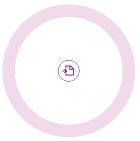
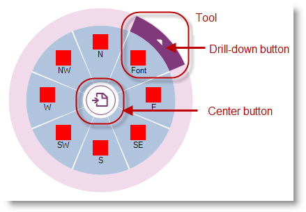
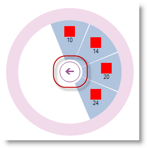

////

|metadata|
{
    "name": "winradialmenu-winradialmenu-component",
    "controlName": [],
    "tags": [],
    "guid": "4e0d74c3-5909-4f80-bb64-c538500d0eef",  
    "buildFlags": [],
    "createdOn": "2013-09-15T21:50:06.7245893Z"
}
|metadata|
////

= WinRadialMenu Component

== Topic Overview

=== Purpose

This topic introduces the 2013 Infragistics  _WinRadialMenu™_   component for Windows Forms with full touch support similar to Microsoft’s OneNote MX 2013 radial menu.

=== In this topic

This topic contains the following sections:

* <<_Ref364619164,Overview>>
* <<_Ref364619169,Terminology>>
** <<_Ref364619179,Center button>>
** <<_Ref364619190,Center tool>>
** <<_Ref364619198,Inner ring>>
** <<_Ref364619214,Outer ring>>
** <<_Ref364619222,Wedge>>
** <<_Ref364619234,Tool>>

* <<_Ref364619307,Related Content>>

[[_Ref364619164]]
== Overview

=== Overview

The  _WinRadialMenu_   component is similar to the Microsoft’s  _OneNote MX 2013_   radial menu with the ability to customize its appearance and functionality. The component’s design uses tree structure of tools and tool collections within the tools.

Allows you to display one or more  _WinRadialMenu_   components in an application with different functionalities and settings, and supports interactions via  *mouse* ,  *keyboard*  and  *touch*  with touch-enabled monitor.

The following code example shows how to display the  _WinRaidalMenu_   after adding the component to the form. Initially it only contains a center button.

*In C#:*

[source,csharp]
----
ultraRadialMenu1.Show(this, new Point(Bounds.Right, Bounds.Top));
----

*In Visual Basic:*

[source,vb]
----
ultraRadialMenu1.Show(Me, New Point(Bounds.Right, Bounds.Top))
----

[[_Ref364619169]]
== Terminology

[[_Ref364619179]]

=== Center button

Functioning to expand and collapse the menu, the center button is always present in the center of the radial menu. , which when in a collapsed state only displays the button itself. When expanded to display the menu or submenu, the center tool determines the appearance of the center button.

[options="header", cols="a,a"]
|====
|Description|Center buttons

|Default center button appearance on the main menu with “Expand” and “Collapse” functionalities.
|image::images/WinRadialMenu_Component_2.png[]

|Default center button appearance in the submenu with “Go Back” functionality.
|image::images/WinRadialMenu_Component_3.png[]

|====

[[_Ref364619190]]

=== Center tool

Determines the appearance and behavior of the center button using the center button as the center tool, located in the center of the radial menu, and arranges the center tool’s descendant tools as wedges around the center button. When the center tool is a root tool, having no parents, then clicking the center button expands or collapses the menu. If the center tool has a parent, then it acts as a “back” button, returning the menu to the previous set of tools.

[[_Ref364619198]]

=== Inner ring

The inner ring is the area between the center button and outer ring, depicted in white in the following illustration. It serves as a container for wedges, presenting the center tool’s descendants’ tools.

[[_Ref364619214]]

=== Outer ring

The outer ring is the outermost ring of the  _WinRadialMenu_  , depicted in pink in the following illustration, is where the tools and their drill down buttons appear. The following screenshot illustrates the outer and inner rings.

[[_Ref364619222]]

=== Wedge

A “wedge” is a pie- shaped segment in a radial menu, which may or may not contain a tool. By default, the  _WinRadialMenu_   displays 8 wedges, similar to the 8 cardinal directions on a compass rose: N, NE, E, SE, S, SW, W, and NW. By default the first wedge is always on top ( _VisiblePosition_   = 0), and the subsequent wedges are added clockwise.

The following screenshot illustrates two different views of the defined wedges and how the component behaves based on the number of tools the wedges occupy. The wedges are colored for demonstration purposes; by default the wedges have white background.

[options="header", cols="a,a"]
|====
|Eight wedges with eight tools.|Eight wedges with four tools.

|image::images/WinRadialMenu_Component_4.png[]
|image::images/WinRadialMenu_Component_5.png[]

|====

.Note:
[NOTE]
====
The number of wedges can be changed only on the component; it will not change based on a tool, for example:
====

`ultraRadialMenu1.MenuSettings.WedgeCount = 4;`

==== Important:

The link:{ApiPlatform}win.ultrawinradialmenu{ApiVersion}~infragistics.win.ultrawinradialmenu.menusettings_members.html[MenuSettings] property for link:{ApiPlatform}win.ultrawinradialmenu{ApiVersion}~infragistics.win.ultrawinradialmenu.menusettings~wedgecount.html[WedgeCount] only exists for the component, not for the tools. Setting the link:{ApiPlatform}win.ultrawinradialmenu{ApiVersion}~infragistics.win.ultrawinradialmenu.menusettings~wedgecount.html[WedgeCount] explicitly to a different number skews the sub menu wedge count as well.

[[_Ref364619234]]

=== Tool

A tool is an object which may be placed in a wedge to display the type of tool to the user. The center button may also be considered as a containing tool.

Use the center button, located in the center of the main menu, for expanding and collapsing the radial menu. Only the center button is visible in collapsed view.

Drill-down button of each tool appearing on the edge of a tool can be used to open up submenu of that tool containing child tools. If a tool does not have any child tools, the drill-down button does not appear.

.Note:
[NOTE]
====
The tooltip of a tool uses the text property of the tool to display it on top of the radial menu. If the tool has no text, the tooltip will be blank unless it is explicitly specified.
====

Submenu displaying set of child tools with a back button in the center for returning back to parent menu.

[[_Ref364619307]]
== Related Content

=== Topics

The following topics provide additional information related to this topic.

[options="header", cols="a,a"]
|====
|Topic|Purpose

| link:winradialmenu.html[WinRadialMenu]
|This section contains the help topics covering the _WinRadialMenu_ component.

|====